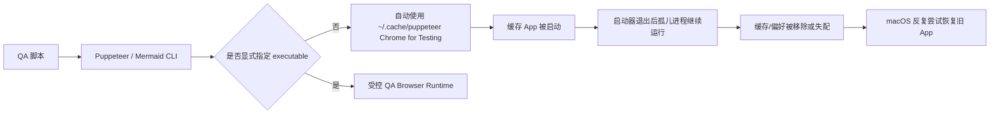
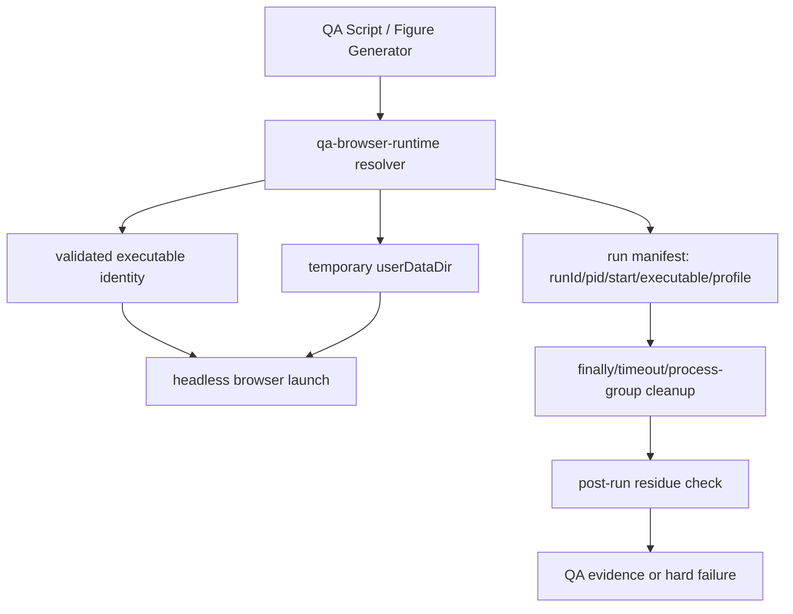
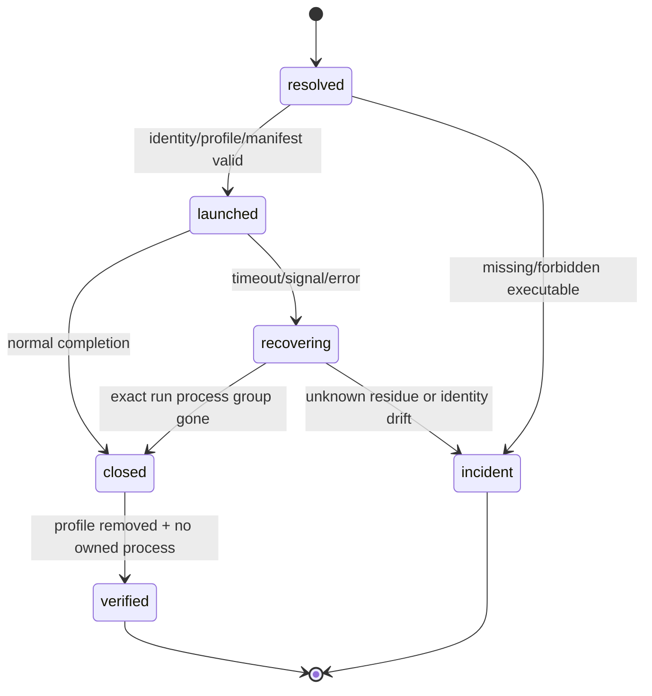

# v0.26.13 QA 浏览器运行时生命周期与残留治理方案

状态：正式产品工程方案，待 Engineering 实现。

## 1. 问题定义与根因

本方案治理的是 xingbuild 的工程 QA 浏览器运行时，不是网站 UI，也不是内容发布。

事实链：



当前诊断已确认：Puppeteer 的默认 `executablePath()` 指向 `~/.cache/puppeteer/.../Google Chrome for Testing.app`；该进程曾在启动器退出后由 PID 1 托管，而其缓存路径后来已不存在。macOS 偏好仍保留旧 `LastRunAppBundlePath`，因此产生 Chrome Testing 与 reopen 混乱。

这不是全局 Codex Chrome 控制能力、ChatGPT Chrome 扩展、内容发布或 SitePublication 的故障。

## 2. 产品与责任边界

### 目标

- 项目 QA 只使用一个可验证的浏览器运行时来源。
- 任何脚本都不能静默下载、启动或打开 Chrome for Testing 图形 App。
- 浏览器、临时 profile、子进程和异常退出都必须可回收、可证明无残留。
- 浏览器运行时异常必须在 QA/发布前硬失败，不能继续生成不可信证据。
- 正常 Chrome、用户 profile、ChatGPT 扩展和全局 Codex 连接不受影响。

### 明确不做

- 不修改页面 UI、IA、schema、视觉、ContentSet、正文、审核、媒体或内容身份。
- 不修改内容发布、SitePublication Coordinator、EdgeOne、产品发布语义。
- 不删除用户的正常 Chrome 或全局 Codex 配置。
- 不扫描或终止不属于本次 xingbuild QA run 的浏览器进程。
- 不把环境清理操作伪装成产品功能完成。

产品兼容声明：

```yaml
contentImpact: none
contentImpactReason: qa-browser-runtime-governance-only
affectedTargets: []
affectedRoutes: []
affectedFields: []
compatibilityEvidence: content-set-and-content-cli-unchanged
```

## 3. 唯一运行时架构



### 3.1 `qa-browser-runtime` 唯一 owner

新增共享运行时模块（建议路径：`scripts/lib/qa-browser-runtime.mjs`），所有项目内浏览器脚本只能通过它解析和启动浏览器。

解析规则：

1. 优先读取显式 `XINGBUILD_QA_BROWSER_PATH`；未设置时仅使用平台登记的受控路径：macOS 为 `/Applications/Google Chrome.app/Contents/MacOS/Google Chrome`。
2. 路径必须存在、可执行，并且不能匹配 `Google Chrome for Testing.app`、`.cache/puppeteer`、`Library/Caches/ms-playwright` 或其他自动下载缓存路径。
3. 不允许 Puppeteer、Mermaid CLI 或 Playwright 自动下载/解析默认浏览器；缺少受控 executable 时直接报 `QA_BROWSER_RUNTIME_UNAVAILABLE`，不自动修复、不继续。
4. resolver 返回不可变的 `{ executablePath, browserFamily, version, source, policyVersion }`，并记录到 QA evidence。

### 3.2 受控启动合同

每次 run 必须：

- `headless: true`；禁止 `headless: false` 和打开 GUI App；
- 使用一次性临时 `userDataDir`，退出后递归清理；
- 注入唯一 `runId`、`userDataDir` 和 executable identity；
- 使用 `finally` 关闭 browser；超时或信号退出时，按 runId/profile 只回收本次进程组；
- 不使用用户默认 Chrome profile，不写 LaunchServices、Dock 或 macOS App 偏好；
- 运行 manifest 保存 pid、start time、executable、profile、parent task 和结束状态。

### 3.3 现有入口接入

- `scripts/qa-v02511-showcase-spacing.mjs` 删除脚本内私有 launch 配置，改用 resolver。
- `scripts/generate-evergreen-figures.mjs` 为每次 `mmdc` 调用生成受控 Puppeteer config，显式传递 executable、headless、临时 profile 和受控 args；未设置环境变量时也不能回到 Puppeteer 默认缓存。
- 任何后续新增 Puppeteer/Playwright/mmdc 入口必须通过 resolver；静态检查拒绝直接 launch 或无 config 的 `mmdc`。
- `MERMAID_PUPPETEER_EXECUTABLE_PATH` 只作为显式路径输入，不再作为绕过 resolver 的后门；解析和拒绝规则相同。

## 4. 生命周期与故障闭环



硬失败条件：

- executable 缺失、不可执行或来自缓存/Chrome Testing；
- browser 未以 headless 运行；
- profile 不是本次 run 创建的临时目录；
- timeout 后仍有带本次 runId/profile 的进程；
- 发现残留但无法证明属于本次 run；
- 生成器尝试在未通过 resolver 时启动 mmdc/Puppeteer。

Incident 至少记录：`QA_BROWSER_RUNTIME_UNAVAILABLE`、`QA_BROWSER_RUNTIME_FORBIDDEN_PATH`、`QA_BROWSER_RUNTIME_ORPHAN` 或 `QA_BROWSER_RUNTIME_RESIDUE_UNKNOWN`，并停止当前 QA/发布阶段。禁止杀掉未确认归属的正常 Chrome。

## 5. 测试与验收合同

### 单元/静态

- resolver 选择显式系统 Chrome；拒绝 Puppeteer、Playwright、Mermaid 缓存路径和 Chrome for Testing。
- 所有现有浏览器入口均通过 resolver；不存在裸 `puppeteer.launch`、裸 `chromium.launch` 或无受控 config 的 `mmdc`。
- launch options 固定 headless、临时 profile、runId 和 cleanup handler。

### 生命周期集成

- 正常完成、断言失败、SIGTERM、超时四条路径均关闭 browser、清理 profile、清除 manifest。
- 人为保留一个本次 run 子进程时，恢复逻辑只终止本次 run；未知进程必须报告而不终止。
- 连续运行至少两次不生成第二个 GUI App、不残留 profile、不改变正常 Chrome 用户数据。
- Mermaid 至少生成一张桌面和一张移动图，确认 executable identity 与 Puppeteer QA 相同。

### 产品闭环

- `npm run check`、`release:prepare`、`release:qa`、`release:closeout-check`、`release:build`、`release:preflight`、`git diff --check` 通过；既有内容/环境 retained failures 分层记录，不隐藏。
- QA evidence 包含 browser runtime identity、run lifecycle、cleanup outcome、owned process count 和 forbidden-path scan。
- 视觉/页面五路由现有验收合同不回归；内容检查、ContentSet、ContentReleaseIntent、SitePublication 和公网 manifest 事实完全不变。
- 视觉/产品验收只确认“工程 QA 证据可信且产品边界未变”；无需重新审核内容正文。

## 6. 版本与交接

- 目标版本：`v0.26.13`；父版本：当前已发布 `v0.26.12`。
- Engineering 主线：`019fcbf2-20e3-7d51-a4de-87ad7c94b190`。
- 本方案写入 `docs/iterations/current.md` 后，Engineering 在 canonical `main` 实现、测试、commit/tag/clean、exact ProductArtifact/preflight。
- 未完成本治理前，不改变 v0.26.12；不运行内容发布、不创建内容身份、不通知 Ops 恢复。
- 产品/视觉验收通过后，按现有产品 transport 工作流决定是否发布；新视觉差异进入下一版本，不回写旧版本。

## 7. 完成定义

只有以下链路全部成立，才称为“根治完成”：

```text
唯一 resolver → 显式 executable → headless 临时 profile
→ 正常/异常都可回收 → 残留可证明 → 静态/集成门禁
→ release gates → commit/tag/clean → 产品验收
```

仅删除一次 Chrome Testing 进程、移动一次偏好文件或修改某个 QA 脚本，不构成完成。
