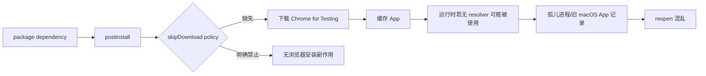
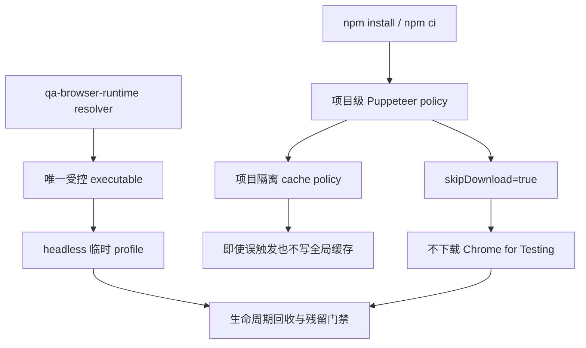

# v0.26.14 QA 浏览器供应链与安装副作用治理方案

状态：正式产品工程方案，待 Engineering 实现。

## 1. 为什么 v0.26.13 仍不构成彻底解决

v0.26.13 已建立运行时层治理：resolver、显式 executable、headless、临时 profile、runId、异常回收和 owned residue 检查均已通过。

但项目仍依赖 `puppeteer@25.4.0`，其 `postinstall: node install.mjs` 会在依赖安装阶段读取 Puppeteer 配置；当前仓库没有固定 `skipDownload` 的项目配置。因此 `npm install`/依赖恢复仍可能把 Chrome for Testing 下载到缓存。运行时拒绝使用缓存，不能阻止缓存再次产生。

完整因果链：



本版本补齐“供应与安装层”，与 v0.26.13 的运行时层组成完整闭环。

## 2. 线上与版本边界

- v0.26.13 已完成一次不可逆 product transport：保持其线上事实、tag、history 和 SitePublication 不变。
- v0.26.13 的 QA 治理结论为 Block，不再重复 transport；本版本不回写旧版本。
- v0.26.14 只治理项目开发/QA 依赖的浏览器供应链，不改变网站 UI、ContentSet 或内容发布。

```yaml
contentImpact: none
contentImpactReason: qa-browser-supply-and-install-governance-only
affectedTargets: []
affectedRoutes: []
affectedFields: []
compatibilityEvidence: content-set-content-cli-and-site-publication-unchanged
```

## 3. 供应链架构



### 3.1 项目级配置

新增项目根配置（建议 `.puppeteerrc.cjs` 或 `puppeteer.config.cjs`，只保留一个 owner）：

- `skipDownload: true`；
- `chrome.skipDownload: true`；
- `chrome-headless-shell.skipDownload: true`；
- `firefox.skipDownload: true`；
- `cacheDirectory` 指向项目 ignored 的隔离目录，禁止默认落到 `~/.cache/puppeteer`；
- 不在该配置中提供运行时 executable，运行时仍必须经过 v0.26.13 的 resolver。

配置必须由 Puppeteer 的真实 `configuration()` API 读取并验证，不能只靠静态文字存在。

### 3.2 安装策略门禁

新增 `scripts/qa-browser-install-check.mjs` 与 `npm run qa:browser:install-policy`：

1. 读取项目级 Puppeteer configuration；
2. 断言所有浏览器下载开关为 true（即跳过下载）；
3. 断言 cacheDirectory 位于项目 ignored 隔离目录，不是用户全局缓存；
4. 断言 `PUPPETEER_CACHE_DIR`、`PUPPETEER_EXECUTABLE_PATH` 等外部变量不会绕过 resolver 或把 cache 指向禁止路径；
5. 运行前后检查 cache snapshot，配置检查不得产生新 App、下载或进程；
6. 缺失配置、配置漂移或副作用不确定时返回 `QA_BROWSER_INSTALL_POLICY_*` Incident 并停止。

### 3.3 运行时层保持唯一

v0.26.13 的 `scripts/lib/qa-browser-runtime.mjs` 继续作为唯一启动入口：

- 安装配置不负责启动浏览器；
- Puppeteer/Mermaid 仍使用显式正常 Chrome；
- 禁止 Chrome for Testing、Puppeteer/Playwright cache 和 GUI App；
- headless、临时 profile、runId、进程组回收和 residue verification 不变；
- 安装门禁与运行时门禁都必须通过，不能只通过其中一层。

## 4. 明确不做

- 不删除或修改用户正常 Chrome、全局 Codex、ChatGPT 扩展、LaunchServices 或用户 profile；
- 不试图用项目脚本“修复”历史 macOS reopen 偏好；历史环境清理由环境责任人单独处理；
- 不替换 Puppeteer/Mermaid 为另一套浏览器工具，不引入第二个 runtime；
- 不修改页面 UI/IA/schema/视觉、ContentSet、正文、审核、media、content CLI、Coordinator、SitePublication、EdgeOne 或内容身份；
- 不修改 v0.26.13 的 tag、history、线上 deployment 或 snapshot。

## 5. 测试与验收合同

### 安装供应

- 真实加载 configuration API，确认 skipDownload 与隔离 cacheDirectory；
- 使用临时 npm 项目/安装模拟验证 postinstall 不下载浏览器；不得依赖网络成功来“证明没有下载”；
- 配置缺失、全局 cache override、Chrome Testing path 和错误 cacheDirectory 均硬失败；
- 连续两次 install-policy 检查不产生新的 Chrome Testing App、cache entry 或 GUI 进程。

### 运行生命周期

- 继承 v0.26.13 的 resolver、normal/failure/SIGTERM/timeout、Mermaid fixture、owned residue 测试；
- 安装 policy 与 runtime policy 的 evidence 必须在同一 QA report 中出现；
- `npm install`/`npm ci` 后再执行 QA，证明安装层和运行层使用同一受控 executable。

### 项目与发布

- `npm run check`、`release:prepare`、`qa:browser:install-policy`、`qa:browser:check`、`release:qa`、`release:closeout-check`、exact `release:build`、`release:preflight`、`git diff --check` 通过；
- `ProductArtifact` 与 exact HEAD/tag 一致；既有内容/环境 retained failures 分层报告；
- v0.26.13 的五路由、视觉、媒体、安全和 content compatibility 事实不回归；不运行 content publish。

## 6. 完成定义

```text
安装不下载/不写全局缓存
→ resolver 只允许受控 executable
→ headless 隔离运行
→ 异常可回收且残留可证明
→ 两层 policy evidence
→ release gates
→ commit/tag/clean
→ 产品治理验收
```

只有运行时层和供应安装层同时通过，才可称为“Chrome Testing/reopen 根因治理完成”。
