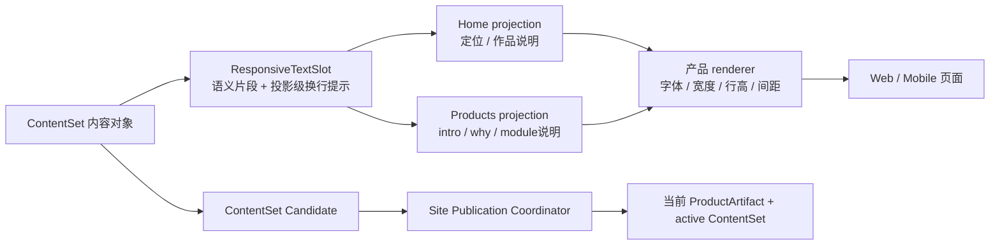

# v0.26.15 通用响应式内容表达与独立发布能力方案

状态：产品/视觉主线正式方案，交 Engineering 实现；不回写 v0.26.14。

## 1. 问题重新定义

当前页面已经有稳定的 ProductHero、内容模块、首页定位区、ClosingAction、媒体槽位和页面组合。缺口不是再造页面或再造一个 Why 页面，而是：内容对象中的说明文字仍以单一字符串表达，内容运营无法在不改代码的情况下为 Web 与 Mobile 提供受控的换行提示。

这会把两个不同责任混在一起：

- 产品工程应负责页面 IA、组件组合、字体、最大宽度、行高、关系间距、响应式容器和可访问性；
- 内容运营应负责经过审核的语义文本、稳定的语义片段，以及在已登记投影上的可选换行提示。

本版本只补齐二者之间的通用内容表达能力。`为什么做` 是 `/products` 现有 ProductHero 内的一个可选语义槽位，不是新的页面模块；首页与 `/products` 仍拥有各自独立的页面投影、CTA、ClosingAction 和生命周期。

## 2. 根本目标与边界



### 2.1 本版本必须达成

1. 新增一个有界、可校验、可回退的 `ResponsiveTextSlot` 能力；不引入通用 HTML、Markdown、CSS 或 DOM 片段。
2. 同一份语义文本只保存一次；Web/Mobile 使用同一 `parts[]`，只允许在登记的页面投影中声明不同 `breakAfter`。
3. 先支持以下内容框，后续可按同一合同登记更多字段：
   - `home.homeTitle`：首页“我是谁/定位”主文案；
   - `home.description`：首页定位辅助说明的内容槽位兼容；本版本不因支持该字段而新增首页可见块，除非已有正式页面投影明确承接它；
   - `products.robotaxi.intro`：Robotaxi 作品说明；首页作品投影和 `/products` 投影可以各自声明换行策略；
   - `products.robotaxi.why.items[].text`：Why 两条原因；
   - `products.robotaxi.module.{moduleId}.shortDescription`：每个作品模块说明。
4. `why` 作为现有 ProductHero 的可选语义槽位；存在时按“标题 → 作品说明 → 为什么做 → CTA”渲染，缺失时完全不渲染且不留空白。
5. 现有字符串内容、既有 ContentSet 和旧内容包继续可读；没有新字段时页面视觉和发布结果保持不变。
6. 内容 task 可在独立 ContentSet Candidate 中更新文本和投影级换行提示；产品版本上线后，普通文案/换行更新不递增产品版本。

### 2.2 明确不做

- 不新增路由、导航、H1、页面模块、页面生命周期或第二套产品/内容发布器。
- 不把 Home 与 Products 绑定为一个页面投影；只共享 resolver、基础组件、tokens 和内容对象读取能力。
- 不把物理换行保存成多段 HTML，不允许 `<br>`、CSS、DOM selector、任意 class 或内联样式进入内容对象。
- 不由内容 task 决定字体、最大宽度、行高、容器间距、按钮、媒体尺寸或 CTA 目标。
- 不修改当前已上线 ContentSet 内容事实；本版本产品 transport 复用现有 active ContentSet，初始新文案由产品上线后内容 task 单独发布。
- 不改变 SitePublication Coordinator 的唯一 transport、lease、SiteSnapshot、publicVerify、atomic finalize 语义。

## 3. 通用内容对象合同

### 3.1 `ResponsiveTextSlot` 规范形状

```json
{
  "schemaVersion": "responsive-text-slot-v1",
  "parts": [
    {"id": "product-identity", "text": "面向 Robotaxi 运营企业的 B 端运营平台，"},
    {"id": "capability-core", "text": "主要覆盖经营规划、需求预测、生产供应、服务订单，"},
    {"id": "capability-operations", "text": "Robotaxi 调度、运维支持、经营分析和自动化运营模拟。"}
  ],
  "projections": {
    "home.productHero.intro": {
      "web": {"breakAfter": ["product-identity"]},
      "mobile": {"breakAfter": ["product-identity", "capability-core"]}
    },
    "products.productHero.intro": {
      "web": {"breakAfter": ["product-identity"]},
      "mobile": {"breakAfter": ["product-identity", "capability-core"]}
    }
  }
}
```

规则：

- `parts[]` 是语义片段，不是屏幕上不可变的“第几行”；每个 `id` 在一个 slot 内稳定、唯一、kebab-case。
- `text` 只允许纯文本；禁止 HTML、URL、CSS、空字符串和不可见控制字符。
- `projections` 只引用产品登记过的页面/slot 投影。未声明的投影使用自然换行；不复制文本。
- `web` 覆盖 1600/1280 等宽桌面 profile，`mobile` 覆盖 390/320 等窄屏 profile；未来增加 `tablet` 只扩展 profile 枚举，不改对象模型。
- `breakAfter` 只能引用当前 `parts[].id`，不能重复、不能放在最后一个片段之后，不能形成空行；缺失或非法提示直接使 Candidate 在 prepare 阶段失败。
- renderer 使用同一个文本节点/同一行高体系插入受控 break marker；它不能改变父级 flow 的 margin/gap。
- 没有提示时使用现有自然排版（`text-wrap: pretty` 或等价能力）；提示是可选表达，不是必须的布局事实。

### 3.2 旧字符串兼容

旧形状 `intro: "一段字符串"`、`homeTitle: "一段字符串"` 等仍是合法输入。resolver 在边界处把它解释为单一 `legacy` part、无 projection hints；ContentSet hash 仍由规范化后的有效值计算。只有内容 task 选择更新该字段时，才允许提交 `ResponsiveTextSlot` 对象。旧 active ContentSet 无需迁移即可被新产品版本读取和发布。

### 3.3 Why 语义

`why` 不是新的页面结构名称，而是现有 `ProductHero` 可选内容字段：

```json
{
  "why": {
    "eyebrow": "为什么做",
    "items": [
      {"id": "transferability", "text": "复盘对企业经营与运作的理解，检验产品能力在新行业中的迁移性。"},
      {"id": "ai-collaboration", "text": "通过完成一个可运行的完整项目，深入实践与 AI 协作的方法。"}
    ]
  }
}
```

`items[].text` 可接受同一 `ResponsiveTextSlot` 规范；若初始内容不需要显式断句，也可使用旧纯字符串形状。Why 的默认关系合同为：标题→作品说明 `16px`；说明→Why `12px`；Why 页眉→第一条 `4px`；两条原因之间 `8px`；原因→CTA `24px`。Why 缺失时恢复原有说明→CTA 关系，不保留空槽位。

## 4. 页面责任与内容投影

```text
products.robotaxi.intro (one semantic source)
├─ HomeProductProjection
│  └─ home.productHero.intro（首页独立宽度、独立布局、独立 break policy）
└─ ProductsShowcase
   └─ products.productHero.intro（产品页独立宽度、独立布局、独立 break policy）
```

- 页面可以读取同一内容对象，也可以只选择自己需要的 slot；这不是要求页面共享结构。未被现有正式页面投影承接的 slot（包括 `home.description`）只获得内容与发布兼容能力，不自动新增视觉区域。
- Home 负责自己的定位、作品内容区、CTA 和 ClosingAction；Products 负责自己的版本卡、ProductHero、Why、模块流和 ClosingAction。
- 基础 `ResponsiveText` renderer、ContentResolver 和 tokens 可共享；页面级顺序、容器宽度、CTA、生命周期不可被共享组件隐式覆盖。
- 产品工程拥有视觉关系：字体角色、字号、行高、测量宽度、`16/12/4/8/24px` 关系和响应式 gutter。内容 task 只提供文本片段与已登记 break hints。

## 5. 内容发布合同

### 5.1 目标注册

Engineering 扩展 `content/registry/content-targets.json` 与 resolver，注册 `responsive-text-slot-v1` valueType 及以下稳定目标：

```text
site.home.homeTitle
site.home.description
products.robotaxi.intro
products.robotaxi.why.eyebrow
products.robotaxi.why.item.{itemId}.text
products.robotaxi.module.{moduleId}.shortDescription
```

目标必须声明 sourcePath、fieldPath、projectionRoutes、允许的 projection keys、长度/片段数量上限和审核边界。`why` 为可选对象；删除 why 是合法的空投影，不删除其他 Robotaxi 内容。

### 5.2 Candidate / ContentSet / Coordinator

- `ops-content` 仍按“采集→审核→Xing确认→ContentSet Candidate”准备；它不能改 `src/`、页面组件、tokens 或产品版本。
- `content:prepare`/`content:build` 必须在 Candidate 阶段校验 slot schema、part IDs、break hints、source/review proof，并把规范化值纳入 content hash。
- 产品版本发布时 active ContentSet 保持原样；Coordinator 只组装当前 ProductArtifact + active ContentSet。产品 transport 成功后，内容 task 可用同一 ProductArtifact 独立发布新的 ContentSet。
- 内容失败只保留 Candidate/recovery/Incident，旧 active ContentSet 不变；不影响产品版本、页面结构或其他内容对象。
- 新字段属于向后兼容扩展，`contentImpact=compatible`；不能写成 `none`，因为 ContentSet schema、target registry、resolver 和 renderer 增加了能力。

## 6. 实现落点（Engineering 合同）

1. 新增最小共享 `ResponsiveTextSlot` normalizer/validator/renderer；不得创建页面私有的文本换行实现。
2. 扩展 Practice 与 Home adapter、ContentSet projection、target registry、ChangeSet value type 和 CLI，使对象值可原子 prepare/build/reconcile；保留旧字符串兼容。
3. 将 ProductHero 的 intro/why 与 Home 定位/作品说明接入独立页面 projection；不重新引入 shared page flow。
4. 保持 content-disabled/product-only fallback 安全；缺失 Why 或 slot hints 不产生空白，也不阻断既有 active 内容。
5. 所有新字段的 hash、review/source proof、ContentSet manifest、SiteSnapshot 和 Coordinator identity 必须使用既有唯一链路；不得另建 publication 或 registry。

## 7. 验收标准

### 7.1 能力与兼容性

- 旧字符串 ContentSet 与未含 Why 的既有 38-entry ContentSet 在新 ProductArtifact 上 prepare/build/manifest projection 通过，hash/entries 不发生非预期变化。
- 新 slot 的重复 id、未知 break id、最后片段 break、空文本、HTML/CSS、超长值、未知 projection、错误 route 均在 prepare 阶段硬失败且零落盘。
- 新 ContentSet Candidate 可同时更新文案和 Web/Mobile hints；before/after hash、review/source proof、changedTargets 和 rollback 完整。
- Product build 不读取 ignored content；产品 transport 不运行 content publish；内容 Candidate 不修改产品版本。

### 7.2 页面与视觉

- `/`、`/products`、`/business-observations`、`/observations`、`/about` 在 1600×1067、1280×1067、390×844、320×844 无横溢出、每页一个 H1、console/page error 为零。
- 首页定位、首页 Robotaxi 说明和 `/products` 说明使用同一语义来源但独立 projection；可证明不同 projection 的 break policy 不互相污染。
- 新 Robotaxi intro 在 Web/Mobile 都不产生孤立末行；无 hints 时自然换行仍可读。
- Why 出现时严格遵守 `16/12/4/8/24px`；缺失时无空白，既有 CTA、媒体、ClosingAction 和页面间距不回归。
- Existing media/video、安全链接、空状态、键盘、Reduced Motion、axe 合同全部通过。

### 7.3 发布闭环

- `npm run check`、`release:prepare`、内容检查、targeted slot/ContentSet/Coordinator tests、`release:qa` 分层报告、`release:closeout-check`、exact `release:build`、`release:preflight` 和 `git diff --check` 通过。
- 产品/视觉独立 Web→Mobile 验收通过后，才执行一次 product transport；同一 deployment 完成 manifest、五路由和媒体公网验证。
- 线上产品验证完成后，再通知 content task 用初始 Robotaxi intro、Why 和 break hints 创建 ContentSet Candidate；内容 task 独立完成内容验证与 transport。

## 8. 产品内容初始值（只作为后续内容 task 输入，不写入产品代码）

`products.robotaxi.intro` 的初始文案为：

> 面向 Robotaxi 运营企业的 B 端运营平台，主要覆盖经营规划、需求预测、生产供应、服务订单、Robotaxi 调度、运维支持、经营分析和自动化运营模拟。

Why 两条原因沿用已确认文本（见 3.3）。Web/Mobile 的具体 break hints 由内容 task 按该能力合同提交；产品工程不把任何物理换行写死在 JSX/CSS。

## 9. 责任与回退

- 产品/视觉：维护页面责任、能力合同、视觉/间距和验收；不直接修改内容事实。
- Engineering：实现 schema/adapter/renderer/target registry、回归和产品版本闭环；不运行内容发布。
- 内容 task：产品上线后提交文本与 break hints 的独立 ContentSet Candidate；不修改产品代码、版本或页面结构。
- Site Publication Coordinator：仍是唯一物理 transport owner；产品或内容失败均保留证据并不污染另一方 active 状态。
- 若新 slot 能力未通过验证，回退到 v0.26.14；若内容 Candidate 失败，保留旧 active ContentSet，产品版本不回退。

## 10. 产品—内容兼容声明

```yaml
contentImpact: compatible
contentImpactReason: responsive-text-slot-and-optional-product-hero-copy-capability
affectedTargets: [content-target-registry, content-set-v1, practice-content, home-content, responsive-text-slot, products.robotaxi.intro, products.robotaxi.why, site.home.homeTitle]
affectedRoutes: [/, /products]
affectedFields: [homeTitle, description, intro, why, modules.shortDescription, responsiveTextSlot.parts, responsiveTextSlot.projections]
compatibilityEvidence: v0.26.15-legacy-string-read-and-contentset-candidate-roundtrip
```
