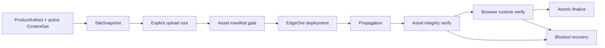

# v0.26.16 发布资产传输与运行时验证闭环方案

状态：产品/视觉主线正式方案，交 Engineering 实现；不回写 v0.26.15。

## 1. 问题重新定义

v0.26.15 的内容 SitePublication 记录为 released，但线上五个路由白屏。只读证据显示：HTML shell 能返回，HTML 引用的 JavaScript 与 CSS URL 却都返回同一份 `index.html`（`200 text/html`），浏览器因此没有挂载 React。相同 assembled client 在本地静态服务可以正常渲染。

这不是 Why、ResponsiveTextSlot、正文、媒体或页面视觉问题，而是发布闭环存在两个结构性缺口：

1. assembled client 到 EdgeOne 的上传源/资产映射没有被证明为一个可移植、逐文件可验证的发布目录；
2. `publicVerify` 只验证路由、manifest 和媒体，没有验证脚本/样式资产的 MIME、正文、完整性与真实浏览器运行时，因此错误 deployment 被 finalize。

## 2. 根本目标



发布成功的定义从“部署成功且页面 HTTP 200”升级为：

`可移植发布目录正确 → 静态资产逐项正确 → 传播后资产仍正确 → 浏览器真实挂载 → SitePublication 才能 finalize`。

## 3. 必须实现的产品/工具能力

### 3.1 明确、可移植的上传根

- 从 assembled client 物化一个独立 upload root，只包含最终 `index.html`、`assets/`、媒体和必要的 EdgeOne 配置。
- 不依赖隐藏 workspace 路径、当前工作目录、symlink、越界路径或目录 fallback 行为。
- `index.html` 引用的每个脚本/样式资产必须在 upload root 中存在且路径归一化后仍位于该 root 内。
- deploy 前生成 machine-readable asset manifest：路径、字节长度、hash、期望 MIME、来源 ProductArtifact/SiteSnapshot 身份。

### 3.2 部署前资产门禁

对所有 `script[src]`、`link[rel=stylesheet]` 和登记媒体执行硬校验：

- 路径存在、无重复、无越界、无 symlink 假设；
- 本地字节长度和 hash 与 upload root 一致；
- 期望 MIME 与文件类型一致；
- 资产正文不能是 index HTML fallback；
- 任一失败在 deploy 前停止，零 deployment 证据，不进入 finalize。

### 3.3 公网资产与浏览器运行时验证

`publicVerify` 必须从实际公网 `index.html` 解析全部脚本/样式引用，并逐项记录：

- status、MIME、长度、hash/正文指纹；
- 资产不是 HTML shell，且与本次 SiteSnapshot 的 upload manifest 一致；
- 通过唯一 `qa-browser-runtime` 打开 `/`、`/products`、`/business-observations`、`/observations`、`/about`；
- 记录 `#root` 子节点、`main=1`、`h1=1`、页面文本存在、console/pageerror、资产请求失败；
- 证据写入 publication，供 resume、审计和最终回传读取。

只有资产门禁与浏览器运行时门禁全部通过，才允许 `state=released` 和 atomic finalize。

### 3.4 失败、恢复与回退

- 当前坏 deployment `dp9g7iu2xbai`、SitePublication 和内容事实保持不可变审计记录；不重试、不手改、不删除。
- 新版本恢复时复用当前 active ContentSet，不重建内容、不修改正文/审核/media，不创建第二套内容生命周期。
- 新 publication/deployment 在验证前只能是 assembled/deployed/recoverable；验证失败不得标记 released。
- 同一 publication 的恢复只查询/验证同一 deployment，不盲目新建 deployment；需要恢复到上一已知正常快照时，使用显式授权的 CAS rollback，失败不污染 active。

## 4. 责任边界与兼容性

| 责任域 | 本版本职责 |
|---|---|
| 产品/视觉 | 定义发布成功语义、白屏阻断、验收门禁和不影响内容/页面的边界 |
| Engineering | 实现 upload root、asset manifest、Coordinator/publicVerify/runtime gate、恢复状态和回归测试 |
| 内容 task | 不改代码；继续使用现有 ContentSet Candidate/审核/内容身份 |
| Site Publication Coordinator | 唯一 EdgeOne transport、传播等待、资产/runtime verify 和 atomic finalize |

本版本 `contentImpact=compatible`：不改内容 schema、正文、审核、来源、媒体或 ContentSet 身份；只使既有产品/内容发布在错误静态资产时可靠失败，并支持同一合同下恢复。

```yaml
contentImpact: compatible
contentImpactReason: explicit-upload-root-and-static-asset-runtime-verification
affectedTargets: [publication-client-packaging, site-publication-coordinator, public-verify, qa-browser-runtime]
affectedRoutes: [/, /products, /business-observations, /observations, /about]
affectedFields: []
compatibilityEvidence: legacy-product-and-contentset-publication-package-renders-locally
```

## 5. 明确不做

- 不回写 v0.26.15，不修改其 commit/tag、SitePublication、deployment 或 manifest。
- 不重试 `dp9g7iu2xbai`，不直接调用 EdgeOne 绕过 Coordinator，不通过手工上传资产恢复。
- 不修改 Home、Products、Why、ResponsiveTextSlot、ContentSet、内容正文、媒体、页面 IA 或视觉。
- 不创建第二套发布器、第二套浏览器 resolver 或内容生命周期。
- 不把 HTTP 200、Deploy Success 或单页 title 当作线上完成。

## 6. 工程落点

- `scripts/lib/site-publication.mjs`：assembled client → explicit upload root、资产 manifest 与路径/完整性校验。
- `scripts/lib/site-publication-coordinator.mjs`：部署前资产门禁、传播后资产验证、浏览器 runtime gate、blocked/recoverable/finalize 状态。
- `scripts/verify-public-release.mjs` 及相关 QA：解析实际引用资产并验证 MIME/正文/长度/hash/runtime。
- tests：正确资产、HTML fallback、错误 MIME、缺资产、symlink/越界、传播旧版本、白屏、resume 幂等和 rollback。

## 7. 验收合同

1. 本地 assembled client 的 `index.html` 所有 JS/CSS/媒体引用均可逐项解析，manifest 与字节/hash 完全一致。
2. 错误 MIME、HTML fallback、缺失资产、路径越界、symlink、旧传播响应在 deploy 前或 publicVerify 阶段硬失败，且不 finalize。
3. 五路由真实公网浏览器运行时均满足 `#root` 有内容、`main=1`、`h1=1`、页面文本存在、console/pageerror=0；资产请求无失败。
4. 旧 active ContentSet 与 v0.26.15 内容身份可继续读取；本版本不运行 content publish，不修改内容事实。
5. `npm run check`、`release:prepare`、新增 asset/runtime targeted tests、分层 `release:qa`、`release:closeout-check`、exact `release:build`、`release:preflight`、`git diff --check` 全通过。
6. 产品/视觉本地验收、公网同 deployment 验收均通过后，才按持续授权执行受控 transport；任何新差异进入下一版本。

## 8. 下一动作

- Engineering 在本版本实现并完成 local commit/tag/clean、ProductArtifact/preflight。
- 产品/视觉完成本地验收后，由 Coordinator 以当前 active ContentSet 组装新 SitePublication 并执行一次受控恢复。
- design-ui 对同一 deployment 做公网视觉/运行时复验；content task 保持冻结，直到产品公网恢复完成。
