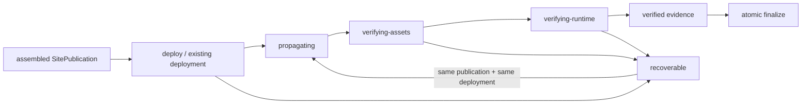

# v0.26.17 公网运行时验证状态机与恢复闭环方案

状态：产品/视觉主线正式方案，交 Engineering 实现；不回写 v0.26.16。

## 1. 问题重新定义

v0.26.16 已经修复了白屏事故的第一层根因：assembled client 使用显式 portable upload root，部署前和公网都校验 index/JS/CSS 的路径、字节、hash、MIME 与非 HTML fallback。

随后对同一 SitePublication/deployment=`dp3ft6f6df8i` resume 时，又暴露出第二层结构问题：公网已经可以读取合法 `release.json`、JS/CSS 和五个已挂载页面，但 Coordinator 在浏览器验证阶段长时间无阶段输出，最终被安全终止；持久记录仍停留在 `state=propagating`、`publicVerify=null`。这说明“浏览器能打开”和“Coordinator 能以可审计证据完成 finalize”之间仍缺少稳定的运行时就绪合同、阶段证据和中断恢复状态。

本版本不是增加等待时间或重复部署，而是把公网验证从“等待网络空闲”改为“验证应用就绪”，并使每一阶段都可以观测、超时、恢复和幂等重放。

## 2. 根本目标



发布成功的定义为：

`身份收敛 → 静态资产逐项通过 → 应用明确挂载 → 路由/媒体证据完整 → evidence identity 与 SitePublication 一致 → 才能 finalize`。

`networkidle2`、单页 HTTP 200、Deploy Success 或人工看到页面，都不能单独代表发布完成。

## 3. 必须实现的能力

### 3.1 应用就绪合同

- 浏览器导航等待 `domcontentloaded`，不再把 `networkidle2` 作为 SPA 完成条件。
- 每个路由在独立的有界时间内等待应用就绪条件：`#root` 有子节点、root 文本非空、`main=1`、`h1=1`、页面正文存在。
- 应用就绪条件与静态资源验证分离；视频、字体或其他长连接不得阻塞页面挂载判定。
- 媒体单独验证：登记媒体必须 HTTP status/MIME 正确；页面中存在视频时，以 `readyState`、`error` 和实际 `currentSrc` 判断媒体可用，不以页面整体网络空闲判断。

### 3.2 请求错误分类

浏览器证据必须区分：

- 脚本/样式请求失败：硬失败；
- 应用 `console.error`、`pageerror`：硬失败；
- 媒体在已达到 `readyState>=2` 且无 `HTMLMediaElement.error` 后因页面关闭产生的 `ERR_ABORTED`：记录为取消事件，不把它误报为资产损坏；
- 媒体未达到可用状态、存在媒体 error 或 HTTP/MIME 错误：硬失败；
- 浏览器启动、进程清理和本机权限错误：环境/运行时 Incident，不伪装成页面失败。

### 3.3 分阶段 machine-readable evidence

每一次公网验证写入同一个 SitePublication evidence envelope，至少包含：

```yaml
schemaVersion: publication-runtime-evidence-v2
publicationIdentity: sitePublicationId/snapshotHash/productArtifact/contentSet
attempt: number
phase: propagating | verifying-assets | verifying-runtime | verified
startedAt: timestamp
finishedAt: timestamp
routes:
  - route: /products
    status: 200
    domcontentloadedAt: timestamp
    appReadyAt: timestamp
    rootChildren: number
    main: 1
    h1: 1
    rootTextLength: number
    consoleErrors: []
    pageErrors: []
    assetFailures: []
    media: []
    verified: true
assets:
  index/js/css: status/mime/bytes/sha256/verified
result: verified | recoverable | failed
```

证据必须绑定当前 SitePublication identity；不允许把另一 deployment、手工截图或没有 identity 的浏览器结果写入 `publicVerify`。

### 3.4 有界执行与进度

- 每个 route、资产阶段和整个 browser run 都有明确 deadline。
- 每次 attempt、phase、route 开始/结束和失败原因都输出并持久化；不得出现数分钟无阶段输出的黑盒等待。
- timeout、SIGINT、浏览器进程异常都必须原子写入 `state=recoverable`、`failure.code`、`failure.phase`、`lastEvidence`，不得留下没有 `publicVerify` 的假 `propagating` 状态。
- `recoverable` resume 只读取同一 publication/deployment；已有 deployment 时不得再次调用 EdgeOne deploy。

### 3.5 恢复与 finalize 不变量

- `publicVerify` 只有在资产阶段与运行时阶段均为 `verified` 时才可写入。
- `state=released` 只能由与 SitePublication identity 完全一致的完整 evidence 触发。
- 同一 publication/deployment 的重复 resume 必须幂等，不重复 deployment、不创建第二个 snapshot、不修改 active ContentSet。
- 失败只保留 recoverable/recovery 记录；不得手改旧 failure、manifest、deployment 或 active pointer。
- v0.26.16 的白屏 deployment 与失败 SitePublication 保持不可变审计事实；恢复只复用既有 v0.26.16 active ContentSet 和新的正式验证器。

## 4. 责任边界与兼容性

| 责任域 | 本版本职责 |
|---|---|
| 产品/视觉 | 定义“应用可用”和“发布完成”的可观察门禁，不改变页面视觉 |
| Engineering | 实现 runtime readiness、错误分类、分阶段 evidence、timeout/interruption 状态与测试 |
| Site Publication Coordinator | 串行执行同一 publication/deployment 的传播、资产验证、runtime 验证和 finalize |
| 内容 task | 不改代码、ContentSet、正文、审核、来源或媒体；继续保持冻结 |
| design-ui | 公网 deployment 完成后按同一 deployment 做视觉/运行时复验 |

```yaml
contentImpact: compatible
contentImpactReason: runtime-verification-state-machine-and-recoverable-observability
affectedTargets: [site-publication-coordinator, public-verify, publication-runtime, publication-evidence]
affectedRoutes: [/, /products, /business-observations, /observations, /about]
affectedFields: []
compatibilityEvidence: v02616-content-enabled-five-route-runtime-and-existing-contentset-identity
```

## 5. 明确不做

- 不回写、重试、删除或修改 v0.26.16、deployment=`dp3ft6f6df8i`、旧白屏 deployment=`dp9g7iu2xbai`、SitePublication、ContentSet、正文、审核、来源、媒体、tag 或 history。
- 不增加页面 UI、IA、组件、视觉 token、ResponsiveTextSlot、Why 或内容 schema。
- 不把 `networkidle2` 换成更长等待作为唯一修复；不通过 sleep、盲目重试或人工改状态绕过门禁。
- 不创建第二套发布器、浏览器 resolver、evidence 事实源或内容生命周期。
- 不运行 content publish；产品公网恢复并完成 design-ui 验收前，内容 task 保持冻结。

## 6. 工程落点

- `scripts/lib/publication-runtime.mjs`：DOM/app-ready 等待、route deadline、media readiness 与取消事件分类、v2 evidence。
- `scripts/lib/qa-browser-runtime.mjs`：保留唯一 Chrome resolver、run cleanup 和 bounded process lifecycle；不引入第二浏览器。
- `scripts/lib/site-publication-coordinator.mjs`：阶段状态、progress/evidence 持久化、timeout/interruption recoverable、同 deployment resume 与 finalize invariant。
- `scripts/verify-public-release.mjs`：消费同一 v2 evidence 合同，输出可审计摘要。
- tests：networkidle 不可用但 app-ready 可用、真实 JS/CSS 失败、真实媒体失败、媒体 ready 后取消、路由超时、SIGINT/timeout recoverable、传播旧响应后收敛、同 publication resume 幂等、禁止第二 deployment。

## 7. 验收合同

1. 当前 active ContentSet 的 content-enabled staging 五路由可在有界时间内完成 app-ready，不依赖 `networkidle2`。
2. 每个 route、资产阶段和总 run 均有机器可读开始/结束/结果/错误证据；不得黑盒等待。
3. 真实脚本/样式错误、真实媒体错误、console/pageerror、DOM 未挂载均硬失败；已就绪媒体的关闭取消事件不误报为损坏。
4. timeout/SIGINT/浏览器异常均把 SitePublication 原子置为 `recoverable`，带 `failure.code/phase/lastEvidence`，不留下 `propagating + publicVerify=null` 的不明状态。
5. 同一 SitePublication/deployment resume 不重复 EdgeOne deployment，成功 finalize 只发生一次，active ContentSet 不变。
6. `npm run check`、`release:prepare`、runtime/coordinator targeted tests、分层 `release:qa`、`release:closeout-check`、exact `release:build`、`release:preflight`、`git diff --check` 全通过。
7. 产品/视觉本地治理验收通过后，仅允许复用同一已组装 publication 做一次受控恢复；公网完整 evidence 通过后才通知 design-ui；内容 task 继续停止。

## 8. 执行顺序

1. Engineering 读取本方案，在 v0.26.17 完成实现、测试、local commit/tag/clean、ProductArtifact/preflight。
2. 产品/视觉按本方案独立验收验证语义和 content-enabled staging 证据。
3. Coordinator 仅复用既有 v0.26.16 SitePublication/deployment，执行一次有界 resume；不新建 deployment。
4. 公网 evidence 全部通过并 atomic finalize 后，design-ui 对同一 deployment 做公网验收。
5. 只有产品公网恢复和 design-ui 验收完成后，才解除 content task 冻结。
