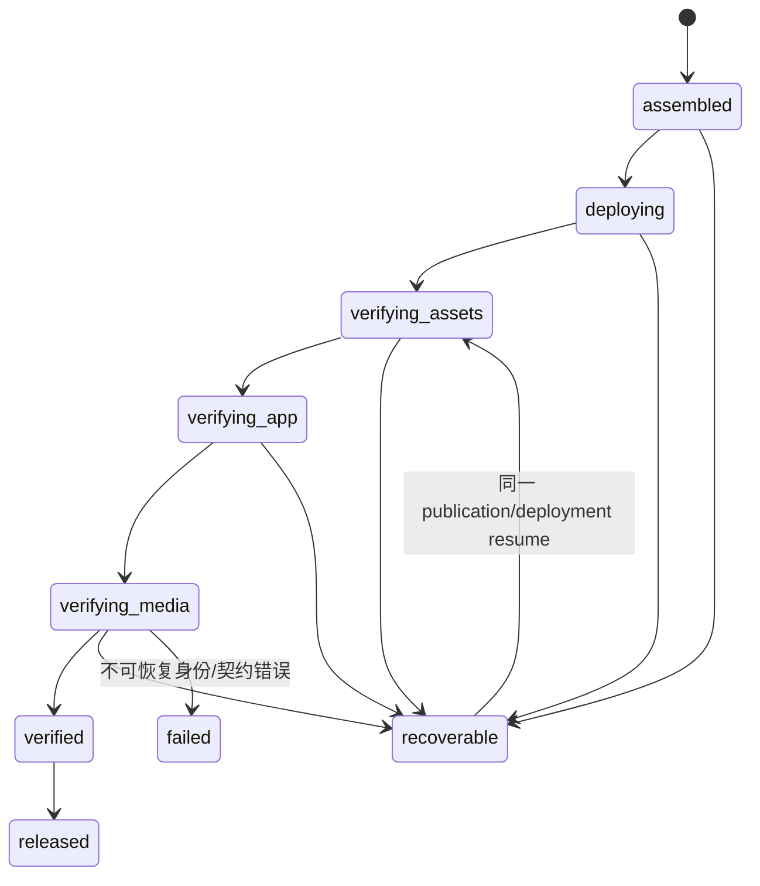

# v0.26.18 发布运行时媒体阶段与原子恢复方案

## 1. 目的

修复 v0.26.17 受控 resume 暴露的两个同源缺陷：

1. 路由 `app-ready` 与视频媒体就绪被放在同一次 route 检查中。页面完成挂载时，懒加载/未进入媒体请求的 `video.readyState=0` 被误判为媒体失败，导致已经可用的页面无法完成验证。
2. `onEvidence`、`onObservation` 和信号处理器可以分别写顶层状态。SIGINT 后虽然写入了 `phase=recoverable` 和中断 failure，但传播回调随后把顶层状态覆盖回 `propagating`，形成 `state=propagating + publicVerify=null` 的不一致事实。

本版本是发布控制面的结构修复，不是重新等待、增加 retry 或修改页面/内容的局部补丁。

## 2. 事实与边界

- v0.26.15 白屏 deployment `dp9g7iu2xbai` 不回写、不重试。
- v0.26.16 deployment `dp3ft6f6df8i` 和 SitePublication 保持原身份，仅允许后续一次受控 resume。
- v0.26.17 已实现 app-ready、阶段 evidence 和 recoverable 语义，但媒体检查与顶层状态写入仍有上述结构缺陷。
- v0.26.17 resume 已停止：只到 `/`，`root/main/h1` 正常，4 个视频 `readyState=0` 且无 media error；顶层记录为 `state=propagating`、`phase=recoverable`、`publicVerify=null`。
- 页面、IA、ResponsiveTextSlot、Why、ContentSet、正文、审核、来源、媒体身份和内容发布流程均不在本版本变更范围。

## 3. 正确的对象与状态边界



### 3.1 应用就绪（App readiness）

每个路由只证明页面应用已经可用：

- `domcontentloaded` 后在 route deadline 内等待 `#root` 有子节点、有文本、`main=1`、`h1=1`、body 有文本；
- 脚本/样式请求失败、console error、pageerror、HTTP/HTML shell 错误硬失败；
- 不读取 `video.readyState` 作为 app-ready 的必要条件；媒体 request failure 不在本阶段决定路由结果。

### 3.2 媒体资产可用（Media asset readiness）

媒体是独立阶段，不与路由挂载绑定：

- 由 SitePublication 的 asset manifest 显式登记 `contentManifest.mediaPaths`，每项带 path、MIME、bytes、sha256；
- 公网逐项验证 status、MIME、非 HTML fallback、bytes、sha256；
- 路由检查点的 `readyState=0` 记录为 `not-probed`，不能直接判定媒体损坏；
- 如需要浏览器媒体探针，必须使用独立 bounded probe，等待 `loadedmetadata/canplay` 或明确 error/timeout，关闭页面产生的 `ERR_ABORTED` 不得回写为应用失败；
- autoplay、muted、loop、controls、离屏暂停属于 design-ui 的页面交互验收，不由 app-ready 阶段重复推断。

## 4. 唯一状态写入者与原子收口

### 4.1 Coordinator 状态 reducer

新增单一 `transitionSitePublication`（或等价的唯一 reducer）作为顶层状态写入入口：

- `onEvidence` 只能追加 evidence envelope，不得直接改变顶层 state；
- `onObservation` 只能追加传播观察，不得把 state 写回 `propagating`；
- `SIGINT/SIGTERM/timeout/browser error` 先触发 abort，再由 Coordinator 统一 `transition(..., state=recoverable)` 并等待原子写入完成；
- `recoverable` 必须携带 `failure.code`、`failure.phase`、`lastEvidence`；
- 任何 `failure` 存在时，顶层 state 不得是 `propagating`；
- `publicVerify=null` 在 `recoverable` 中是合法的，不能被解释为未知状态。

### 4.2 Resume 不变量

- 同一 `sitePublicationId + snapshotHash + deploymentId` 才能 resume；
- resume 不创建第二个 deployment，不改变 active ContentSet；
- 已完成的 phase/evidence 可复用，未完成 phase 从最后一个一致 checkpoint 继续；
- finalize 只接受 `verified` 且所有 phase evidence identity 精确匹配的 publication；
- 失败写入和恢复写入均使用原子文件替换与 CAS，不能留下半个状态。

## 5. 证据合同

版本化为 `publication-runtime-evidence-v3`，保留 v2 只读兼容：

```yaml
schemaVersion: publication-runtime-evidence-v3
publicationIdentity: <exact SitePublication identity>
attemptId: <stable attempt>
phase: verifying-assets|verifying-app|verifying-media|verified|recoverable
startedAt: <iso>
finishedAt: <iso|null>
routes:
  /: { status, appReady, rootChildren, rootTextLength, main, h1, consoleErrors, pageErrors, assetFailures }
media:
  /media/...mp4: { status, contentType, bytes, sha256, browserProbe, verified }
failure: { code, phase, message, lastEvidence }
result: running|verified|recoverable|failed
```

每个 phase 和 route 都要写入开始、结束、结果；重启/中断后可从 evidence 判断下一步，不依赖终端是否仍有输出。

## 6. 工程范围

允许修改：

- `scripts/lib/publication-runtime.mjs`
- `scripts/lib/publication-assets.mjs`、SitePublication asset manifest 组装路径
- `scripts/lib/site-publication-coordinator.mjs` 及 publication evidence 持久化
- 相关 targeted tests、release gate tests、machine-readable QA evidence
- `VERSION.md`、package、current、design、history（由 Engineering 收口）

禁止修改：

- v0.26.17、v0.26.16、`dp3ft6f6df8i`、`dp9g7iu2xbai` 的历史事实；
- UI、IA、组件、tokens、ResponsiveTextSlot、Why、ContentSet schema、正文、审核、来源、媒体事实；
- active ContentSet、内容 task、ops-content；
- 任何第二套发布器、浏览器 resolver 或 evidence source。

## 7. 验收门禁

Engineering 必须覆盖：

1. app-ready 先于媒体，不使用 `networkidle2`，懒加载 `readyState=0` 不误判；
2. JS/CSS/console/pageerror、HTML fallback、真实媒体 MIME/hash 错误的失败分类；
3. media cancellation、media timeout、media error 的独立证据；
4. SIGINT、SIGTERM、route timeout、media timeout 后顶层必为 `recoverable`，不得出现 `propagating + failure`；
5. evidence v3 的 phase/route/media 断点、原子写入、CAS 与重复 resume；
6. 既有 v0.26.16 assembled client 五路由 content-enabled staging；
7. `npm run check`、`release:prepare`、targeted runtime/coordinator/assets tests、分层 `release:qa`、`release:closeout-check`、exact `release:build`、`release:preflight`、`git diff --check`。

产品/视觉本地验收通过后，才允许在既有 `dp3ft6f6df8i` 上进行一次有界 resume；公网资产、应用、媒体证据全部通过并 finalize 后，才通知 design-ui 做同一 deployment 验收。

## 8. 产品—内容兼容声明

```yaml
contentImpact: compatible
contentImpactReason: separate-media-readiness-and-atomic-publication-state
affectedTargets: [publication-runtime, publication-assets, site-publication-coordinator, publication-evidence]
affectedRoutes: [/, /products, /business-observations, /observations, /about]
affectedFields: []
compatibilityEvidence: existing-v02616-content-enabled-assembled-client-and-contentset-identity
```
