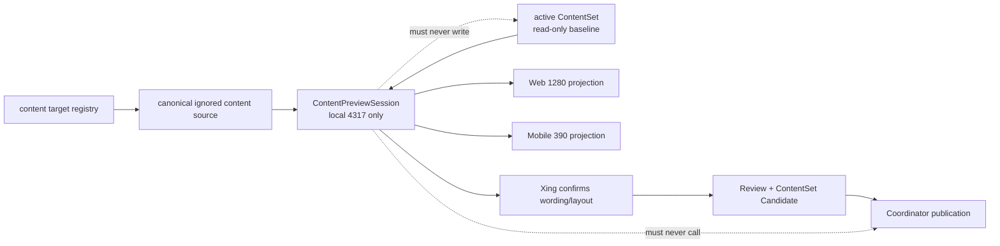

# v0.26.20 本地内容预览工作台与 Task 入场治理方案

状态：正式方案。由 elon 负责产品与架构合同，交 elon engin 实现；不回写 v0.26.19。

## 一、目标

让 Xing 与 elon ops 在正式发布前直接编辑 canonical ignored 内容源，并在本地网站即时看到真实页面的 Web/Mobile 投影、换行、媒体和页面组合效果。确认后的内容才进入既有 Review → ContentSet Candidate → Coordinator；本地预览永远不能改变 active ContentSet 或线上状态。

同时固化新 task 的入场、命名、责任、direct-local/worktree 和交接规则，使 elon1/elon2 等并行分析 task 能共享项目事实而不共享写入权。

## 二、根本边界



预览使用现有内容对象、ResponsiveTextSlot、page composition、媒体 manifest 和 Vite HMR。不得创建第二套 schema、第二套 renderer、第二套发布引擎或项目副本。

## 三、对象与状态

### 3.1 ContentPreviewSession

本地、短生命周期运行对象：

```text
mode=content-preview
cwd / HEAD / version / taskId
targetId / sourcePath / projectionRoutes
activeContentSetId (read-only baseline)
port=4317 / pid / startedAt
```

它只扩展现有 preview lease。产品普通预览和内容预览的 mode 必须不同；若 4317 已由另一 mode/HEAD/task 占用，停止并报告，不终止未知进程、不换端口。

### 3.2 内容源

唯一可编辑源仍是 target registry 映射到的：

```text
.content-workspace/content/**
```

例如：

```text
products.robotaxi.intro
→ .content-workspace/content/products/robotaxi.json
→ /products
```

active ContentSet、review、recovery、release package 和 SitePublication 都是只读对照，不是预览写入目标。

### 3.3 状态边界

```text
editing/previewed ≠ confirmed ≠ reviewed ≠ approved ≠ published
```

预览成功只证明页面能够本地投影当前文件，不授予审核或发布状态。

## 四、用户入口

新增唯一命令：

```bash
npm run content:preview:site -- --target-id products.robotaxi.intro
```

命令必须：

1. 读取 content target registry 并验证 targetId 可编辑；
2. 输出绝对 source file、fieldPath、projectionRoutes、active ContentSet baseline；
3. 验证源文件存在且 JSON 可解析；缺失时硬失败，不自动从历史 release/recovery 猜测或复制；
4. 以 XINGBUILD_CONTENT_BUILD=1 和显式 content-preview mode 启动现有 4317 supervisor；
5. 打开本地工作台 URL；
6. 不执行 prepare/build/review/approve/publish/finalize。

elon ops 可直接编辑输出的 source file。保存后，Vite 必须让对应真实页面自动刷新。

## 五、本地工作台

Vite dev-only 路径：

```text
/__xingbuild/content-preview?target-id=<registered-target>
```

只在 content-preview mode 可访问；普通 dev、ProductArtifact 和生产构建不存在该入口。

工作台最小信息：

- targetId、绝对 source file、fieldPath；
- 当前 active ContentSetId 与“只读基线”状态；
- “本地内容预览 · 未审核 · 未发布”；
- projectionRoutes；
- Web 1280 和 Mobile 390 两个真实页面 iframe/tab；
- 最近一次源文件加载状态与错误；
- 不提供 approve、publish、deploy、active 切换按钮。

工作台只承载控制信息；页面 iframe 使用真实组件、tokens、ContentSet adapter、ResponsiveTextSlot 和媒体渲染，不制作预览专用页面副本。

## 六、响应式与内容合同

- responsive-text-slot-v1 继续是 Web/Mobile 断行的唯一语义合同；
- Web/Mobile 使用同一 parts 文本，只允许各 projection 的 breakAfter 不同；
- 普通 string 继续自然换行；
- 预览不得引入 HTML、CSS、DOM selector 或页面私有换行补丁；
- 保存后两个视图同时刷新，间距仍由现有组件/tokens owner 决定；
- Why、Home、ProductHero、ShowcaseModule、Article、About 等均复用现有页面能力。

首个真实验收目标为 products.robotaxi.intro，并保持 Why、四媒体、CTA、ClosingAction 和页面独立性。

## 七、工程实现边界

允许：

- scripts/preview-runtime.mjs 的 mode/target 身份扩展；
- 新增 scripts/content-site-preview.mjs 或等价单一入口；
- vite.config.mjs 的 dev-only content-preview middleware/workbench；
- package.json 脚本；
- 预览状态、目标解析和零写入门禁测试；
- AGENTS.md、task-onboarding、baseline index、task registry；
- VERSION/package/current/design/history 与相关测试。

禁止：

- 修改 ContentSet schema、target registry 字段、ResponsiveTextSlot schema；
- 修改页面 IA、线上视觉、正文、review、media approval、active.json；
- 新建 CMS、数据库、第二套内容目录、第二套 publisher；
- 自动 materialize/复制历史 release、recovery 或 active 内容；
- 运行 content publish、product transport 或 EdgeOne；
- 创建 branch/worktree/task/automation。

## 八、验收标准

### 8.1 零写入

运行预览前后以下 identity/hash 必须完全不变：

- .content-workspace/content-state/active.json；
- active ContentSet 文件；
- reviews、recoveries、releases、SitePublication；
- Git tracked files（除本版本工程实现）；
- 线上 manifest。

### 8.2 定位与运行

- 注册 target 能精确输出 absolute source path、fieldPath、route；
- 未注册 target、unsafe path、缺文件、无效 JSON 均在启动前硬失败；
- 产品普通 preview 与 content preview mode 不混用 lease；
- 4317 被其他 owner 占用时停止，不换端口、不杀进程；
- source save 后 Web/Mobile 页面在有界时间内刷新；
- 工作台入口只存在于 content-preview dev mode。

### 8.3 真实页面

对 /、/products、/business-observations、/observations、/about 做轻量保持性检查；对 /products 做深验收：

- Web 1280 / Mobile 390 / Narrow 320 无横向溢出；
- main=1、h1=1、console/pageErrors=0；
- responsive intro 的 Web/Mobile breakAfter 生效且语义文本一致；
- Why 间距、四视频、CTA/外链、ClosingAction 保持；
- source 改动后无需 build/ContentSet Candidate/transport 即可看到本地效果；
- 恢复原内容后页面恢复基线。

### 8.4 Task 治理

- 新 task 只需读取 AGENTS.md → task-onboarding.md → baseline index 即可完成责任分流；
- elon/elon ui/elon engin/elon ops 及编号下属命名进入 active registry；
- elon1 使用 direct-local 只读，不创建 worktree；
- 未核验 threadId 的编号 task 不允许预登记。

## 九、内容与发布兼容

```yaml
contentImpact: none
contentImpactReason: local-content-preview-and-task-governance-only
affectedTargets: [preview-runtime, content-target-resolution, vite-dev-middleware, task-governance]
affectedRoutes: [local-only]
affectedFields: []
compatibilityEvidence: active-contentset-read-only-and-no-publication-side-effects
```

正式发布能力保持：

```text
Xing confirms → elon ops review → ContentSet Candidate
→ Coordinator SiteSnapshot → publicVerify → active CAS
```

本版本不会缩短或绕过该链路，只把“写什么、怎么换行、页面是否好看”的确认提前到本地。

## 十、执行与验收顺序

1. elon 完成正式 design/current 和 task 治理文件；
2. elon engin 实现单一 content-preview 入口、dev-only workbench、测试和版本闭环；
3. elon 做产品/架构验收；
4. elon ui 对本地 Web/Mobile 真实页面做独立验收；
5. 验收通过后，本地能力可交给 elon ops 与 Xing 使用；
6. 本版本是否 transport 仅按产品能力发布合同决定；不得因为本地预览而自动发布任何内容。
