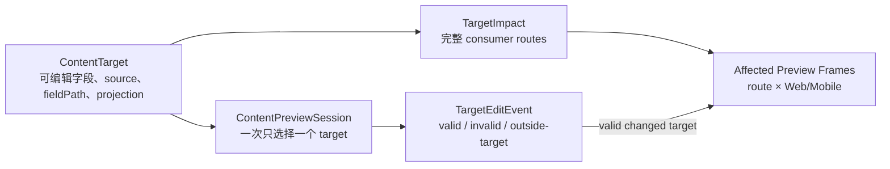

# v0.26.21 精准内容预览与局部刷新闭环方案

状态：正式方案。由 elon 负责产品与架构合同，交 elon engin 实现；不回写 v0.26.20。

## 一、问题与目标

v0.26.20 已建立本地 `ContentPreviewSession`，但它仍把内容文件变化处理成全站 `full-reload`，并只展示 `projectionRoutes[0]`。这不符合 Xing 的目标：修改一个内容 target 后，应立即、只在真实消费该 target 的页面中看到 Web/Mobile 结果；无关页面、构建、ContentSet 和线上状态都不能变化。

本版本只完成这一个闭环：

```text
选择一个 registered target
→ 编辑它的 canonical ignored source field
→ 校验该 target 的新值
→ 解析完整 consumer routes
→ 只刷新这些 route 的 Web/Mobile frame
→ 其他页面与所有发布状态保持不变
```

它不是 CMS、全站编辑器或发布器。

## 二、对象与唯一责任



### 2.1 ContentTarget

`content/registry/content-targets.json` 继续是“允许编辑什么”的唯一注册表。现有 `projectionRoutes` 必须表达该 target 的完整真实消费页面，不允许只登记主页面或示例页面。

- `products.robotaxi.intro` 被首页和 `/products` 使用，因此影响面必须同时包含 `/` 与 `/products`；
- Products-only Why 只影响 `/products`；
- Home positioning 只影响 `/`；
- 其他 target 由当前实际页面消费者逐项核对，不能按 source 文件粗略推断为全站。

不新增第二份 preview route map。页面定义用于验证 route 存在和内容对象归属；target registry 负责字段级影响面。两者发生冲突时启动前硬失败。

### 2.2 TargetImpact

由现有 target registry 和 page definitions 只读解析：

```text
targetId
sourcePath / fieldPath
projectionKeys
consumerRoutes[]
consumerViews[] = route × [web-1280, mobile-390]
```

`consumerRoutes` 必须去重、稳定排序且至少一项；未知 route、与页面 contentRef 不相容、projectionKey 未登记或实际消费者缺失时，预览不可启动。

### 2.3 ContentPreviewSession

一次 session 只聚焦一个 `targetId`。这保证 Xing 明确知道当前修改哪个字段，也使刷新边界确定。

- 选中 target 的值变化：验证通过后刷新它的全部 consumer frames；
- 同一 source 中其他字段变化而选中 target 未变：显示 `outside-selected-target`，不刷新页面；
- JSON 或 ResponsiveTextSlot 无效：显示错误并保留上一个有效页面，不把无效状态包装成成功；
- 修正后：错误消失，受影响 frames 刷新。

如果需要修改第二个字段，切换或重新打开该字段的 target session；不把整个 JSON 文件当作一个模糊变更对象。

## 三、精准刷新协议

删除 content-preview 下的全站：

```js
server.ws.send({ type: "full-reload", path: "*" })
```

替换为 dev-only target 事件：

```text
event: xingbuild:content-target-update
targetId
sourceHash / beforeValueHash / afterValueHash
status: valid | invalid | outside-selected-target
consumerRoutes[]
revision
error?
```

工作台只重载 `consumerRoutes` 对应的 iframe；普通页面 client 不响应该控制事件。Vite plugin 必须阻止该 ignored JSON 继续走默认全站 reload。

精准刷新不表示生产增量部署。它只优化本地确认环节：

- 不运行 build；
- 不生成 ProductArtifact；
- 不生成 ContentSet Candidate；
- 不写 active/review/recovery/release/SitePublication；
- 不访问 EdgeOne 或线上 manifest。

## 四、工作台

工作台按 target 的完整影响面生成视图，而不是固定取第一条 route：

```text
target: products.robotaxi.intro
├─ /          → Web 1280 / Mobile 390
└─ /products  → Web 1280 / Mobile 390
```

最小状态区必须显示：

- selected target、source、fieldPath；
- 完整 consumer routes 和 projectionKeys；
- active ContentSet 只读基线；
- 当前状态：`ready` / `valid-updated` / `invalid` / `outside-selected-target`；
- 最近一次校验时间、revision 和错误；
- “本地内容预览 · 未审核 · 未发布”。

工作台不提供视觉设计工具，不增加 approve、review、publish、deploy、active 或 ContentSet 操作。

## 五、Home canonical source readiness

`site.home.homeTitle` 与 `site.home.description` 已登记为 editable，但 canonical `.content-workspace/content/home.json` 缺失。该事实不能由产品代码或预览工具从历史 release 猜测。

由 elon ops 一次性把当前 active ContentSet 中已核验的 `homeContent` 原样物化为 canonical ignored source，并用现有 Home adapter 证明 hash 与 active home entry 一致：

```text
active homeContent（只读事实）
→ exact canonical home.json
→ adapter validation + contentHash equality
```

这一步不改变文案、审核、active ContentSet 或线上状态。预览工具仍保持“source 缺失即硬失败”，不内置自动恢复或复制逻辑。

## 六、验收 owner 与最小验证

本版本不改变正式网站 UI/IA/视觉，因此不调用 elon ui 做全站视觉验收。

验收 owner：

- elon：对象边界、影响面和零发布副作用；
- elon engin：功能、HMR、错误状态和零写入自动验证；
- Xing：实际打开工具，修改并恢复一项内容，确认使用效率。

### 6.1 必须自动证明

1. `products.robotaxi.intro` 只生成 `/`、`/products` 的 Web/Mobile frames；
2. 修改 intro 后只刷新这四个 frames，其他测试 route/frame 的 revision 不变；
3. 修改同文件非选中字段时，不刷新并显示 `outside-selected-target`；
4. 无效 JSON/slot 显示错误，页面保留上个有效状态；修复后恢复；
5. `site.home.homeTitle` 在 canonical home source ready 后可预览且只刷新 `/` 的两个 frames；
6. source 改动后有界时间内可见，不执行 build；
7. 测试结束恢复源文件 exact bytes/hash；
8. active pointer/ContentSet、reviews、recoveries、releases、SitePublications 和 ProductArtifact identity 前后完全不变；
9. 4317 lease、PID、profile 和临时状态正常清理。

### 6.2 Xing 实际确认

Engineering 收口后提供一个命令和一个本地 URL。Xing 只需：

1. 打开工作台；
2. 修改明确的 target 字段；
3. 看到受影响页面即时变化；
4. 恢复原文；
5. 确认操作是否足够直接。

这不是内容审核或发布授权。

## 七、工程边界

允许：

- 修正 target registry 的真实 `projectionRoutes` 元数据并增加跨 registry/page definition 一致性验证；
- ContentPreviewSession 的 TargetImpact、选中字段 hash 和状态；
- Vite dev-only custom event、精准 iframe refresh 和工作台状态；
- HMR/错误/零写入/清理测试；
- v0.26.21 VERSION/package/current/design/history。

禁止：

- 修改正式网站页面布局、组件视觉、tokens、文案或响应式策略；
- 新建 consumer registry、第二套 schema/renderer/content directory/CMS/publisher；
- 用 source 文件变化触发全站 reload；
- 自动从 active/release/recovery 复制缺失 source；
- 修改 active/review/recovery/release/SitePublication 或运行 content/product publish；
- 创建 branch/worktree/task/automation。

## 八、内容与发布兼容

```yaml
contentImpact: compatible-metadata-correction
contentImpactReason: correct-target-consumer-routes-and-local-preview-only
affectedTargets: [content-preview-session, target-impact, products.robotaxi.consumer-routes, site.home.source-readiness]
affectedRoutes: [local-only]
affectedFields: []
compatibilityEvidence: no-content-value-or-lifecycle-write-and-no-publication-action
```

target route 元数据修正只让影响报告更准确，不改变内容值、ContentSet identity 或发布生命周期。正式内容发布仍为：

```text
Xing confirms → elon ops review → ContentSet Candidate
→ SitePublication Coordinator → publicVerify → finalize
```

## 九、执行顺序

1. elon 写入本方案和 v0.26.21 current；
2. elon ops 独立完成 exact Home canonical source readiness；
3. elon engin 在 canonical main 实现精准影响面、刷新、状态与测试；
4. elon 做产品/架构验收；
5. Xing 做一次实际本地使用确认；
6. 本地能力完成不自动触发内容发布；产品 transport 按产品发布合同单独闭环。
