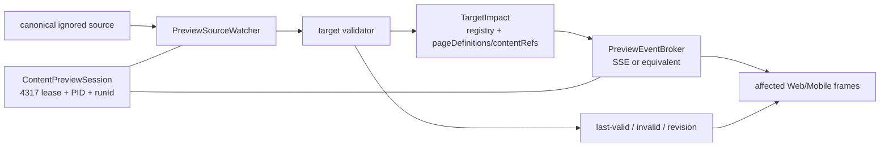

# v0.26.22 内容预览运行时 v2 与局部刷新闭环方案

状态：正式方案，已写入 `docs/iterations/current.md`，等待 Engineering 实现；不代表已实现、已验收或已发布。

父版本：v0.26.21 / `3bde62d80a1bb666ee5846e30dd10fa631fbf29f`

## 一、结论先行

本版本不是再给 Vite HMR 加一个补丁，而是把“内容修改后本地如何更新页面”定义成独立的 Preview Runtime（预览运行时）能力：一个 source、一个 target、一个影响面解析器、一个本地事件通道、受影响的 Web/Mobile frame。

它只解决 Xing 的本地工作闭环：改内容 → 立即看到真实消费页面 → 错误不白屏 → 只刷新受影响页面 → 退出无残留。它不改变页面产品能力、内容发布生命周期或线上发布链。

## 二、问题与根因

### 已知事实

v0.26.21 的 reducer、target impact 和“禁止全量 reload”定向测试通过；一次真实浏览器编辑中，源文件 hash 发生变化，但四个 consumer frame 的 revision、URL 和 DOM 均不变。

### 直接根因

自定义 workbench HTML 没有包含可运行的 Vite HMR client，内联 `import.meta.hot` 没有被 Vite transform；因此文件变化不会进入浏览器事件链。

### 结构性根因

预览能力依赖开发服务器的隐式模块热更新，而不是自己拥有“source change → validate → targeted event → frame update”的可验证协议。只修 HTML 注入或再加一次监听，会继续把运行时责任分散在 Vite、iframe 和页面代码之间。

## 三、目标、边界与非目标

### 目标

- Xing 修改登记内容后，在固定 4317 的真实页面立即看到 Web1280/Mobile390 结果。
- 只更新字段实际影响的 route×viewport；无关页面的 URL、revision、DOM、导航计数不变。
- 半写入或非法内容保持 last-valid，错误可见且可恢复，不出现白屏。
- Web/Mobile projection 与 `ResponsiveTextSlot` 的换行规则来自同一 canonical source，不在预览工作台复制一套 schema。
- 预览会话可追踪、可终止、可清理，且不写入发布生命周期。

### 非目标

- 不修改正式 UI/IA/视觉、组件、tokens 或文案。
- 不新增 CMS、数据库、第二套 ContentSet/registry/renderer、页面私有内容源或全量刷新协议。
- 不构建 ProductArtifact、ContentSet、SiteSnapshot，不执行 review、approve、release、finalize、transport、content publish 或 EdgeOne。
- 不迁移、归档、删除历史 QA、releases、site-publications、base-site-artifacts 或 recoveries。
- 不创建 worktree、branch、automation 或并行 task。

## 四、最小系统模型



### 对象责任

| 对象 | 唯一责任 | 禁止承担的责任 |
| --- | --- | --- |
| `ContentTarget` | 登记 target、field、source、projection、安全校验 | 不保存页面布局或发布状态 |
| `TargetImpact` | 解析真实 consumer routes/views | 不手工复制第二份映射 |
| `ContentPreviewSession` | 绑定 HEAD、4317、PID、selected target、生命周期 | 不写 active/release 状态 |
| `PreviewSourceWatcher` | 监听 selected source，处理 rename/partial/debounce | 不监听整个仓库或发布目录 |
| `PreviewEventBroker` | 传递可验证的局部更新事件 | 不触发 build/publish |
| `FrameManager` | 更新受影响 frame，保留无关 frame | 不执行 full reload |

## 五、事件与状态合同

事件最小字段：

```json
{
  "type": "valid-updated",
  "targetId": "products.robotaxi.intro",
  "sourceHash": "sha256:...",
  "valueHash": "sha256:...",
  "revision": 2,
  "consumerViews": [
    {"route": "/", "viewport": "web-1280"},
    {"route": "/products", "viewport": "mobile-390"}
  ]
}
```

状态只允许以下闭环：

```text
ready → validating → valid-updated
                   ↘ invalid → last-valid
valid-updated → outside-selected-target（无刷新）
invalid → validating → valid-updated（恢复）
```

必须拒绝：未知 target、未登记 projection、越界 fieldPath、空文本、非法 breakAfter、半写入 JSON、重复 revision、过期 sourceHash、乱序事件和跨 session 事件。

## 六、局部刷新规则

- `products.robotaxi.intro`：由 registry 与 page definitions 解析 `/`、`/products`，只刷新这两个 route 的 Web/Mobile frame。
- Products-only `practice.why`：只刷新 `/products`。
- `site.home.homeTitle`：只刷新 `/`。
- 同一 source 内未被选中的 target：返回 `outside-selected-target`，不导航、不刷新。
- 其他路由的 frame URL、DOM、revision、导航次数和媒体播放状态保持不变。

## 七、原子保存与错误处理

Watcher 必须处理编辑器常见的“写临时文件 → rename 覆盖”流程：

1. debounce 同一 source 的短时间事件；
2. 重新读取完整字节并校验 JSON/target/schema；
3. 校验失败时保留 last-valid snapshot，不把半写入值推送到 frame；
4. 校验成功才递增 revision 并广播事件；
5. 连续事件按 sourceHash/valueHash 去重；
6. source 删除或暂时不可读显示 recoverable error，恢复后自动回到 valid-updated。

## 八、零写入与清理

允许读取：canonical ignored content、target registry、page definitions、review/draft、approved media manifest、active ContentSet hash/baseline。

禁止写入：产品源码、schema/CSS/组件、active.json、ContentSet、review/recovery/release、ProductArtifact、SitePublication、deployment、EdgeOne。

每个 session 的 lease、PID、browser profile、临时缓存和临时截图必须可归属、可终止、可清理。SIGINT/SIGTERM/timeout/浏览器失败都要记录 cleanup 结果，并保证不会留下 orphan lease、owned process、profile/temp residue。长期 QA 只保存最小摘要和 hash，不把运行时 profile 作为证据。

## 九、验收矩阵

| 场景 | 必须观察到 |
| --- | --- |
| 有效编辑 `products.robotaxi.intro` | 约定时限内 `/` 与 `/products` 四个 frame 更新，revision +1，文本/换行正确 |
| 无关 route | URL、DOM、revision、导航计数不变 |
| 非选中字段 | `outside-selected-target`，无刷新 |
| 非法/半写入 | `invalid`，last-valid 保留，无白屏 |
| 修复有效值 | 只刷新受影响 frame，revision 单调递增 |
| 重复/乱序事件 | 去重或拒绝，不回退页面 |
| 会话刷新/退出 | hash、identity 保持；lease/PID/profile/temp 清理可证明 |
| 生命周期快照 | active ContentSet、review/recovery/release/SitePublication/ProductArtifact byte/hash 不变 |

工程完成还需要：`npm run check`、内容兼容/target 定向测试、真实固定 4317 浏览器证据、`git diff --check`、exact build、preflight、clean。全站视觉验收不是本能力的必要门槛；只有改变 UI/IA/视觉时才交 elon ui。

## 十、责任与交付顺序

1. `elon` 维护产品合同与当前版本；不把预览运行时缺陷扩大为页面视觉任务。
2. `elon engin` 实现 watcher、validator、broker、frame manager、cleanup 和证据。
3. Xing 进行一次真实内容编辑，确认“立即看到、只更新影响面、错误可恢复、退出无残留”。
4. 之后才决定是否完成产品版本 transport；内容发布依旧由 `elon ops` 独立按 ContentSet 生命周期执行。

## 十一、与后续候选的边界

- 历史过程截图、浏览器 profile、releases、site-publications、base-site-artifacts 的引用盘点与可恢复清理：见 `XBUILD-HISTORICAL-DERIVED-ARTIFACT-CLEANUP-001`，不进入本版本。
- 内容当前状态、有限历史、派生快照和保留窗口的数据模型：见既有 `XBUILD-CONTENT-DATA-LIFECYCLE-001`，不因本版本自动迁移或删除。
