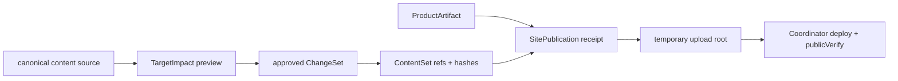

# v0.27.0 内容生命周期、变更复用与派生物治理方案

父版本：v0.26.32 / `50643e6ea1edac080759e292d30b447aff64b293`
来源候选：`XBUILD-CONTENT-LIFECYCLE-GOVERNANCE-001`
contentImpact：compatible；不改变页面、内容事实或发布身份。
协作记录：本版本 record-only 核验并修正活动 task 的 hostId；不改变职责、threadId 或产品产物。

## 目标

让一次内容修改只产生必要的变更对象，历史派生物可追溯、可复用、可恢复；不再因局部修改复制或重建整站。

## 架构合同

- 每个 `logicalContentId` 一个 current，最多两个历史 revision；revision 保存 source/value hash 与前序引用，不复制整站。
- `ChangeSet` 只产生变化 target 的 revision/ref；未变化 target、媒体、静态资源的 identity/hash 不变并复用。
- `SitePublication` 只保存 ProductArtifact、ContentSet、manifest、deployment、publicVerify、recovery 引用；完整 client 只在临时 upload root 物化。
- 相同 ProductArtifact + ContentSet + manifest 必须确定性重建相同 snapshot/hash；失败不改变 active，同一 publication/deployment 可恢复。
- inventory 可重跑，交叉 active ContentSet、receipt、registry、lineage、SitePublication、recovery、Incident、lease；未知引用一律保留。
- 输出 `keep`、`review`、`archive-dry-run`、`delete-never` 清单；v0.27.0 只做零写入、可恢复 dry-run，不删除或迁移。

## 实现范围

- `DL-01`～`DL-04`：生命周期模型、ChangeSet/ref 复用、SitePublication 引用收敛、确定性重建与恢复。
- `CL-01`～`CL-04`：可重跑 inventory、引用图、保留分类、无写入 dry-run。
- `CL-05`（保留窗口与物理清理）不进入本版本，需 Xing 另行授权。

## 不变边界

- 不改页面 IA、组件、视觉、schema、正文事实、审核事实、active ContentSet 或线上状态。
- 不新增 CMS、第二套发布器、数据库或事件系统；只保留现有 ContentSet 流程和 Site Publication Coordinator。
- 预览仍按 target → `consumerViews` 局部刷新；不触发无关 route、全站 reload/build、ProductArtifact 或 ContentSet 写入。
- 本版本无页面表现变化，不触发 `elon ui`；不运行内容发布或 `elon ops`。

## 验收清单

1. 一个 target 变化时，只有该 target revision/ref 改变，其他 identity/hash 不变。
2. 相同 ProductArtifact + ContentSet + manifest 重建相同 snapshot/hash。
3. SitePublication 长期记录只含引用、manifest、deployment、publicVerify、recovery 事实。
4. inventory 可重跑；dry-run 前后 active/review/recovery/release/SitePublication hash 不变。
5. 中断或失败不改变 active；同一 publication/deployment 可恢复；未知引用不清理。
6. v0.27.0 不执行物理删除；`CL-05` 保持单独授权门禁。

## 执行顺序

协作记录 → 生命周期/ref 模型 → ChangeSet 与复用 → inventory/引用图/dry-run → 定向回归与 release gates；不迁移、不删除、不发布内容。
