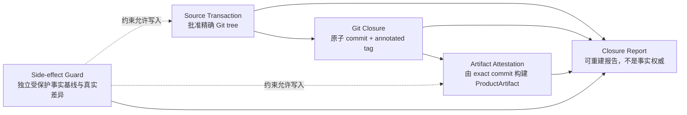
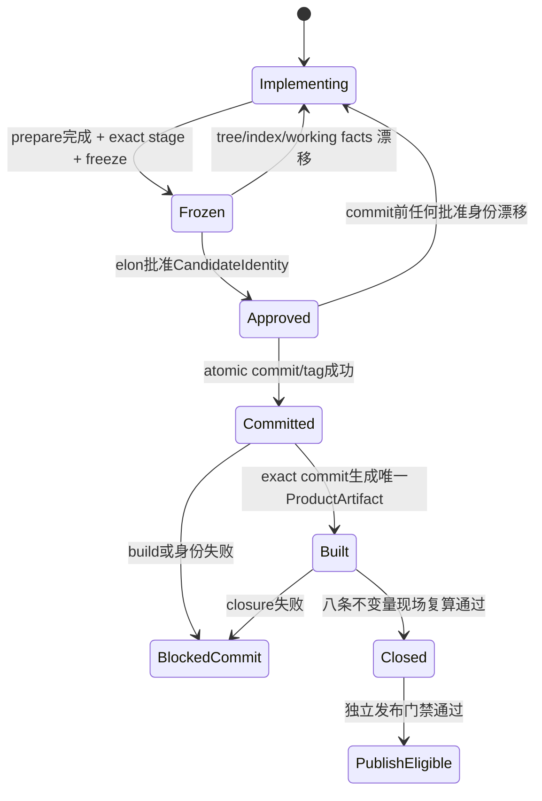
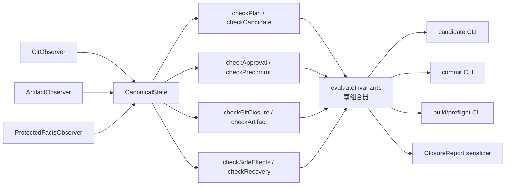

# v0.28.1 Release Transaction 单一权威与封闭验收方案

状态：产品方案已重构；Engineering 必须在 Xing 确认后才能恢复

版本：v0.28.1

父版本：v0.28.0 / `f7146bf654a9f6fd6467255746d6a07d9eec47c7`

父版本状态：`BLOCKED_LOCAL_ARTIFACT`，未 transport、未 content publish、未 EdgeOne 发布

方案 owner：`elon`

实现 owner：`elon engin`

## 1. 决策结论

v0.28.1 不再沿 R1～R4 的逐 validator 补丁路线继续演进。旧方案的根本问题不是少了某个 hash，而是把批准、Git、制品、内容保护和证据展示混成一套重复事实系统：生成器写一份事实，validator 再相信这份事实，不同层复制同一字段，验收阶段因此不断发现新的遗漏。

本方案改为四条相互独立、边界封闭的证明链：



核心原则固定为：

1. 一个事实只有一个权威来源；其他对象只保存引用，不复制第二套事实。
2. 批准对象只锚定 Git tree，不承担构建、内容生命周期或发布结果。
3. ProductArtifact 只证明“由哪个 exact commit 构建”，不反向定义 Git 或批准事实。
4. 内容与历史制品保护由独立的 canonical filesystem diff 证明，不由 lifecycle evidence 自述。
5. evidence 是可删除、可重建的报告或缓存，不参与决定事实是否成立。
6. 验收只检查本方案预先定义的八条不变量；验收阶段不得临时增加新性质。
7. 复杂度必须随权威对象数量而不是受保护文件数量增长：身份与报告保持常量级，逐路径事实只允许在一份 SideEffectBaseline 中出现一次。

## 2. 问题、目标与非目标

### 2.1 已确认问题

- v0.28.0 的 `READY_FOR_COMMIT` 没有持久的机器对象，批准时的 scope 与最终 commit scope 发生漂移。
- 后置 gate 把重新生成后的 manifest 当作新权威，只证明最终状态内部自洽，不能证明它仍是批准对象。
- v0.28.1 R1～R3 虽建立 Candidate/Approval/Closure，但又把同一事实复制进 checklist、lifecycle、preflight、artifact 和 closure，形成新的多权威问题。
- R1～R3 的测试主要证明各 evidence 相互一致，没有先固定完整信任边界与有限完成条件，因此验收变成开放式漏洞扫描。
- scope manifest 同时保存路径分类和 tracked bytes hash，使它与 Git tree 竞争字节身份；ProductArtifact 又在三份 manifest 重复批准字段，任何新增字段都要在多个读写器和测试中同步。
- 历史 base-site artifact 每个版本复制完整 source，内容发布仍保留依赖 source copy 的旧路径；这把 Git 已经拥有的源码 provenance 再复制一遍，放大存储、验证和迁移成本。

2026-08-16 的 canonical 只读盘点量化了浪费：R3 的 `.content-workspace/qa/v0.28.1` 为 36 MB，其中 lifecycle evidence 32 MB、candidate check 2.3 MB、candidate envelope 1.2 MB；四个历史 base-site artifact 共 12 MB/863 个文件，均含完整 `source/`。这不是“证据更严谨”，而是同一事实被重复物化。v0.28.1 的设计目标包含实质删除这种线性复制。

### 2.2 本版本唯一目标

建立一条可回答以下问题的本地产品收口事务：

```text
elon 批准了哪个 Git tree？
最终 commit/tag 是否就是该 tree？
ProductArtifact 是否只由该 commit 构建？
上述过程是否没有改写产品版本之外的受保护内容事实？
```

### 2.3 明确非目标

- 不防御拥有本机 root 权限、可任意改写进程内存或 Git object database 的恶意执行者。
- 不引入 PKI、远程签名、远程审批服务、透明日志或多用户权限系统。
- 不证明硬件、操作系统、Git SHA-1 或 SHA-256 算法不存在实现缺陷或碰撞。
- 不把内容 review/release、SitePublication、transport、EdgeOne 或公网结果并入 Release Transaction。
- 不修改页面 IA、组件、视觉、正文、媒体、ContentSet、active ContentDataArtifact 或 SitePublication。
- 不修改、删除、移动或重打 v0.28.0 commit/tag，不把 v0.28.0 ProductArtifact 恢复为可发布。
- v0.28.1 不执行产品 transport、content publish 或 EdgeOne。

这组非目标构成封闭威胁边界。验收中发现边界之外的风险，不得临时扩展本版本；只有它直接推翻本方案八条不变量时，才退回产品设计，而不是继续增加补丁。

## 3. 单一权威模型

| 事实 | 唯一权威 | 允许的派生对象 | 禁止作为权威 |
| --- | --- | --- | --- |
| 本次提交的全部 tracked bytes | Git `treeOid` | scope/path 解释报告 | working tree、scope digest、聊天消息 |
| 谁批准了哪个候选 | canonical `ApprovalRecord` | annotated tag 内的 durable copy | Engineering 自述、普通 READY 消息 |
| 最终提交身份 | Git commit object + annotated tag object | ClosureReport 引用 | VERSION/history 中的自填 commit hash |
| 产品制品身份 | `release.json` 根 manifest + 其绑定的 subordinate manifest hash | adapter 复算的 `ProductArtifactIdentity`、preflight/ClosureReport 引用 | subordinate manifest 中重复的批准身份、任一旧 dist |
| 内容与发布事实是否被改写 | closure 时现场采集的 filesystem snapshot 与批准基线的真实 set diff | SideEffectResult | lifecycle evidence、`onlyAllowedDelta=true` 等布尔自述 |
| 是否可进入发布分流 | 现行发布规则的独立 gate | publish intent | Release Transaction 的 PASS 报告 |

scope manifest 只声明 `version/baseHead/path/classification/owner/reason/state` 等范围分类事实；`scopeDigest` 只覆盖这份分类声明。它不保存逐路径 bytes hash。VERSION、current、design、history 和所有 tracked bytes 已包含在 Git tree 中，最终字节身份只由 `treeOid` 负责。现有 classifier/schema/rules 中要求 `pathHash` 的实现必须在本版本统一移除，不能保留为兼容权威。

## 4. 核心对象

### 4.1 `ReleaseCandidate`

freeze 前由 Engineering 维护的可变 staged 候选，包含本版本全部 `implementation + record-only` tracked 变更。它不是批准事实。

### 4.2 `CandidateIdentity`

freeze 对 exact index 形成的最小不可变身份：

```json
{
  "schemaVersion": "release-candidate-identity-v1",
  "version": "v0.28.1",
  "baseHead": "<commit>",
  "treeOid": "<git tree>",
  "scopeDigest": "<explanatory scope digest>",
  "protectedBaselineHash": "<SideEffectBaseline hash>",
  "candidateHash": "<canonical payload sha256>"
}
```

约束：

- `treeOid` 是候选全部 tracked bytes 的唯一锚点。
- freeze 前必须证明 working tree 与 index 一致、未知 untracked 为空、scope classifier ready。
- 版本/current/design/history/scope 的一致性必须在 freeze 前检查；freeze 后不得靠修改文件修复。
- Candidate 只保存身份，不嵌入命令 stdout、14 项 PASS 副本或 post-commit 预测状态。

### 4.3 `ApprovalRecord`

`elon` 对一个 CandidateIdentity 的唯一批准事实：

```json
{
  "schemaVersion": "release-approval-record-v1",
  "version": "v0.28.1",
  "candidateHash": "<candidateHash>",
  "baseHead": "<same baseHead>",
  "approvedTreeOid": "<same treeOid>",
  "approver": {
    "task": "elon",
    "threadId": "<approved tree 中的 active elon>",
    "registryPathHash": "<sha256>"
  },
  "verdict": "READY_FOR_COMMIT",
  "approvalHash": "<canonical payload sha256>"
}
```

约束：

- Engineering 只能生成 CandidateIdentity，不能生成 ApprovalRecord。
- `elon` 通过正式入口生成 ApprovalRecord，不手工拼 JSON。
- 当前可信单用户环境无法从文件字节密码学证明“实际由哪个 task 按下命令”；Engineering 不代调属于责任与交接门禁，机器只验证 record 中的 approver snapshot 来自 approved tree 的 active `elon`。若未来需要验证真实调用者，必须升级到签名/远程审批，属于本版本非目标。
- commit 前 ignored candidate/approval/baseline 文件是操作输入；commit 后 annotated tag 中的 canonical CandidateIdentity、ApprovalRecord 与同一 SideEffectBaseline 是 durable authority。
- 缓存存在时必须与 tag canonical exact-equal；缓存缺失不影响恢复；缓存不一致硬失败。
- ApprovalRecord 不含 RT checklist、build PASS、tag PASS 或 closure PASS。

### 4.4 `ReleaseCommit`

由已批准 tree 构造的 Git commit 与 annotated tag：

```text
commit.parent  == ApprovalRecord.baseHead
commit.tree    == ApprovalRecord.approvedTreeOid
commit trailer == ApprovalRecord.approvalHash
tag.target     == commit
tag.body       contains canonical CandidateIdentity + ApprovalRecord + SideEffectBaseline
```

tag 中只持久化这一份逐路径 baseline；其 hash 必须等于 CandidateIdentity.protectedBaselineHash，ApprovalRecord.candidateHash 必须等于 CandidateIdentity.candidateHash。commit 与 tag object 必须先完成构造和验证，再通过一个 Git ref transaction 同时创建 tag、移动 `main`；任何失败均不得留下部分 ref 状态。

### 4.5 `ProductArtifactIdentity`

`dist/client/release.json` 是 ProductArtifact 唯一根 manifest，负责保存并绑定：

```text
productVersion
productCommit
productArtifactId
productArtifactHash
baseSiteArtifactId
approvalHash
candidateHash
approvedTreeOid
contentManifestHash
baseSiteArtifactManifestHash
```

`productArtifactHash` 不是对包含自身的 `release.json` 做递归 hash，而是对以下 canonical payload 计算 SHA-256：根 identity 中除 `productArtifactHash` 外的字段，加上按路径排序的 deployable client 文件清单及 hash；文件清单排除 `release.json` 本身。这样根 manifest 可以验证全部部署 bytes，同时不存在自引用。

`content-manifest.json` 与 `base-site-artifact.json` 只保存各自领域事实，不重复根 manifest 已拥有的 product/approval/candidate/tree identity。唯一 adapter 必须：

1. 读取并验证 `release.json` 的完整根身份；
2. 复算两个 subordinate manifest 的 bytes hash，与根 manifest 的引用 exact-equal；
3. 复算静态制品根 hash，确认 `productCommit`、artifact id 与 approval identity 一致；
4. 输出一个规范 `ProductArtifactIdentity`，不选择“第一个非空值”，也不接受旧 dist。

删除、替换根字段或篡改任一 subordinate manifest 都必须硬失败；不再用“三份都复制同一字段”证明连续性。

### 4.6 `SideEffectBaseline` 与 `SideEffectResult`

这是独立于批准/Git/制品的零写入证明。

`SideEffectBaseline` 在 candidate commands 之前现场采集，保存：

- immutable roots：内容源、active pointer/sets、ContentDataArtifact roots/objects/receipts、SitePublication、publication-runs、recoveries；
- append-only allowed root：`.content-workspace/base-site-artifacts` 的逐路径、类型、mode、size、symlink target 或 SHA-256；不保存原始文件 bytes；
- canonical path ordering、policy version 与整个 snapshot hash。

逐路径记录只属于一个逻辑 SideEffectBaseline payload：commit 前是 ignored 操作输入，commit 后 exact copy 进入 annotated tag 并成为 durable authority；其余 precommit cache 可删除。CandidateIdentity、ApprovalRecord、lifecycle、preflight 与 ClosureReport 只保存 baseline hash 或判定摘要，不得再次嵌入完整文件清单、完整 snapshot、命令 stdout 或跨阶段 checklist。

candidate commands 完成后必须再次现场采集并与 baseline exact-equal；不同则 freeze 失败，不能把副作用拖到 post-commit closure 才发现。CandidateIdentity 绑定的是已经通过该 before/after 比较的 baseline hash。

closure 时不得读取 lifecycle evidence 代替现场事实，必须重新采集 filesystem，并计算真实集合差：

```text
immutableRoots.before == immutableRoots.after
existingArtifactRecords.before == existingArtifactRecords.after
deletedRecords == []
modifiedExistingRecords == []
addedRecords 全部位于 expected ProductArtifact subtree
extraAddedRecords == []
```

允许的唯一 delta 是一个此前不存在的最小 ProductArtifact record：

```text
.content-workspace/base-site-artifacts/<expected baseSiteArtifactId>/
```

该 subtree 的新格式固定为一个 immutable `client/`：它是 `dist/client` 的 exact 部署 bytes 副本，内含根 `release.json` 与必要 subordinate manifest；除此之外不得出现 `source/`、repository 文件或第二份 descriptor。内容寻址去重不是 v0.28.1 的必要条件，暂不增加 CAS 层。若目标 subtree freeze 前已经存在，build 必须停止，不得覆盖或把旧目录重新解释为本次 delta。

v0.28.1 起 Git commit/tag 是源码 provenance 的唯一权威，正常 product build 和 content-only publication 都不得依赖 `.content-workspace/base-site-artifacts/<id>/source`。content-only publication 必须从当前 ProductArtifact record 的 immutable `client/` 读取已构建 JS/CSS/runtime bytes，在临时 upload root 与 ContentDataArtifact 组装，不从 source copy 重新 build。历史 artifact 中已有的 source bundle 只读保留为 provenance；本版本不迁移、不删除。任何仍要求 `sourceDirectory` 的旧 assembly 入口必须退出正常 release/content 路径并显式失败，不得为了兼容继续生成第五份 source copy。

`onlyAllowedDelta` 等布尔字段不能作为输入；它只能是完成真实 set diff 后的派生结果。

### 4.7 `ClosureReport`

ClosureReport 只保存八条不变量的判定、canonical authority 引用和失败原因。它可删除、可重建，不参与决定 commit/tag/artifact 是否有效；validator 必须从 Git、artifact 和 filesystem 重新观察事实，不能让 report 自证。

## 5. 状态机



规则：

- freeze 前允许修改、生成、格式化、stage 和重新运行检查。
- freeze 后到 commit 前，任何 tracked/index/执行源变化都使 Candidate 与 Approval 失效，回到 `Implementing`。
- commit 后不再修改该 commit/tag；失败进入 `BlockedCommit`，由下一版本修复。
- `Closed` 只表示本地事务完成，不表示部署或公网完成。

## 6. 每阶段允许写入

| 阶段 | 允许写入 | 禁止写入 |
| --- | --- | --- |
| prepare / implementing | 本版本声明的 tracked 文件与 index | v0.28.0 tag/commit、active content/publication facts |
| candidate check + freeze | ignored CandidateIdentity、SideEffectBaseline、独立 test report | tracked bytes、index、受保护 roots |
| approval | ignored ApprovalRecord | tracked bytes、index、Git refs、ProductArtifact |
| commit | Git objects、tag 内 durable Candidate/Approval/Baseline 与一次性 refs transaction | tracked/index 自动修复、build、受保护 roots |
| build | `dist/client` 与一个仅含 immutable `client/` 的全新 ProductArtifact record | tracked/index、旧 ProductArtifact、内容/publication roots、repository source 副本 |
| closure / preflight | ignored ClosureReport | tracked/index、Git refs、artifact、内容/publication roots |
| publish | 不属于本版本 | 本版本明确禁止执行 |

任何工具捕获 observer 错误后将字段写成 `null` 并继续 PASS，均视为合同违约；观察失败必须硬失败。

## 7. 单一验证架构

Engineering 只能实现一套观察层和一组按不变量分离的纯判定器：



- observer 只读取 canonical authority；读取失败硬失败。
- 每条不变量只由对应 predicate（判定器）拥有；`evaluateInvariants` 只是组合与路由，不包含新的领域规则，避免形成新的 God function（上帝函数）。
- candidate、closeout、preflight、publish 调用同一组 predicate，不得各自复制不同规则或另建 checklist 语义。
- serializer 只能输出判定结果，不能反向给 validator 提供事实。
- scope classifier 只负责路径集合与 `implementation/record-only/excludedExternal/unclassified` 分类；tree OID 负责全部 tracked bytes，两者不得互相替代。
- 正式 CLI 必须调用同一内核；测试只调用 helper 不能作为正式链通过证据。

## 8. 八条封闭不变量与有限验收矩阵

验收只检查以下八条，不再使用 RT-00～RT-13 的跨阶段 PASS 复制体系。

| ID | 不变量 | 正向证明 | 必须硬失败的有限负向集合 |
| --- | --- | --- | --- |
| `I-01 Plan` | version/base/current/design/history 与 classification-only scope 在 freeze 前一致，声明路径集合精确覆盖 staged 变化 | exact staged plan 被 observer 接受 | 版本缺失、重复、顺序错、base/scope/design 不一致、scope 携带 pathHash、声明路径缺失/多余 |
| `I-02 Candidate` | Candidate hash 唯一绑定 exact tree 与 protected baseline | 同一输入重复生成相同 identity | index drift、unstaged/mode/rename、未知 untracked、candidate 字段篡改 |
| `I-03 Approval` | ApprovalRecord 的 approver snapshot 来自 approved tree 的 active `elon`，并只批准一个 exact Candidate | `elon` 按责任门禁调用正式 approval 入口；机器验证 snapshot/candidate/hash | wrong registry snapshot、wrong tree/candidate、cache/tag 不一致 |
| `I-04 Precommit immutability` | Approved 后 commit 前 source/index 仍等于批准对象 | closeout 现场复算相等且零写入 | 任一 implementation/record-only/scope/VERSION/index/working drift |
| `I-05 Git closure` | commit parent/tree/trailer 与 tag 全部绑定 approval，refs 无部分状态 | 正式 commit CLI 成功后 exact compare | tag 已存在、tag 构造失败、ref race、parent/tree/trailer 不同 |
| `I-06 Artifact provenance` | 单一根 manifest 绑定 commit/approval 与 subordinate hashes，adapter 复算出唯一 ProductArtifactIdentity | 正式 build + adapter 复算通过 | 旧 dist、根字段缺失/替换、subordinate hash/bytes 不符、错误 commit/tree/approval、重复身份字段重新成为权威 |
| `I-07 Side-effect isolation` | candidate commands 前后 immutable/allowed roots 不变；closure 时 immutable roots 与旧 artifact 不变，仅新增不含 source copy 的 expected artifact record | freeze 前后 exact compare；closure 现场 set diff 只有唯一允许 delta | candidate command 写入、protected root 改/删/增、旧 artifact 改/删、额外 artifact、覆盖已存在目标、生成 source bundle、stale evidence |
| `I-08 Recovery/read-only` | 删除 ignored Candidate/Approval/Baseline cache 与 report 后可由 tag+canonical facts恢复；验证不写 authority | cache 删除后 build/preflight/closure 可恢复且前后 authority hash 不变 | stale cache、tampered tag/report、tag baseline/hash 缺失、observer error、validator 写 tracked/ref/protected facts |

矩阵边界：

- Engineering 必须为表中每个逗号分隔的负向类型至少提供一个正式入口测试；无需继续枚举任意恶意操作。
- `elon` 验收只复核这八条的实现、正式测试和 canonical state，不在 Candidate 到达后增加第九条不变量。
- 若发现的问题只是同一不变量的另一输入样例，由 Engineering 在同一测试类别中修复；若需要新不变量，立即停止实现并回到 Xing/产品方案确认。

### 8.1 复杂度预算与反浪费约束

- 只有拥有独立生命周期和唯一事实责任的对象才能新增；展示报告、CLI 输出和 test fixture 不能升级为新权威对象。
- CandidateIdentity、ApprovalRecord、ProductArtifactIdentity 与 ClosureReport 的结构大小必须相对受保护文件数量保持 `O(1)`；只有一个逻辑 SideEffectBaseline payload 可以是 `O(n)`，其 precommit cache 与 tag durable copy 必须 exact-equal。
- 同一 approval/candidate/tree 身份不得复制到三个 artifact manifest、lifecycle evidence 或 RT checklist 中；只保存 authority 引用或 hash。
- scope manifest 只分类，不保存 tracked bytes hash；ProductArtifact 不复制 repository source。
- 每条不变量只有一个 predicate、一个 authority boundary 和一组有限负向类别；新增输入样例扩展既有类别，不增加新 gate。
- Engineering 应优先删除或替换 R1～R3 原型中的重复 schema、serializer、validator、evidence 和旧 source-copy normal path；代码与 evidence 总复杂度必须相对原型实质下降，而不是用新命名包裹同等重复。

## 9. v0.28.1 bootstrap

v0.28.1 实现自身工具，采用一次性、有限 bootstrap：

1. Engineering 完成本版本全部 tracked 变更并 stage。
2. freeze 前要求所有 tracked working bytes 与 index exact-equal、未知 untracked 为空；正式入口实际加载的项目脚本和模块必须都属于该 tree。
3. 因 working bytes 与 staged bytes 完全相同，本版本允许从 canonical working path 执行新 CLI；observer 随即用 `git write-tree` 锚定 exact tree。
4. `elon` 只批准该 tree；commit tree 必须 exact-equal。
5. v0.28.2 起直接使用已提交工具，不再保留 bootstrap 分支或测试 seam。

不创建 branch/worktree，不把临时 clone、test fixture 或环境变量通道作为生产发布入口。

## 10. tracked history 的非自引用规则

commit hash 由 commit 内容决定，不能把最终 commit hash 写入同一个 commit 内的 tracked history。v0.28.1 起：

- freeze 前的 `history/v0.28.1.md` 只记录版本、父版本、方案、scope、approval contract 和“exact commit 由 annotated tag target 解析”；
- 不在同一 commit 中写虚构、pending 或预计算的自身 commit hash；
- 最终 commit/tag OID 只由 Git 和 post-commit ClosureReport 记录；不回写已批准 tree。

## 11. 旧 Candidate 处置

以下 R3 Candidate 因产品合同重构永久失效：

```text
treeOid:       775bb1b19d7024f202a3b3e22ec0805ede72285c
scopeDigest:   2cddff6e17141b12d966c01d47dbb0344f9a4b81207f96259900bbe36a136e45
candidateHash: a01a73f662da797f527587099c257f832f3e9a675145e52defc7429b4ad51b84
```

- 不得为它生成 ApprovalRecord，不得 commit/tag/build/preflight。
- 当前 staged implementation 只可作为未批准原型供 Engineering 后续评估；不得把 R4 继续叠加在其上作为产品方案。
- Xing 确认本方案后，Engineering 应按八条不变量整体重构；可以删除、替换或复用原型代码，但每项保留都必须能映射到本方案对象和不变量。
- 新实现必须形成新的 tree/scope/candidate identity，并从头自 QA。

## 12. 一次性 Engineering 合同

Xing 确认后，Engineering 的交付不是“修复 R4”，而是完成以下一个整体：

1. 将 Candidate/Approval/Closure 对象简化为本方案定义的最小对象，删除重复 checklist、snapshot 和命令输出副本。
2. 建立三类 observer、八个模块化 invariant predicate 与薄 `evaluateInvariants` 组合器。
3. 让 candidate、approval、commit、build、preflight 正式 CLI 全部消费同一内核。
4. 实现真实 filesystem baseline/diff 与仅含 immutable `client/` 的 ProductArtifact record；将依赖 `sourceDirectory` 的旧 assembly 入口移出正常路径。
5. 将 `release.json` 收敛为 ProductArtifact 根 manifest；subordinate manifest 不再复制 approval identity。
6. 将 scope manifest 收敛为 classification-only，并同步 iteration/release、Engineering 规则、VERSION/history/scope，不保留与本方案冲突的 R1～R3 表述。
7. 完成 `I-01`～`I-08` 的正向与有限负向矩阵、正式 CLI 集成链和 bootstrap 验证。
8. 回传一个新的未提交 CandidateIdentity；此前不得生成 Approval、commit/tag/build/preflight。

若 Engineering 发现某项在当前 Git/Node/本机边界不可实现，只能回传“哪条不变量不可实现、复现证据、一个替代方案及代价”；不得自行降级不变量或增加兼容旁路。

## 13. 完成定义

### 13.1 产品方案完成

本文件完成以下定义即视为方案完整：对象、单一权威、威胁边界、状态机、允许写入、八条不变量、有限测试矩阵、bootstrap、旧 Candidate 处置和 Engineering 合同。后续实现不得通过验收消息扩展这些内容。

### 13.2 本地事务完成

v0.28.1 只有同时满足以下事实才算本地闭环：

- Xing 已确认本方案并授权 Engineering 恢复；
- 新 CandidateIdentity 对应新的 exact tree，旧 R3 Candidate 未被批准；
- `I-01`～`I-08` 全部由正式入口和 canonical state 复算通过；
- `elon` 对该 CandidateIdentity 生成唯一 ApprovalRecord；
- exact commit、annotated tag 和 ProductArtifact 绑定同一 approval；
- immutable protected roots 与旧 ProductArtifact 逐字节不变，只新增当前不含 repository source copy 的最小 ProductArtifact record；
- canonical `main` clean，v0.28.0 commit/tag 仍不可变且未发布；
- 未执行 transport、content publish 或 EdgeOne。

任何一项失败都只返回其所属不变量，不新增临时 gate。提交前失败回到同版本实现；提交后失败保留 blocked commit/tag，并由下一版本修复。
