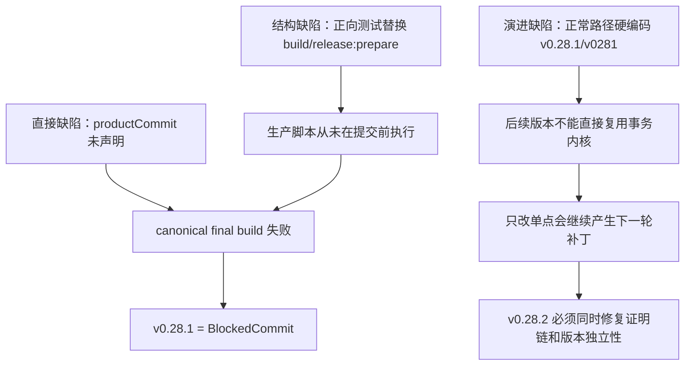

# v0.28.2 Canonical Final Build 提交前证明与阻断版本恢复方案

## 1. 决策

v0.28.1 不修、不 amend、不重打 tag，也不恢复发布资格。它已经形成的 commit、annotated tag 与 ApprovalRecord 是不可变历史事实；正式构建失败使该版本永久停在 `BlockedCommit`。

v0.28.2 是唯一恢复版本。它不是对 `ReferenceError` 的局部补丁，而是完成 v0.28.1 尚未真正建立的提交前充分证明：批准的 exact staged tree 必须在不可变提交发生前，通过不替换生产脚本的 canonical final-build 链。

本版本继续使用既有四个事实对象与八条不变量，不引入第九条不变量、第二批准对象或新的总表式 validator。

## 2. 已确认事实与边界

### 2.1 已完成事实

- v0.28.1 commit：`0fb5c24cc9c8851fd5fe44add9bd0bb7f2999dab`。
- v0.28.1 annotated tag：`v0.28.1`；tag object：`bb777d185ab73e0d10bad88fcdfa60159c7ceac8`。
- ApprovalRecord hash：`03ac45be9a24abad8cf47db6e01cfc3fd95683cc8b41fdf60e784730c5b439d0`。
- HEAD、tag 与 approved tree identity 一致；tracked worktree clean。
- release preparation 与 Vite 编译完成后，canonical `scripts/prepare-sites-build.mjs` 因引用未声明的 `productCommit` 失败。

### 2.2 未完成事实

- 没有 v0.28.1 ProductArtifact directory/record。
- 没有 ClosureReport。
- 没有 post-commit preflight。
- 没有 transport、content publish 或 EdgeOne 公网发布。
- 失败构建留下的 ignored `dist/client/release.json` 只是 partial bytes，不是任何发布对象。

### 2.3 禁止的恢复方式

- 禁止直接在 v0.28.1 exact approved tree 上改源码。
- 禁止 amend commit、移动/删除/重打 `v0.28.1` tag，或重写 ApprovalRecord。
- 禁止把 partial dist 补齐后声明为 v0.28.1 ProductArtifact。
- 禁止绕过 build/preflight 继续发布。

## 3. 根因模型

直接错误只有一个变量，但事故不是由“少测一行”单独造成。真正的因果链是：

1. D6 integration 用 fixture 替换 `package.scripts.build` 与 `release:prepare`。
2. 测试证明了 Candidate → Approval → commit/tag → fixture artifact 的事务编排，却没有执行 canonical final build。
3. commit/tag 是不可逆边界；生产脚本中的直接缺陷直到该边界之后才暴露。
4. 同时，scope classifier、SideEffect policy 和 Candidate test routing 仍绑定 v0.28.1 名称，说明“可复用内核”只在文档中成立，没有在正常路径中成立。

因此验收对象必须从“更多负向样例”改为两个互补但不可互相替代的证明：有限故障矩阵证明拒绝语义，canonical positive chain 证明真实成功路径。

## 4. 目标架构

### 4.1 保持现有对象与责任

| 对象 | 唯一责任 | 禁止承载 |
| --- | --- | --- |
| ScopeManifest | 路径分类与 scope contract | tracked bytes hash、批准结论 |
| CandidateIdentity | exact staged tree + protected baseline | approver、构建 PASS |
| ApprovalRecord | approver 批准哪个 Candidate/tree | ProductArtifact、Closure PASS |
| ProductArtifact `release.json` | exact deployable client artifact identity | 重复完整 source、第二批准事实 |
| ClosureReport | post-commit 现场观察与不变量结果 | 改写 Candidate/Approval authority |

`treeOid` 继续是 tracked bytes 的唯一身份权威；annotated tag 继续是 post-commit durable recovery authority；filesystem observer 继续证明 protected facts 没有被修改。

### 4.2 两条测试链必须分层

#### A. 有限故障矩阵

- 保留现有 data-driven matrix，用于 mode、rename、drift、cache、tag、artifact、closure tamper 与失败注入。
- 允许测试专用 fixture seam，但必须显式标记为 failure-injection evidence。
- 不得以该矩阵的 fixture build 成功替代生产 build 成功。

#### B. Canonical positive chain

- 从 canonical repository 的真实 base commit 与当前 exact staged tree 创建隔离 Git transaction。
- 复用同一 Git object identity；不得重新复制文件并生成“内容等价但 tree identity 不同”的仓库。
- 使用 Candidate 中的真实脚本与模块。
- 不得替换 `package.json` 的 `build`、`release:prepare`，不得替换 `release-build.mjs`、`prepare-sites-build.mjs`、ProductArtifact adapter 或 `release-preflight.mjs`。
- 只允许测试专用 elon approval fixture，以及 bounded、read-only、ignored 内容输入；这些 seam 不能进入 canonical CLI 或 production release path。
- 顺序执行正式 candidate-check（避免递归运行自身总测试）、freeze、测试批准、closeout、atomic commit/tag、真实 `npm run release:build`、真实 `npm run release:preflight`。
- 删除 ignored Candidate/Approval cache 后，必须从 annotated tag 恢复并再次验证 closure identity。

### 4.3 Exact staged-tree 隔离原则

推荐使用共享/alternate Git object database 或等价的只读 object 复用机制，使隔离 repo 的 base commit 与 staged tree OID 与 canonical 完全相同。隔离执行产生的新 commit/tag/artifact 只能存在于临时 root，不得写 canonical refs、index、working tree、dist 或 `.content-workspace` 事实。

正向链开始和结束都必须观察：

- canonical HEAD、index、working tree；
- parent v0.28.1 tag object/type/peeled commit；
- active ContentSet 与 active ContentDataArtifact；
- SitePublication、publication runs、recoveries 与旧 receipts；
- 历史 ProductArtifact roots。

除隔离临时 root 内的新 v0.28.2 ProductArtifact 外，上述事实必须 exact unchanged。

### 4.4 稳定 contract identity

正常行为不能再由 `version === "v0.28.1"` 或测试文件名中的 `v0281` 选择。

- ScopeManifest：新版本使用稳定的 classification-only schema/contract（例如 `release-scope-v2`）；classifier 根据 schema/contract 解析。v0.28.1 legacy schema 只读兼容，不能成为新版本创建器的默认输出。
- SideEffectBaseline：创建器写稳定 policy identifier（例如 `release-side-effect-policy-v1`），不写当前产品版本作为 policy。validator 仅为已存在 durable v0.28.1 tag 保留明确 legacy reader。
- Candidate tests：正式入口调用稳定的 `test:release-transaction`，而不是硬编码 `tests/v0281-release-transaction.test.mjs`。历史测试可以继续作为该稳定入口的一部分。
- 任何 legacy branch 都必须以数据 schema/tag provenance 为依据，并有只读回归测试；不得用“当前待发产品版本号”改变正常行为。

这属于现有 `Bootstrap / I-01` 的实现完成，不是新增不变量。

## 5. Canonical build 完成条件

修复后的 `prepare-sites-build` 必须从唯一已验证 identity chain 获得 `productCommit`，不能由未绑定环境变量或重复推断提供。真实 build 结束时：

1. `dist/client` 只包含 deployable client bytes 与根 `release.json`。
2. ProductArtifact 只持久化 immutable `client/` 与根 manifest，不生成 repository `source/` copy。
3. `release.json` 的 productVersion、productCommit、productArtifactId、productArtifactHash、baseSiteArtifactId、approvedTreeOid、candidateHash、ApprovalRecord hash 与 canonical facts exact。
4. subordinate content/base manifests 只保存领域引用，由根 manifest hash 绑定，不复制批准 authority。
5. readProductArtifact 删除、替换或交叉混用任何 identity 字段都 hard fail。
6. preflight 必须读取既有 ClosureReport 后先校验，不能用重算报告覆盖 tamper。

这属于现有 `I-06 Artifact provenance` 与 `I-07 Side-effect isolation`。

## 6. v0.28.1 partial dist 的处理

partial `dist/client/release.json` 是失败命令的 ignored 输出：

- 不进入 v0.28.2 scope manifest；
- 不作为 parent ProductArtifact 或 baseSiteArtifact；
- 不补写、不迁移、不发布；
- v0.28.2 正向链与最终 build 必须从自己的 identity 和 clean build root 生成结果；
- 如正式 build 自身按既有规则清理/覆盖它，只把该动作作为 ignored build output lifecycle，不改变 v0.28.1 历史事实。

## 7. 固定验收合同

### V282-01 Parent immutability

v0.28.1 commit、tag object/type/peeled commit、ApprovalRecord 与 protected roots before/after exact；其状态始终为 `BlockedCommit`、未发布。

### V282-02 Version-independent transaction core

新 scope、SideEffect policy 与 Candidate test routing 由稳定 schema/contract 决定；新版本正常路径无 `v0.28.1/v0281` 特判。legacy reader 只读且有 provenance test。

### V282-03 Canonical final build

canonical positive chain 执行真实 `release:build`、`prepare-sites-build`、ProductArtifact adapter 与 `release:preflight`，并形成可读取的真实 artifact/closure。

### V282-04 No-substitution exact-tree proof

隔离 repo 的 base commit、staged tree OID 与待批准 Candidate exact；正式 build scripts/package entries 未被替换；canonical repo refs/index/working tree/protected facts unchanged。

### V282-05 Existing invariant continuity

`I-01`～`I-08`、现有有限故障矩阵、cache 三态、tag recovery、artifact/closure tamper 和 phase-aware checks 全部继续通过；不新增 `I-09`。

### V282-06 Regression and retained-failure honesty

`npm run check`、`npm run release:prepare`、稳定 transaction tests、scope classifier tests 与 `git diff --check` PASS。完整 `test:sites` 必须重新分类 A/B/C：C=0；历史 retained B 可保留但不得写成全量 PASS。

### V282-07 Local closure only

批准后允许 atomic commit/tag、final build 与 preflight；本版本不执行 transport、content publish 或 EdgeOne。公网状态保持未发布。

## 8. Engineering 一次性交付合同

Engineering 不分轮回传“先改单变量”“再改测试”“再改版本分支”。下一次产品验收只接受一个完整、未提交 CandidateIdentity，至少同时包含：

- canonical build defect 修复；
- stable scope/policy/test routing；
- canonical exact-tree positive chain；
- 既有有限故障矩阵与全部相关回归；
- VERSION、current/design/history、scope manifest 与 machine evidence 同步；
- Candidate commands 前后 canonical working/index/protected facts exact。

Engineering 只能生成 CandidateIdentity，不得生成 ApprovalRecord。`elon` 对 exact Candidate 独立复核并通过正式 approval 入口批准；批准前禁止 canonical commit/tag/final build/preflight，批准后严格消费同一 tree identity。

## 9. 完成定义

v0.28.2 的完成不是“变量错误消失”，而是同时证明：

1. 相同的 release transaction core 可以服务下一产品版本，不靠版本名特判；
2. 被批准的 exact staged tree 在 commit 前已经通过真实生产构建与 preflight；
3. fault-injection evidence 与 canonical-success evidence 各自证明自己的问题，不再互相冒充；
4. 不可变 commit/tag 之后不会首次发现可由真实提交前构建捕获的实现错误。

只有上述固定合同全部通过，`elon` 才能为 v0.28.2 生成 ApprovalRecord。
