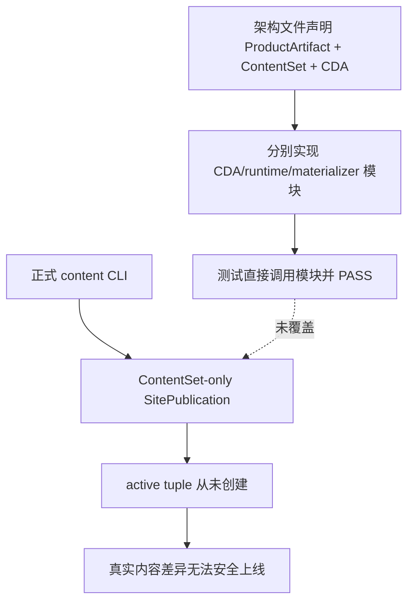

# v0.28.3 内容数据发布事务与首次 Active Tuple 切换方案

状态：正式当前方案；Engineering 只实现本文件与 `current.md` 的固定合同。

## 1. 决策

v0.28.0 建立了 ContentDataArtifact、CAS、runtime reader、materialization 等部件，但正常 `content-release → Site Publication Coordinator` 没有消费这些部件。v0.28.2 证明了产品 ProductArtifact 的提交与构建事务，不等于内容发布事务已经完成。

本版本不再修单个入口。唯一决策是：建立一个由正式 CLI、Coordinator 和 verifier 共同消费的 `ContentPublicationIntent`，并把 `content-data-active.json` 设为 ContentSet + ContentDataArtifact 的唯一 active authority。任何 canonical SiteSnapshot 缺少 ProductArtifact、ContentSet、ContentDataArtifact 或 tuple identity 都必须失败。

## 2. 事故事实与根因

### 已确认事实

- current ProductArtifact：`v0.28.2-3a615ce0ff71`，本地 closure 完整，但按版本合同未 transport。
- active ContentSet：`content-set-3a5231342805bec96dea19a88fd92c410dda01ea0f364a1656edb98222d4aadb`，38 entries。
- `content-state/content-data-active.json` 不存在。
- Xing 本轮工具变更只涉及 `home:home`；before contentHash 为 `f12a0c1a…`，after normalized contentHash 为 `01f90ae1…`。
- `content-release.mjs` 的正常 Candidate/publish 路径只创建 ContentSet；`site-publication.mjs` 的 canonical ContentSet 路径创建不含 CDA 的 SiteSnapshot；`content-only-publication.mjs` 未被正式入口调用。

### 根因



错误不是少调用一个函数，而是没有定义“谁拥有完整发布输入”和“哪一个对象是 active authority”。分散模块测试把组件存在误当成端到端能力完成，导致文档、测试和生产入口不一致。

## 3. 对象与唯一责任

| 对象 | 唯一责任 | 禁止承载 |
| --- | --- | --- |
| ContentSet | elon ops 审核后的一批内容 identity | runtime active 权威、ProductArtifact bytes |
| ContentDataArtifact | ContentSet 对应的 immutable runtime records/CAS | 审批结论、deployment 状态 |
| ContentPublicationIntent | 一次待发布的 ProductArtifact + ContentSet + CDA + candidate tuple 完整输入 | 修改任何对象、网络结果 |
| SiteSnapshot | intent 的站点快照 identity | active 状态、审批替代品 |
| PublicationRun | transport、传播、验证、恢复事实 | 内容或产品 authority |
| content-data-active.json | 公网验证后本地唯一 active tuple | 历史完整内容、第二套审批 |
| content-state/active.json | pre-bootstrap legacy fallback/audit 输入 | cutover 后的 active 写入或判定 |

`ContentPublicationIntent` 只引用 immutable 对象并计算自己的 hash。它不能复制完整内容或成为第五套发布状态。

## 4. 首次 cutover

### 4.1 Baseline resolver

首次运行没有 active CDA。Coordinator 必须从 legacy active ContentSet 构造 baseline CDA：

1. 读取 immutable active ContentSet，不读取旧 SitePublication 作为内容值权威。
2. `home:home` 使用 ContentSet 内嵌 `homeContent`，因为 canonical `home.json` 已是新值。
3. 其余 entry 从 canonical source 读取，规范化后必须与 active entry 的 `contentHash` exact；practice 同时验证 media manifest。
4. 每条 source/value/content hash 与 provenance 写入 baseline record；无法 exact 重建时整个 bootstrap 零写失败。
5. baseline CDA 可以持久化为 immutable predecessor，但不写 active tuple、不产生 deployment。

### 4.2 Candidate artifact

由已确认首页 Candidate 生成 next CDA：

- `home:home` 形成新 revision，predecessor 指向 baseline revision；
- 其余 37 条复用同一 record/object ref；
- retained history 为 current + 2；
- Candidate、ChangeSet、CDA 与 intent 均确定性、幂等；
- createdAt、runId、deploymentId 不进入 identity。

### 4.3 Joint first publication

v0.28.2 被明确限制为 local-only，线上旧 ProductArtifact 又不具备 CDA runtime。因此首次 data-plane cutover 不能假装是普通 content-only 更新，也不能先发布缺少 active tuple 的 v0.28.3 ProductArtifact。

正确路径是一次 Joint SitePublication：

```text
approved ProductArtifact v0.28.3
  + approved home ContentSet Candidate
  + derived candidate ContentDataArtifact
  + candidate active tuple
  → one SiteSnapshot / one PublicationRun / one deployment
```

产品批准与内容批准各自保持独立；只有 Coordinator 在物理 transport 层合并引用。此后普通产品发布复用 active tuple，普通内容发布复用当前 ProductArtifact。

## 5. 单一 active authority

cutover 前：读取器可在 `content-data-active.json` 缺失时读取 legacy `active.json`，仅用于 baseline preparation；不得据此声称 CDA 已 active。

cutover 后：

- `readActiveContentSet`、runtime reader、产品 publish、内容 publish、rollback/recovery 全部先读取 `content-data-active.json` 并由其中的 `contentSetId/contentSetHash` 读取 immutable ContentSet；
- finalize 只以 CAS 写入一个 tuple 文件；不同时写 `active.json`；
- legacy `active.json` 保留原字节作为迁移前审计事实；
- tuple 必须同时绑定 ProductArtifact、ContentSet、CDA 与 public manifest hash；任一引用缺失或 hash drift 失败。

这消除了两个 active 指针之间无法原子提交的结构性问题。

## 6. 发布事务

### Prepare

- 读取 exact canonical target 与 review/approval proof；
- 生成或复用 ContentSet Candidate + ChangeSet；
- 生成或复用 baseline/next CDA；
- 创建 immutable ContentPublicationIntent；
- 验证 exact changed/reused、ProductArtifact 与 protected facts；
- 不 materialize、不 transport、不写 active。

### Build

- 从 intent 创建临时 upload root；
- exact-copy ProductArtifact client；
- 只增加 CDA immutable manifest/objects、public active pointer、content manifest 与最小 receipt；
- 运行 quota、hash、path safety、client identity 与浏览器本地 runtime smoke；
- 清理临时 root 由 lease 生命周期负责，不能变成持久 ProductArtifact。

### Transport and verify

- Coordinator 取得唯一站点 lease；
- EdgeOne 只由 Coordinator 调用一次；
- 有界传播等待后，验证固定域名上的 release/content/data manifest、immutable object、目标页面文案、真实 runtime、媒体和缓存；
- 所有证据属于同一 PublicationRun 和 deployment。

### Finalize and recover

- public proof 完整后以 expected previous tuple hash 做单文件 CAS；首次 expected 为 `null`；
- 成功写 released run/receipt；重复 finalize 幂等；
- CAS 冲突不覆盖现场；transport 或 verify 失败不写 active；
- 已部署但验证失败保留 recoverable run，恢复必须复用同 deployment 或明确记录新 attempt，不静默重复 deploy。

## 7. 正式入口约束

- `content:prepare` 与 `content:build` 必须输出 ContentPublicationIntent identity；仅输出 ContentSet ID 视为失败。
- `publish-content.command`、`publish-article.command`、`publish-practice.command` 只能提交 intent；不能各自组装 SiteSnapshot。
- `createSiteSnapshot` 对 canonical ProductArtifact release schema 必须要求 CDA 与 tuple ref；ContentSet-only 仅允许明确 legacy/audit fixture，不能由生产环境变量开启。
- `content-only-publication.mjs` 若保留，必须成为正式 intent materializer；否则删除其正常路径宣称，不能继续作为未调用的“完成证据”。
- public verifier 必须从公网重新读取 identity，不能只检查本地期望对象或单页 HTTP 200。

## 8. 证明策略

### 8.1 Canonical positive chain

隔离 repo 复用 exact staged tree 和真实 production scripts，依次执行：

```text
release Candidate/Approval/commit/tag/build/preflight
→ content review fixture with exact authority
→ content prepare/build
→ joint upload-root materialization
→ local HTTP server as the external transport boundary
→ real browser runtime/public verifier
→ finalize/tag recovery/readback
```

只允许替换 EdgeOne 网络 provider；不允许替换 CLI、Coordinator、snapshot、materializer、runtime reader、public verifier、ProductArtifact reader 或 active CAS。

### 8.2 Fault matrix

至少覆盖：baseline 不可重建、source/contentHash drift、review hash drift、CDA/object tamper、intent cross-mix、ProductArtifact mismatch、missing data ref、no-change、duplicate prepare、quota、lease、transport timeout、public stale manifest、browser fallback、CAS conflict、finalize crash、resume、temporary-root cleanup。

矩阵证明拒绝语义，正向链证明真实成功路径；两者不能互相替代。

## 9. 当前首页发布验收

- before：`f12a0c1ac4429805e861bdd5d07b4cf68be6acd180a1e811aee6e5e18ef78855`
- after：`01f90ae11586c97f71958bf58b28d6c0c1bf1f1058b83d9c279777138db0e1ad`
- route：`/`
- changed：1；reused：37
- public H1 三行：
  1. `14 年企业 B 端产品经验，正在探索并构建`
  2. `没有传统界面，而由 AI 直接完成业务操作的`
  3. `企业软件.`
- ProductArtifact client JS/CSS identity 和 bytes 不因内容变化而改变。

Xing 本轮直接指令构成该 exact after 内容的预览确认与 publish authorization；Engineering 不把它写入产品 bundle，elon ops 在能力完成后生成正式内容 review proof。

## 10. Engineering 一次性交付合同

下一次只接受一个完整未提交 CandidateIdentity：

- CP-01～CP-11 machine evidence 全部可独立复算；
- 正式入口已真实接通，不以直接调用孤立模块代替；
- exact staged-tree canonical positive chain与 fault matrix 分层通过；
- `npm run check`、`release:prepare`、stable release transaction、content data plane、ContentSet、SitePublication、runtime regression PASS；
- 完整 `test:sites` A/B/C 分类 C=0；
- canonical active ContentSet、legacy active pointer、内容 bytes、旧 ProductArtifact/PublicationRun/receipts before/after exact；
- 未生成 canonical ApprovalRecord，未 commit/tag/final build/preflight/transport/content publish/EdgeOne。

范围内任何缺陷在 v0.28.3 同一未提交版本修复并重新 freeze；不得拆成 v0.28.4 或用运行手册绕过。
