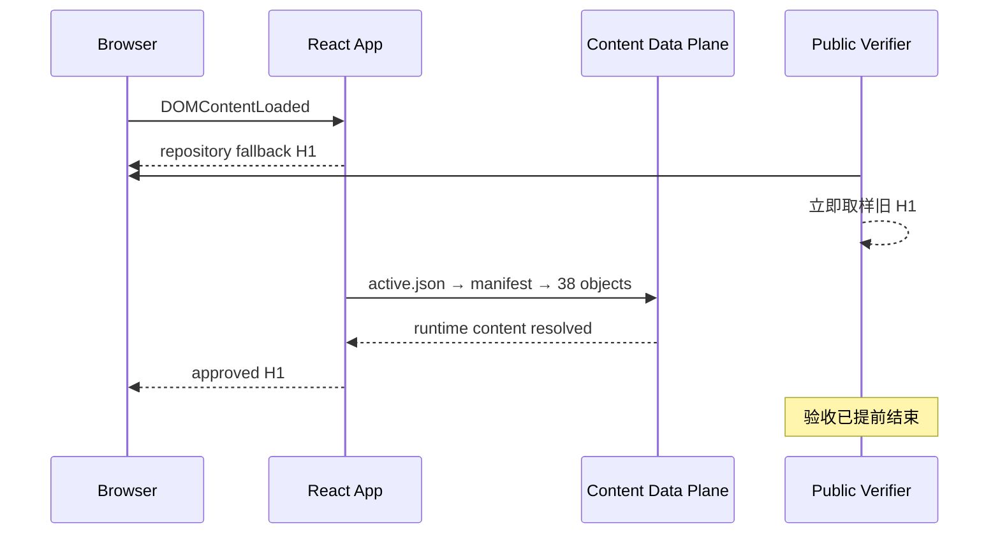
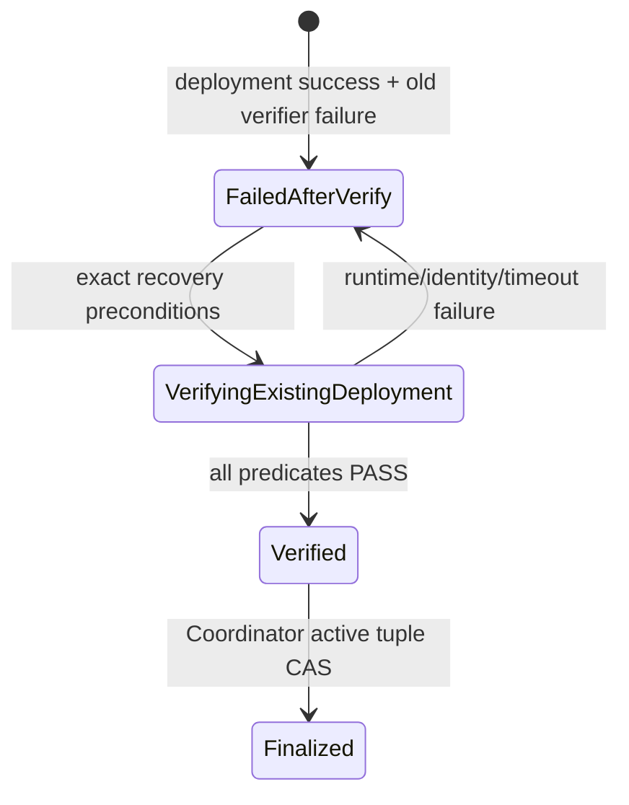

# v0.28.4 公网内容 Runtime Ready 与同一 Deployment 恢复方案

## 1. 决策结论

本版本修复的是发布完成条件，而不是内容、部署或浏览器速度。

v0.28.3 已把正确的 ProductArtifact、ContentSet、ContentDataArtifact 和 candidate active pointer 部署到固定 EdgeOne 目标；浏览器最终也能渲染正确首页。正式验收失败，是因为 verifier 在异步内容数据收敛前读取了 repository fallback。继续增加 sleep、重试 deployment 或手工激活只会掩盖错误状态边界，并可能制造第二次部署或错误 active 事实。

唯一正确方案是：让每次 SitePublication 自己声明最终 runtime acceptance，由 verifier 在统一 deadline 内等待该声明成立；已经成功 transport 的 publication 只重做验证和 finalize，不再 transport。

## 2. 事故事实与边界

### 2.1 不变身份

| 对象 | 事实 |
| --- | --- |
| v0.28.3 commit | `85e8c3d080f998449a4fefb0c8429b1e27beb36e` |
| ProductArtifact | `v0.28.3-85e8c3d080f9` |
| SitePublication directory | `.content-workspace/site-publications/v0.28.3-85e8c3d080f9-0f0dd6c9be883e84` |
| SitePublication snapshotHash | `0f0dd6c9be883e840fa0e5385ad35317bd9c1dd3e0f6d7f52acbc91ba0dbf8f2` |
| PublicationRun | `publication-run-site-snapshot-0f0dd6c9be883e840fa0e5385ad35317bd9c1dd3e0f6d7f52acbc91ba0dbf8f2` |
| deployment | `dpgr0trnxfcv`，平台状态 success |
| ContentSet | `content-set-c0377df3307713df1725102c8053797bd8c0b46e1ae9895d5186c904a6f6983a` |
| ContentDataArtifact | `content-data-artifact-fa32e7d1fccc9ff492a9139e` |
| candidate tuple | `5acaf2ff4e0d531478d7a20ea781662bca536342ea4065a654195eb0d5bb74e2` |
| EdgeOne target | `xingbuild-nochina / makers-ze0f6txvlhco / xingbuild.top` |

公网 manifest、immutable data object 和最终 runtime 内容已证明与这些身份一致；本地 active tuple 尚未写入。因此，外部 deployment 已成功，但 SitePublication 仍未 finalized，不能称为内容发布完成。

### 2.2 已证实因果链



时间观察为：0ms、250ms、750ms 均为 fallback；约 1750ms 起为 approved H1。由此可排除“公网仍在旧版本”“EdgeOne target 错误”和“内容没有部署”作为根因。

## 3. 根本模型

### 3.1 两种 ready 不得混用

| 状态 | 含义 | 可以证明什么 | 不能证明什么 |
| --- | --- | --- | --- |
| `shellReady` | React root、main、h1 已出现 | 应用可启动、基础 DOM 存在 | approved runtime 内容已加载 |
| `runtimeReady` | publication 声明的所有 route expectation exact match | 当前浏览器已消费并渲染该 publication 的目标内容 | manifest/immutable object 身份本身正确 |

最终成功必须同时满足：公网身份 exact、应用无致命运行错误、`runtimeReady=true`。三者是 AND 关系，任何一个都不能替代另一个。

### 3.2 唯一新增对象：RuntimeAcceptanceSpec

`RuntimeAcceptanceSpec` 不是第二套内容数据，而是从同一 approved publication 输入确定性生成的验收投影：

```json
{
  "schemaVersion": "runtime-acceptance-v1",
  "sitePublicationId": "<exact>",
  "snapshotHash": "<exact>",
  "activeTupleHash": "<exact>",
  "routes": [
    {
      "route": "/",
      "targetId": "home:home",
      "expectations": [
        {
          "kind": "normalized-text-hash",
          "selector": "main h1",
          "valueHash": "<hash derived from approved runtime value>"
        }
      ]
    }
  ],
  "specHash": "<canonical hash of preceding fields>"
}
```

约束：

1. spec 只能由 ContentPublicationIntent/SiteSnapshot 中已批准的 value 和 identity 派生；CLI、Coordinator 或测试不得手写另一个 expected 文本。
2. `sitePublicationId/snapshotHash/activeTupleHash/specHash` 必须在 prepare、build、verify、recovery、finalize 全链 exact。
3. selector 属于产品渲染合同；value/valueHash 属于内容验收投影。两者组合只服务于观察，不成为 active authority。
4. 没有内容数据面的 legacy publication 可显式使用 shell-only compatibility；v0.28.3 data-plane publication 不得降级为 shell-only。

### 3.3 既有事故的单点兼容边界

`RuntimeAcceptanceSpec` 是 v0.28.4 新增投影，真实 v0.28.3 事故记录没有该字段，且旧 Coordinator 把浏览器阶段完成后抛出的内容断言保存为 `state=failed / failure.phase=verified`。因此正式恢复不能把“缺少新字段”或旧 phase 名称直接当成事故身份漂移。

兼容只允许一个窄入口：同时 exact 匹配已登记的 v0.28.3 product/site snapshot/active tuple/fixed target/`dpgr0trnxfcv`，确认 `PublicationRun.deploymentCount=1`、两侧 `publicVerify=null`、deployment status success、旧 active tuple 缺失，并从该旧记录已持久化的 approved `contentManifest` 确定性派生 spec。派生值必须通过与 manifest 的完整 canonical exact compare，并作为新的 recovery attempt evidence 保存；不得由 CLI、环境变量、测试或公网 DOM 提供 expected 文本。

这不是通用 legacy bypass：任何其他 data-plane publication 缺失 spec、身份不匹配、已有 spec 与重派生结果不一致，仍然 hard fail。v0.28.4 以后新建的 publication 必须在 prepare/build 时持久化 spec，不能进入该兼容入口。

## 4. Verifier 合同

### 4.1 入口

正式 browser verifier 接收完整 `RuntimeAcceptanceSpec`，不能只接收 route 列表。每个 route 的执行顺序为：

1. 导航并校验 HTTP；
2. 等待 `shellReady`，记录 `shellReadyAt`，但不形成 verified；
3. 在该 route 剩余 budget 内反复计算声明 selector 的 normalized observed value/hash；
4. 全部 exact match 时记录 `runtimeReadyAt` 与最终 DOM evidence；
5. 汇总 console/page/asset/data request failure；
6. 只有 identity、runtime 和应用三类 predicate 全部成立才返回 verified。

`normalized-text-hash` 使用项目已有 canonical text normalization；不得用 substring、正则宽松命中或任意非空文本替代 exact hash。

### 4.2 有界等待

- 复用顶层 deadline、route timeout 和 AbortSignal；所有等待都受同一个剩余预算约束。
- 不写固定 `sleep(3000)`；测试可以延迟网络响应，但生产成功条件只能是 expectation 成立。
- timeout 证据必须保存最后 observed hash/value、未满足 expectation、数据请求失败和 elapsed time。
- 页面已出现 fallback 不是失败；直到 deadline 仍未收敛才是 `PUBLICATION_RUNTIME_CONTENT_TIMEOUT`。
- 明确 object/manifest/active pointer 请求失败时可提前返回 `PUBLICATION_RUNTIME_CONTENT_FETCH_FAILED`，但仍保存最终 route evidence。

### 4.3 Evidence

每个 route 至少记录：

- `shellReadyAt/runtimeReadyAt/finishedAt/durationMs`；
- `acceptanceSpecHash`；
- 每条 expectation 的 selector、expectedValueHash、observedValueHash、matched；
- final H1/body 摘要、console/page/asset/data failures；
- publication identity 与 verification attempt id。

失败 attempt 只追加，不删除或覆盖；后续 recovery 使用新的 attempt id，最终 aggregate 同时保留原失败和新成功的引用。

## 5. 同一 Deployment 恢复

### 5.1 状态转换



恢复不是重新发布。正式 recovery 入口必须：

1. 读取现有 SitePublication、PublicationRun、deployment record 和 immutable snapshot；
2. exact 校验 v0.28.3 产品、内容、data、tuple、target 与 `dpgr0trnxfcv`；
3. 确认 deployment status success，且 record 中只有一个 deployment；
4. 依据“deployment 已成功 + deployment count=1 + publicVerify 缺失 + failure evidence 存在 + active tuple 未激活”的组合事实判定 post-transport verification failure；`failure.phase` 只是历史 evidence，不是恢复资格 authority；
5. 对真实 v0.28.3 缺失 spec 的记录，仅通过 3.3 的 exact 事故适配从持久化 manifest 派生 spec，并生成新的 verification attempt；
6. 完全跳过 materialize/transport/create-deployment；
7. 新 verifier PASS 后调用既有 Coordinator finalize；
8. 以 `expectedPreviousTupleHash=null` 首次 CAS 写入 `content-data-active.json`；
9. 重复 recovery/finalize 必须读取同一 tuple 并幂等成功，不能创建新外部动作。

若 target、snapshot、deployment、public manifest、spec 或旧 active 发生漂移，立即 hard fail；不能通过重建“看起来相同”的 publication 恢复。

### 5.2 版本与发布顺序

v0.28.4 是修复本地 release tooling 的产品版本，但既有外部事实仍属于 v0.28.3 SitePublication。必须严格分阶段：

1. v0.28.4 exact Candidate 经 elon 验收后 local commit/tag/build/preflight；
2. 使用 v0.28.4 工具只读恢复 `dpgr0trnxfcv`，完成 v0.28.3 publicVerify 与 active tuple finalize；
3. v0.28.3 内容 publication 完整收口后，v0.28.4 ProductArtifact 才可作为独立产品 SitePublication transport；
4. 两个 SitePublication 各自保存 deployment、public proof 和 finalize，禁止合并状态或把前者的成功证据复制给后者。

## 6. 测试策略

### 6.1 必须先能复现旧缺陷

使用正式页面与正式 data-plane reader，通过受控本地 HTTP server 让 active/manifest/38 objects 分阶段返回：

- 0ms 出现 fallback H1；
- 至少 1 秒内 expectation 不成立；
- 随后全部 object 返回并渲染 approved H1；
- 旧 shell-ready verifier 会捕获 fallback 并失败；
- 新 verifier 只能在 expected hash exact 后 PASS。

这项测试不得用直接写 DOM、替换 verifier、跳过 ContentDataArtifact reader 或 synthetic `runtimeReady=true` 冒充真实链。

### 6.2 负向矩阵

- expectation 缺失、spec hash 篡改、跨 snapshot/tuple 混用；
- runtime 永不收敛、错误 H1、active/manifest/object 404 或 hash mismatch；
- timeout、abort、browser cleanup；
- 旧失败 evidence 被覆盖或删除；
- recovery 意外调用 transport/create deployment；
- deployment count 大于 1、deployment id/target 漂移；
- 用 `failure.phase` 前缀误拒真实 `phase=verified` 事故，或把任意 `verified` failure 误判为可恢复；
- 对非 exact v0.28.3 身份派生缺失 spec，或由 CLI/测试/DOM 注入 expected 文本；
- finalize 前 active 被写、CAS predecessor 漂移、重复 finalize 不幂等；
- legacy shell-only publication 被错误强制 data-plane expectation，或 data-plane publication 被错误降级。

### 6.3 正向链

exact staged tree 的隔离链必须覆盖：Candidate → Approval fixture → commit/tag → release build/preflight → content prepare/build → delayed runtime materialization → shell ready → runtime ready → public evidence → 同一 deployment recovery simulation → Coordinator finalize → cache/tag recovery。除此之外，必须从 canonical 既有 v0.28.3 SitePublication/PublicationRun/deployment 复制真实持久化字节到隔离目录，以旧 `state=failed / failure.phase=verified / runtimeAcceptanceSpec=null` 形状通过正式 recovery；新建 v0.28.4 publication 后再注入 recoverable failure 不能替代该测试。canonical 环境只生成未提交 Candidate evidence，不得创建 deployment 或 active tuple。

## 7. 完成定义

Engineering 的完成不是“改了 wait 条件”，而是同时证明：

- `RuntimeAcceptanceSpec` 有单一来源、可复算、全链 identity exact；
- slow data-plane 下不再读取 fallback；
- 所有失败路径有界、可恢复、保留证据并清理 QA browser；
- 既有 `dpgr0trnxfcv` 可在零 transport、零新 deployment 下恢复；
- active tuple 仍只在完整公网 proof 后由 Coordinator CAS；
- 内容 facts、v0.28.3 commit/tag/ProductArtifact、旧 active 与外部 deployment 在 Candidate 阶段完全不变。

只有上述合同形成一个 exact staged-tree CandidateIdentity，才进入 elon 独立验收。
