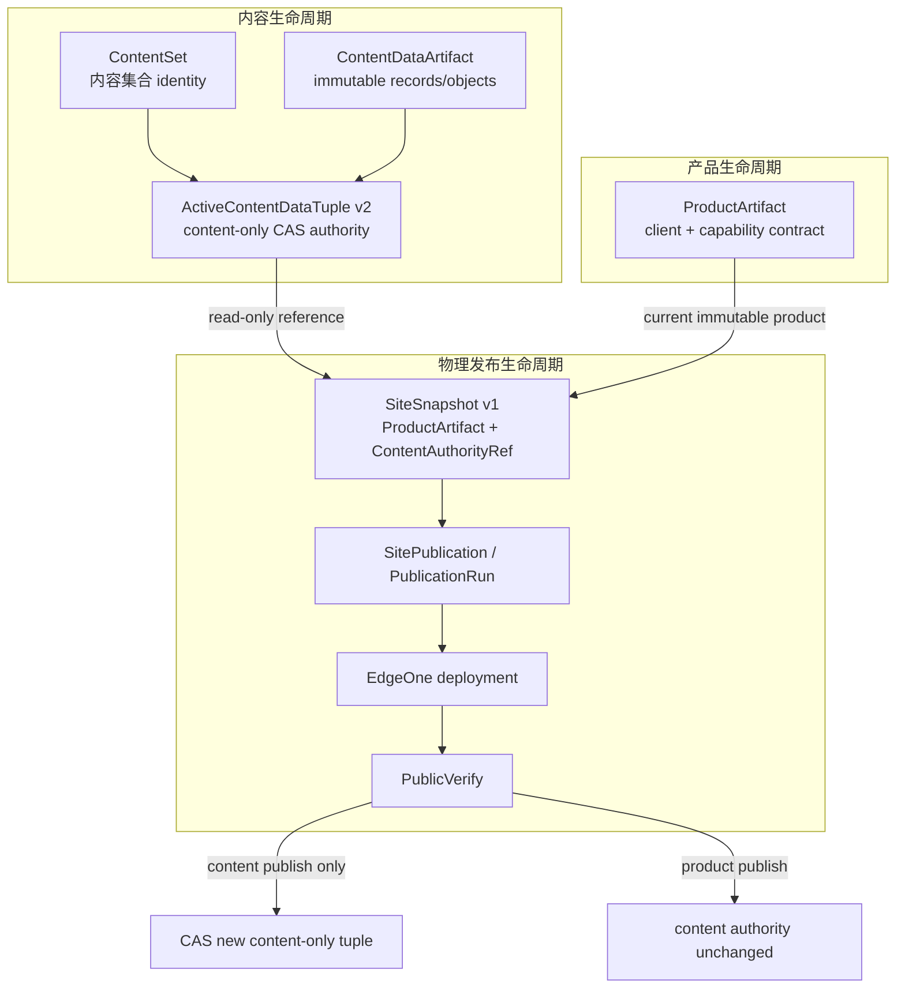
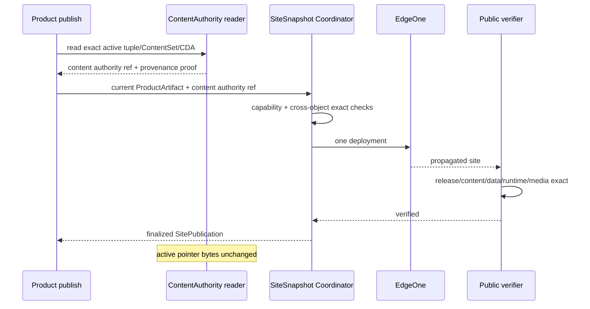
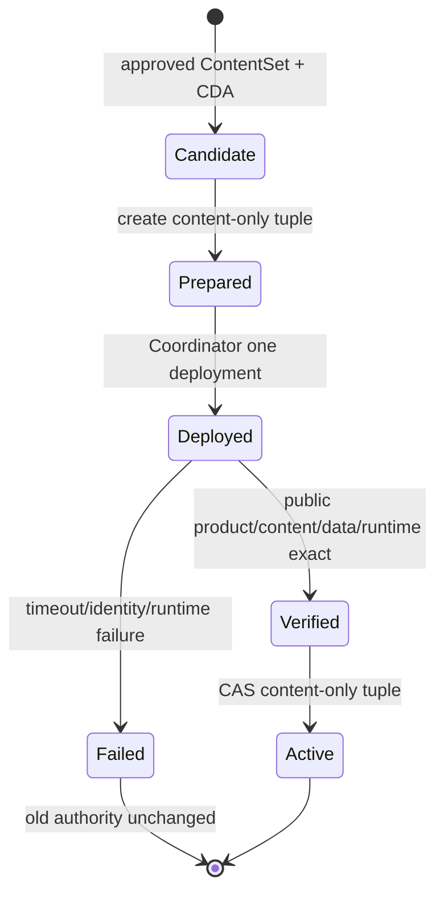
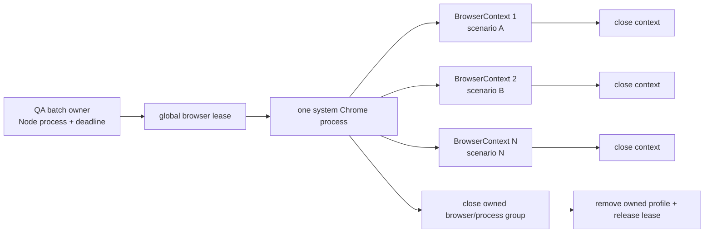

# v0.28.5 内容 Authority 与产品 SiteSnapshot 解耦及 QA Browser 单会话方案

## 1. 决策结论

本版本不继续为 v0.28.4 publish 增加 rebind 特例。根因是 `ActiveContentDataTuple` 同时承担了两种不相容责任：内容当前 authority 与某一时点 ProductArtifact 的站点组合身份。正确修复是恢复三个对象的单一责任：

| 对象 | 唯一责任 | 不再承担 |
| --- | --- | --- |
| `ContentAuthority` | 当前 ContentSet、CDA、immutable objects 与 content-only manifest 的原子引用 | 当前产品版本 |
| `ProductArtifact` | 当前产品代码、静态 client 与 capability contract | 内容 active 状态 |
| `SiteSnapshot` | 某次物理发布中 ProductArtifact + ContentAuthority 的不可变组合 | 任一上游对象的 active authority |

QA Chrome 问题采用同样原则：场景不是进程 owner。一个 batch session 拥有一个 Chrome，场景只拥有一个隔离 BrowserContext。

## 2. 事实、推断与边界

### 2.1 已知事实

- v0.28.4 local closure 已完成：commit `b23d76a567645b222605a3944611825a7441db00`、annotated tag `v0.28.4`、ProductArtifact `v0.28.4-b23d76a56764`、preflight PASS。
- v0.28.3 既有内容 publication 已在唯一 deployment `dpgr0trnxfcv` 上恢复并 verified，active tuple `5acaf2ff4e0d531478d7a20ea781662bca536342ea4065a654195eb0d5bb74e2` 已 CAS 激活。
- v0.28.4 产品 publish 在 transport 前失败；没有新 deployment。失败条件是 active tuple 的 `productArtifactId/productArtifactHash` 仍指向 v0.28.3。
- `contentManifestFromContentSet(..., { productArtifact })` 把产品字段写入 manifest；tuple 的 `manifestHash` 因此也随产品版本变化。
- `createSiteSnapshot` 对 tuple 与当前 ProductArtifact 做 identity equality，导致产品更新不能复用 active 内容。
- 既有 v0.25.16/v0.26.0 架构明确要求产品更新复用 active ContentSet，产品发布不写内容 active；当前实现与该原则冲突。
- runtime/fault QA 会多次启动系统 Chrome。现有 cleanup 能结束 owned process，但不能阻止一个 batch 高频 launch。

### 2.2 合理推断

- 仅增加“允许 v0.28.3→v0.28.4 mismatch”会把版本对写成兼容白名单，下一次产品发布仍会失败。
- 在产品 publish 前重建一个带新 ProductArtifact 的 tuple，会制造没有内容变更的内容 authority 变化，并把产品版本生命周期重新写入内容生命周期。
- 只删除 equality 断言也不安全，因为旧 tuple 的 manifestHash 仍绑定旧产品，且 cross-mix 将失去可验证拒绝条件。

### 2.3 未授权动作

本方案不迁移或重写当前 active pointer，不修改内容正文/媒体，不触发 canonical EdgeOne，不清理已有 Chrome/profile 记录，不修改旧 tag/commit。

## 3. 目标模型

### 3.1 结构视图：谁拥有哪一种事实



### 3.2 ContentAuthority 的 canonical identity

新 tuple 使用现有 active 文件但采用明确的 content-only shape：

```text
schemaVersion
contentSetId
contentSetHash
contentDataArtifactId
contentDataHash
contentAuthorityManifestHash
manifestUrl
tupleHash
updatedAt
```

`tupleHash` 只覆盖以上稳定内容字段，不含 `productArtifactId/productArtifactHash`。`contentAuthorityManifestHash` 只覆盖 ContentSet collections、homeContent、entries、CDA refs/object refs 等内容字段，不含 version、commit、ProductArtifactId/Hash 或 release manifest hash。

ProductArtifact capability 仍是发布前置条件，但属于 SiteSnapshot composition predicate，不进入内容 authority identity。

### 3.3 Legacy v1 tuple 只读适配

当前 active tuple 不重写。adapter 的顺序固定为：

1. 按旧 schema 对原始 bytes 复算 tupleHash；
2. 读取 exact ContentSet、CDA manifest 和全部 object refs；
3. 复算旧 product-aware manifestHash，证明 provenance 未漂移；
4. 从相同 ContentSet/CDA 生成 product-independent `ContentAuthorityRef`；
5. 将旧 `productArtifactId/productArtifactHash` 标为 `legacyProductProvenance`，不参与当前 ProductArtifact equality；
6. SiteSnapshot 同时保存 source tupleHash 与 content authority fields，保证审计可回到原 authority。

adapter 不写 active pointer、不生成第二 active 文件、不缓存另一 authority。任一旧字段不可复算即拒绝。

### 3.4 SiteSnapshot v1 组合

`site-snapshot-v1` 保持唯一 schema。新组合 identity 包含：

```text
current ProductArtifactIdentity
ContentSet identity
ContentDataArtifact identity
source active tuple hash
content authority manifest hash
public content manifest projection
```

public `content-manifest.json` 可以携带当前 ProductArtifact identity，供公网交叉验证；它不是 active content manifest。CDA immutable manifest 与 active pointer 继续只表达 content authority。

兼容检查从“tuple.productArtifact == currentProductArtifact”改为：

- ProductArtifact capability contract 支持当前内容 schema、slot、route 和 runtime reader；
- ContentSet/CDA/objects/manifest 自身 exact；
- ProductArtifact、ContentAuthority 在 SiteSnapshot 中分别 exact；
- 任何 cross-mix 或 unknown compatibility 在 transport 前失败。

## 4. 两条发布状态机

### 4.1 产品发布：不写内容 authority



### 4.2 内容发布：只在成功后 CAS content-only tuple



## 5. QA Browser 资源模型

### 5.1 资源所有权



- lease 在 launch 前取得；并发 batch 不得各自启动 Chrome。
- session 内场景串行，`peakContextCount=1`；每场景新 context，禁止 cookie/localStorage/page/console 串场。
- 嵌套生产 verifier 通过显式 session context 复用 browser，不改变正常单次调用入口。
- browser runner 以一个正式进程执行全部 browser 场景；不得再为证据行重复启动 `node --test --test-name-pattern`。
- evidence 每行仍记录真实入口、输入、结果和 outputHash；batch 总证据记录 PID、launch/context/peak、lease、deadline、cleanup。

### 5.2 失败与清理

| 事件 | 必须动作 | PASS 条件 |
| --- | --- | --- |
| assertion fail | 关闭当前 context，session 标记 failed | browser/profile/lease 最终清理 |
| timeout/abort | 中止剩余场景，关闭 owned process group | 无 owned process，receipt 有 timeout code |
| SIGINT/SIGTERM/SIGHUP | 只终止本 session owned browser | 不扫描或终止未知 Chrome |
| stale lease | 只有 owner PID 不存活且 TTL 到期才删除 | 删除原因写入 receipt |
| normal completion | 等待队列结束，关闭 browser/profile/lease | launch=1、activeContext=0、ownedProcess=0 |

## 6. Engineering 一次性实现合同

Engineering 先完整审阅以下耦合点，再一次性实施，不按失败测试逐项补丁：

- `content-data-plane.mjs`：tuple identity、hash、legacy reader、content authority manifest；
- `content-publication-intent.mjs`：ProductArtifact 仍为 intent/snapshot input，但退出 tuple identity；
- `content-set.mjs`：区分 content-only authority manifest 与 product-aware public manifest；
- `site-snapshot.mjs` / `site-publication.mjs` / Coordinator：组合、兼容、product/content finalize 分流；
- runtime/public verifier：公开 manifest 与 content authority refs 的独立 exact；
- `qa-browser-runtime.mjs` 与 QA runner：single session、lease、context、cleanup、receipt；
- 规则/current/history/scope/tests：同步对象边界和门禁。

`/private/tmp/xingbuild-qa-browser-session-v0285` 只提供原型事实：一个 Chrome 可复用多个 context 且清理成功。Engineering 不得直接 merge；必须对照当前 HEAD、正式错误语义、signal/lease 安全和 candidate gate 重新实现或选择性移植。

## 7. 验证策略

### 7.1 必须证明的正向链

1. exact staged tree 构建 ProductArtifact；
2. 复制 canonical 当前 active tuple/ContentSet/CDA/objects 到隔离根，保持 bytes exact；
3. 用新 ProductArtifact + legacy active content 生成 `site-snapshot-v1`；
4. 一次隔离 deployment 模拟和正式 public verifier PASS；
5. ProductArtifact identity 更新，content authority before/after bytes/hash exact；
6. 新 content-only tuple 的独立内容发布模拟只在 verified 后 CAS；
7. 整个 browser 场景批次只启动一个 Chrome，场景 context 独立并全部清理。

### 7.2 必须覆盖的拒绝链

- legacy tuple/hash/manifest/object 任一漂移；
- ContentSet/CDA cross-mix；
- incompatible/unknown ProductArtifact capability；
- public product identity 与 content authority 任一漂移；
- 产品 publish 试图写 active pointer；
- content publish 未 verified 就 CAS；
- 第二 browser batch lease 冲突；
- context 污染、timeout、abort、signal、stale lease owner 仍存活；
- browser/profile/process/lease 任一残留。

### 7.3 门禁与证据

- 定向测试先证明 CA/BR，不重复执行相同 browser matrix；
- `npm run check`、`release:prepare`、release transaction、scope classifier 与完整 `test:sites` 分层；
- `test:sites` 保留 A/B/C 原始失败，C 必须为0，B 不伪装 PASS；
- 最后只运行一次 candidate-check/freeze，生成一个 CandidateIdentity；
- Candidate 阶段 canonical active content、SitePublication、ProductArtifact roots 和 EdgeOne 均零写入。

## 8. 完成定义

只有以下事实全部成立才完成：方案/规则采用正确对象边界；实现与 fault tests 通过；真实 browser batch launch=1 且零残留；exact staged-tree product publication chain 复用当前 active 内容且 bytes 零变化；唯一 Candidate 被 elon 独立批准并完成 commit/tag/build/preflight；随后正式产品 publish 形成唯一 deployment，并在 `xingbuild.top` 同时证明新 ProductArtifact 与既有内容 authority。Chrome 原型或单测 PASS、local closure、deployment success、HTTP 200 均不能单独称为完成。

## 9. 旧站最终稳定化与冻结

本节不是新一轮产品设计，而是旧站停止迭代前的最终可用性收口。公网事实已证明 ContentSet/CDA、简历、Robotaxi 外站与 MP4 均存在；页面缺失来自产品读取边界，而不是内容不存在：

- `observationBriefs` 仍读取 product-only build 中为空的构建时 repository，导致首页、经营观察侧栏与 `/observations` 不显示 33 条 active observations；
- `/observations/:slug` 只调用构建时 `findObservation`，active CDA 中已有的 slug 会进入 NotFound；
- runtime practice 保留 `mediaId`，但没有执行 approved media projection，导致公网资产存在而四个模块显示无媒体；
- runtime loading 期间先渲染 empty state，制造“暂无内容”的错误事实；
- `robots.txt`、`sitemap.xml` 不存在，被 SPA fallback 以 HTML 响应。

最终修复只允许建立一条明确读取链：App 拥有一次 runtime loading 状态；PageComposition 从同一 runtime data 解析 scalar、observation collection 与 dynamic slug；practice 只投影当前内容 manifest 已批准的唯一媒体；crawler 文件作为静态 ProductArtifact 输入。不得新增第二内容 authority、页面特例数据源或运行时发布器。

公网验收必须等待运行时 ready 后逐页检查 `/`、`/products`、`/business-observations`、`/observations`、`/about`，抽查 active observation slug，验证简历、Robotaxi 外链、MP4、crawler 文件及 console/page/network errors。全部通过后旧站标记 frozen；以后只允许处理真实宕机或安全事件，不再在旧架构上增加功能或继续重构。
