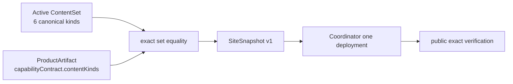

# v0.28.6 旧站最终发布兼容收口方案

## 决策

不绕过发布门禁，不重打 v0.28.5 tag，不增加 ProductArtifact/ContentSet 特例。唯一修复是让 ProductArtifact capability contract 使用当前 canonical ContentSet 的真实 kind 集合。

## 根因

旧 contract 使用 `content` 作为泛化 kind，却没有在任何 canonical 边界定义 `content -> home | observation` 的映射。发布器正确地按真实 ContentSet entries 逐类检查，因而在 transport 前拒绝。问题不是内容不兼容，而是 ProductArtifact 对自身能力的声明不真实。

## 唯一实现

将 capability kinds 固定为 `home`、`observation`、`article`、`practice`、`profile`、`businessObservation`。测试以完整六类调用现有 compatibility predicate；不得改 predicate、降低 equality、引入 alias 或跳过校验。

## 完成定义

新 ProductArtifact 与既有 active ContentAuthority 成功组成 `site-snapshot-v1`，Coordinator 只创建一个 deployment，active content bytes 不变；公网 release/content/data/runtime/media/crawler files 与五个 canonical 页面全部一致。之后旧站冻结。
