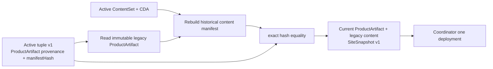

# v0.28.7 Legacy Active Tuple 最终只读发布适配方案

## 决策

保留现有 `content-data-active-v1` 原始字节与身份。产品发布通过其不可变历史 ProductArtifact 重建激活时的 content manifest，exact 验证 `manifestHash` 后只读复用；不把 v1 当作 v2 重算，不修改内容 authority。

## 根因

v1 tuple 的 `manifestHash` 来自带历史 ProductArtifact 字段的 content manifest；v2 authority manifest 则明确不含 ProductArtifact。两者是不同合同。此前发布器把 v2 重算结果用于验证 v1，形成必然失败。

## 唯一实现

1. 仅当 schema 为 `content-data-active-v1` 时，读取 `.content-workspace/base-site-artifacts/{productArtifactId}/client` 的不可变 ProductArtifact。
2. exact 验证 tuple 的 `productArtifactId/productArtifactHash`。
3. 用该历史 ProductArtifact 与当前 tuple 指向的 ContentSet 重建原 content manifest；hash 必须 exact 等于 tuple `manifestHash`。
4. 物化时使用该已验证历史 manifest；当前 SiteSnapshot 仍绑定当前 ProductArtifact，并保存 legacy provenance。
5. v2 正常路径不变；任一历史输入缺失或漂移 hard fail。

## 完成定义

当前 ProductArtifact 与既有 active ContentSet/CDA/v1 tuple 在 transport 前成功组成唯一 SitePublication；只创建一个 deployment；公网 release、内容数据、页面、媒体和 crawler 文件全部通过；active tuple bytes 不变，旧站冻结。
