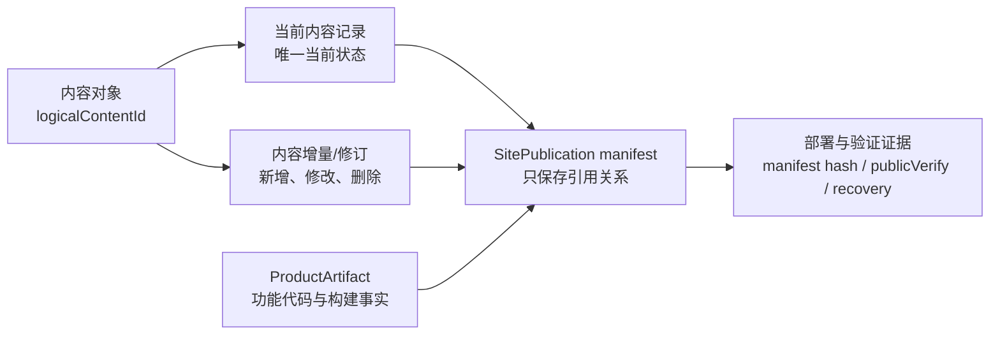

# XBUILD-CONTENT-DATA-LIFECYCLE-001｜内容中心化数据生命周期与有限增量保留

候选 ID：`XBUILD-CONTENT-DATA-LIFECYCLE-001`
类型：产品/Engineering 架构候选
状态：`pending`
executionAuthorization：`pending`
责任：产品/视觉确认目标与边界；Engineering 在候选获批并进入正式方案后设计、实现和验证
范围：重新定义产品功能代码、内容数据、内容历史、SitePublication 记录和派生站点快照的边界

## 1. 候选性质

这是一个数据生命周期与存储边界候选，不是当前版本实现授权，也不是历史文件清理授权。

本候选确认后，仍需经过产品方案、数据对象/规则设计、Engineering 实现、迁移验证和独立验收；在此之前不得修改代码、`current.md`、`VERSION`、ContentSet、SitePublication 或既有发布事实。

## 2. 根本问题

当前内容 release、SitePublication 和 ProductArtifact 将以下对象反复物理复制：

```text
功能代码/构建产物
+ 当前内容
+ 未变化的历史内容
+ 未变化的媒体、字体和静态资源
+ 完整站点派生目录
```

这把“功能版本生命周期”误当成“内容数据生命周期”。问题与网站大小无关；即使是大型系统，也应先区分功能代码、业务数据和发布证据，再按风险决定保留多少派生快照。

当前只读盘点证据：

- `.content-workspace/releases/`：约 `1.13 GiB`、`16,353` 个文件；多个 package 同时保存 `source/`、`dist/client/` 和 `site-publication/`。
- `.content-workspace/site-publications/`：约 `602 MiB`、`8,127` 个文件；包含正式、QA 和测试站点快照。
- `.content-workspace/base-site-artifacts/`：约 `162 MiB`、`13,462` 个文件；按产品版本重复保存构建源和产物。

## 3. 已确认的目标模型



### 3.1 功能代码与内容数据分离

- Git 与 ProductArtifact 负责功能代码、构建结果、commit/hash 和产品版本事实。
- 内容是独立的数据对象，不属于某个产品版本的完整副本。
- 产品版本可以改变功能、页面行为或数据读取方式；它只读取/解释内容数据，不因版本变化而复制全部内容。
- 如果功能改变导致既有单据/对象结构不兼容，必须做明确的数据迁移、兼容转换或字段升级；这不是复制整站数据的理由。

### 3.2 内容对象以自身生命周期为主

每个稳定的 `logicalContentId` 只维护一份当前内容状态：

```text
logicalContentId
├─ current：最新当前状态
├─ history[0]：上一个内容状态
└─ history[1]：上上个内容状态
```

已确认的保留规则是：

- 每条内容级别执行，不是全站统一复制。
- 当前状态之外，再保留前两个历史状态；总计最多三个内容状态。
- 新增内容才新增内容对象记录。
- 内容发生变化时只记录该内容的新修订/增量，并引用上一个状态。
- 内容完全没有变化时不生成新的内容副本。
- 未变化的媒体、字体和静态资源只保存一次，通过稳定引用或内容 hash 复用。
- 删除、下线或状态改变记录为内容事件/增量；是否立即物理回收超出保留窗口的数据，留待实现方案确定。

内容修订可以记录“由哪个产品版本或发布事件带入”，但该版本只是 provenance（来源），不是内容对象的父级，也不是内容存储主键。

### 3.3 SitePublication 是发布事实，不是内容数据库

SitePublication 长期保存最小充分的事实记录：

```text
SitePublication record
├─ ProductArtifact 引用
├─ active ContentSet / 内容 manifest 引用
├─ manifest hash
├─ deployment 与 publicVerify
└─ Incident / recovery 引用
```

完整 assembled snapshot 是由代码和内容引用组装出来的派生物。它可以为 transport、验证和短期恢复而生成，但不应成为每次内容变化都永久复制的内容事实源。

## 4. 非目标

- 不在本候选中删除、移动或归档现有 `.content-workspace` 数据。
- 不修改当前 `ProductArtifact`、active ContentSet、SitePublication、`current.md`、`VERSION`、tag 或线上发布状态。
- 不立即选择 event log、字段级 diff、文件级 patch 或具体数据库实现。
- 不假设产品代码也自动采用“当前 + 两个历史”的保留策略；代码/artifact 的历史保留需单独按产品回滚风险确认。
- 不以清理空间替代数据模型修正。

## 5. 后续设计必须回答的问题

1. 当前内容记录、内容修订和内容 hash 的最小字段是什么？
2. 内容增量按对象、字段、媒体引用还是其他最小粒度记录？
3. SitePublication 如何只保存引用和验证证据，而不把完整内容再次写入长期事实？
4. ProductArtifact、ContentSet 和 SitePublication 的引用关系如何保证可重建和可验证？
5. 当前 + 两个历史超出窗口后，哪些内容保留审计摘要，哪些派生文件可恢复地回收？
6. 现有 34 个 active package 中，`source/`、`dist/client/`、`site-publication/` 哪些是真实依赖，哪些只是重复派生物？

## 6. 后续验收方向

- 未变化的内容不会因为产品版本或其他内容发布而生成新副本。
- 新增/变更内容只产生该对象的当前记录和有限修订记录。
- 每条内容最多保留当前状态加前两个历史状态。
- 产品功能版本可以读取同一份内容数据，不复制整站内容。
- 数据结构变更有显式迁移/兼容路径，不以全站快照掩盖对象结构问题。
- SitePublication 记录可独立证明“哪个 ProductArtifact + 哪个 ContentSet 被部署并验证”，同时不要求永久保存所有重复二进制快照。
- 当前 active ContentSet、内容身份、发布证据和恢复链在模型变更前后可被独立验证。

## 7. 当前状态

本候选仅记录已确认的底层方向，尚未进入正式产品方案，尚未实现，尚未迁移，尚未清理。
