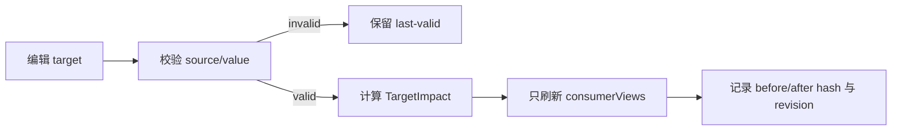

# XBUILD 页面内容结构与内容工作台覆盖方案

状态：`DRAFT`；下一版本候选；未进入 `current.md`，不授权 Engineering 实现。

日期：2026-08-14

责任 owner：`elon`（产品与架构）；视觉关系由 `elon ui` 独立确认；实现由 `elon engin` 负责；内容事实与发布由 `elon ops` 负责。

## 1. 为什么记录本候选

本候选不是一次聊天摘要，而是把 Xing 已经提出的产品优化和使用目标保存为可复用的项目事实，供后续 `elon`、`elon ui`、`elon engin`、`elon ops` 和子 task 读取，避免上下文压缩、task 切换或交接后重复询问、遗漏或误实现。

它只记录产品问题、边界、候选方向和验收条件；不会改变当前 `v0.26.28`、代码、ContentSet、内容事实、发布状态或线上环境。

## 2. Xing 已明确的目标

- 每个页面的可编辑内容要按页面和内容结构清楚列出；Xing 能知道“正在改什么”。
- 内容值可以通过本地工作台即时预览，但字号、层级、间距、媒体比例、安全链接、组件组合等视觉和产品结构由系统锁定。
- 修改哪里，只刷新对应 target 的实际 `consumerViews`；不能因为改一个字段而全站 reload、全站 build 或生成新的 ProductArtifact/ContentSet。
- 页面说明、摘要、Why、简讯等属于可选内容时，空值应自动移除投影并由父级 flow 收紧，不保留空白占位。
- 长文的正文应是一个连续、易编辑的内容面；段落是正文表达，不应被工作台误解成可随意改变页面结构的组件。
- 需要结构化的标题、目录、证据、媒体和操作入口仍由产品合同控制，不能让内容编辑破坏页面语义或视觉系统。
- 关于我的简历入口应友好、简洁，只显示“查看简历”和“下载简历”；HTML/PDF 是内部制品类型，不应成为用户界面文案。

## 3. 当前页面内容与工作台支持矩阵

状态含义：

- `已支持`：当前工作台已有目标或当前版本已覆盖，仍需保持差异更新和零写入边界。
- `部分支持`：已有源字段或 renderer，但可见投影、consumerViews 或编辑入口不完整。
- `候选新增`：本候选要补齐，未授权实现。
- `锁定`：内容可引用或替换，但结构、视觉和安全边界不由 Xing 在工作台调整。

| 页面/路由 | 页面内容结构块 | Xing 可编辑内容 | 当前支持 | 固定/锁定内容 | 本候选处理 |
| --- | --- | --- | --- | --- | --- |
| 首页 `/` | 页面标题；B 端作品投影；作品说明/模块；作品行动块；最新观察简讯 | 页面标题/定位；作品 title、intro、模块说明；行动块文案（若有登记 target）；简讯内容 | `部分支持`：已有内容 target 和局部刷新，但部分 Home 投影与 registry/静态配置仍需对齐 | 路由、H1、模块顺序、CTA 目标、安全链接、视觉 token、媒体比例 | 补齐可见 target→consumerViews；不复制 `/products` 页面投影 |
| B 端产品 `/products` | 版本卡；ProductHero；intro；Why；CTA；ShowcaseModule 列表；ClosingAction | title、intro、Why 页眉/原因、模块 label/说明/关系、已登记 CTA/closing 文案 | `部分支持`：正文/intro/Why/模块可读写；CTA/closing 需核对实际可见来源 | 版本身份、模块数量/顺序、媒体 ID/比例、外链目标、字号间距、页面 IA | 补齐真实可见来源；Why 缺失时不留空白；保留 Products-only 语义 |
| 经营观察 `/business-observations` | 页面 H1；页面说明（可选）；最新经营观察栏目；文章标题；摘要（可选）；TOC；正文；证据/媒体；最新简讯 | 页面说明；文章 title/summary；正文段落；受控 heading 文本；简讯内容 | `部分支持`：文章正文和简讯可编辑；页面说明未完整投影；摘要/图形投影需明确可见性 | H1、H2/H3 层级、TOC ID/顺序、证据来源、媒体结构、文章路由 | 增加可选页面说明；正文用连续 authoring surface；可选 block 消失后父级收紧 |
| 观察 `/observations` | 页面 H1；观察卡片/列表；观察 brief；事实范围；经营影响；证据单元 | 观察 title/summary/boundary、brief、事实段落、经营影响、evidence claim | `部分支持`：观察对象 target 已登记；页面级说明需补齐判断 | 观察身份、来源、证据状态、路由与卡片结构、链接安全策略 | 只补实际可见 target；不让编辑改变证据身份或卡片结构 |
| 关于我 `/about` | 页面 H1；页面说明；RichDocument 正文；受控标题/列表/定义；简历操作入口；联系/收束 | title/summary；正文段落、受控标题和列表文本；简历入口显示文案 | `部分支持`：title/summary/正文可编辑；简历入口当前为静态配置 | heading level/ID、TOC/隐藏规则、简历制品 hash/来源、下载安全链接 | 简化简历入口；标记隐藏或不可见 source block，避免工作台编辑“改了但页面不显示” |

### 3.1 统一可编辑类型

| 类型 | 允许编辑 | 禁止编辑 |
| --- | --- | --- |
| `string` | 单行标题、label、按钮文案、短说明 | 回车、HTML、Markdown、字号、颜色、CSS |
| `content-rich-text-list-v1` | 连续正文中的段落；Enter 形成新段落；段落顺序和值可改 | 任意 HTML、字体样式、任意组件插入、破坏 heading/TOC 结构 |
| `responsive-text-slot-v1` | 内容 parts；已登记的 Web/Mobile `breakAfter` | 任意 DOM/`<br>`/CSS；未登记断点；视觉宽度控制 |
| `media-reference` | 选择已审核、已登记的 `mediaId` | 任意上传、裁切比例、自动替换审核资产、媒体安全属性 |
| `optional-content` | 写入/清空可选说明、摘要、Why 或受控 block | 删除必需页面结构；保留空壳占位；绕过内容审核/发布状态 |

## 4. 长文结构边界

### 4.1 结构化组件（产品锁定）

- 页面 H1、文章标题、受控摘要位置和页面栏目标题；
- H2/H3 级别、稳定 ID、TOC 顺序和锚点；
- 证据、来源、媒体、callout、定义列表等有明确语义的 block；
- About 的简历操作入口及其制品身份；
- 页面组合、双栏/单栏、模块顺序、响应式布局和视觉 token。

这些结构可以由产品方案决定是否出现，但不应在内容编辑器中任意改层级、顺序、布局或样式。

### 4.2 正文内容面

经营观察和关于我的长文正文在工作台中应表现为一个连续的编辑区域。内部段落可以由 Enter 产生、删除和恢复，但它们是正文内容，不是可拖拽/可任意替换的页面组件。标题、目录、证据和媒体仍通过受控结构表达。

正文为空时是否允许整个正文区域消失，必须由页面合同逐页规定；不因为编辑器把正文拆成数组，就自动改变页面结构。

### 4.3 可选结构的消失规则

页面说明、摘要、Why、callout、figure、architecture view、简历入口等只有在产品合同标为 optional 时，清空才会：

1. 不渲染该 block；
2. 父级 flow 自动收紧；
3. 不留下 margin、padding、空 heading 或占位节点；
4. 受影响页面的 geometry 和其他 consumerViews 进入验收证据。

### 4.4 一套长文结构、两种投影模式

本候选明确不为“关于我”和“经营观察”建立两套长文 schema。两者统一使用一个 `long-form-document-v1` 内容模型；差异只存在于页面投影配置，决定哪些受控区域显示或隐藏。

统一模型的最小形态为：

```json
{
  "schemaVersion": "long-form-document-v1",
  "projectionProfile": "profile | article",
  "title": "页面或文章标题",
  "summary": "可选摘要",
  "sections": [
    {
      "id": "stable-section-id",
      "heading": "结构化小标题",
      "body": {
        "schemaVersion": "content-rich-text-list-v1",
        "blocks": [
          { "type": "paragraph", "text": "正文段落。" },
          { "type": "orderedList", "items": ["第一项", "第二项"] }
        ]
      }
    }
  ],
  "controlledBlocks": [],
  "sources": []
}
```

统一规则：

- `sections[]` 是两类长文共同使用的区块容器；每个 section 的标题是结构化字段，正文是连续的 `content-rich-text-list-v1`。
- 正文支持回车形成段落、编号列表、项目列表及经过批准的有限强调/链接语法；不开放任意 HTML、CSS、字号或颜色。
- section 可以为空或不出现在数组中；清空后标题、正文和该 section 的间距一起消失，不留空节点。
- `id` 仍是稳定逻辑身份，用于 target、目录、证据和差异更新；编辑正文不会改变 section 身份。
- `controlledBlocks`、`sources` 和 `evidence` 由页面合同决定，不变成自由富文本，也不允许内容编辑器伪造来源或审核状态。

两种投影只选择能力，不改变 schema：

| projectionProfile | 适用页面 | 显示/启用 | 不适用或关闭 |
| --- | --- | --- | --- |
| `profile` | `/about` | 页面标题、sections、连续正文、受控简历入口 | 文章摘要、文章目录、文章图形、文章来源栏（除非产品合同另行启用） |
| `article` | `/business-observations` | 页面 H1、文章 title、可选 summary、sections、由标题生成的 TOC、受控图形/callout/sources | About 专属简历入口 |

因此：

- About 的“职业概况、企业经营领域积累、擅长解决的问题、我的方向”只是同一 `sections[]` 中的可选 section，不是四套组件或四种正文 schema。
- 经营观察的文章章节也使用同一 `sections[]` 和同一正文编辑器；只有文章投影额外启用摘要、目录、图形和来源等受控区域。
- 未来新增长文页面只需复用 `long-form-document-v1` 并声明 projection profile，不再设计第三套长文结构。
- 工作台使用同一套长文编辑体验；页面只决定可见的受控区域和 target 映射，不复制编辑逻辑。

兼容边界：现有 About/article block 数组由 adapter 读取，未确认前不做破坏性全量迁移；迁移后必须保持原稳定 ID、正文事实、来源、审核和媒体身份不变。

## 5. 视觉问题登记：首页 B 端作品与最新观察简讯

只读核查已发现首页产品投影的 ClosingAction 与“最新观察简讯”之间实际无 section gap（测得相邻边界 gap=0px），与既有 section 节奏不符。

候选方向：由首页父级页面 flow 负责两大 section 的间距，复用现有 `--rhythm-section`/已确认 section rhythm；不在 ClosingAction 或简讯卡片上增加页面私有 margin，不改变两个区块内部节奏，也不新增 token。

待 `elon ui` 确认：

- Web/Mobile 的最终节奏值是否直接继承现有 responsive token；
- 视觉上是否需要维持与 ShowcaseModule/ClosingAction 的既有层级关系；
- 空的最新观察区是否整个消失并由父级 flow 收紧。

在以上确认前，不进入 Engineering。

## 6. 关于我的简历入口

候选方向：保留同一份已核验 `ResumeArtifactRef`、hash、来源和安全链接；只改变可见界面：

- 移除“已核验简历制品”这类内部管理语句；
- “查看简历 HTML”改为“查看简历”；
- “下载简历 PDF”改为“下载简历”；
- 不在工作台中编辑制品 hash、文件类型、来源或公开状态；
- 链接失效时由系统显示受控状态，不让内容编辑器伪造可用简历。

待 `elon`/`elon ui` 确认文案和入口结构后，才形成正式 design/current。

## 7. 精准差异更新合同

任何编辑都必须经过：



- 同一 source 被多个页面使用时，按 target/field 的登记映射刷新所有受影响 consumerViews；未受影响页面、frame、route 不刷新。
- 不因为内容编辑生成 ProductArtifact、ContentSet、SiteSnapshot、SitePublication 或线上发布状态。
- 页面真实导航是唯一页面选择；工作台不再增加重复的顶部页面选择器；页面内 target 选择只负责定位内容。
- 无效输入、半写入、重复 ID 或未登记 target 必须硬失败并保留上一个有效页面。

## 8. 验收条件（形成正式方案前）

1. 逐页面列出可见内容 block、targetId、source、fieldPath、consumerViews 和当前支持状态；不可见 source 必须明确标记，不能让 Xing 误以为修改生效。
2. 每类可编辑内容使用正确 typed authoring；字号、间距、组件结构和媒体安全属性不可在工作台调整。
3. 修改一个正文/说明/模块后，只更新登记消费者；无关 route/frame 的 URL、revision、DOM 和滚动上下文不变。
4. 普通正文 Enter 在 Web/Mobile 形成真实段落；清空 optional summary/description/Why 后无空白占位，父级自动收紧。
5. About 与经营观察都读取同一个 `long-form-document-v1` schema；差异只来自 projection profile，不存在两套长文编辑器或两套正文模型。
6. 页面/文章标题、section heading、正文、summary、TOC、controlledBlocks、sources 的 target 和可见性均可追溯；不可见 target 明确标记。
7. 首页产品区与最新观察简讯的 section rhythm 在 Web/Mobile 通过独立视觉验收。
8. 关于我简历入口只显示“查看简历”“下载简历”，制品身份和安全链接仍由系统锁定。
9. active ContentSet、review、release、SitePublication、ProductArtifact、线上状态和内容审核事实在本地预览前后均不变。

## 9. 明确不做

- 本候选不回写 `v0.26.28`，不修改当前正式方案、版本、tag、ContentSet 或线上状态。
- 不把工作台变成自由排版工具，不开放字号、颜色、CSS、HTML、任意拖拽布局或任意媒体上传。
- 不通过全站刷新、全站构建或复制整站快照实现局部预览。
- 不把内容编辑自动变成审核、active、ContentSet 或 publish。
- 不把候选中的建议值直接视为 Xing 已确认的最终视觉合同；先由 `elon`/`elon ui` 收口，再决定是否写入下一正式版本。
