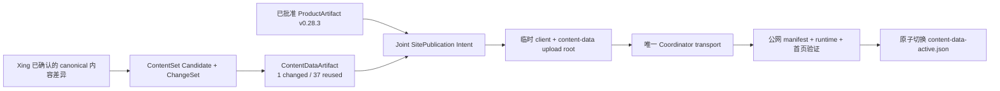

# 当前迭代

## 当前唯一版本：`v0.28.3`

父版本：v0.28.2 / `3a615ce0ff712be339cef0c4fc8387ae0d0bd779`

parentStatus: local-closure-complete-unpublished
contentImpact: compatible-joint-first-activation
contentImpactReason: connect-approved-content-diff-to-canonical-content-data-publication
affectedTargets: [home:home]
affectedRoutes: [/]
affectedFields: [contentDataActiveAuthority, contentPublicationIntent, siteSnapshotContentDataRef, contentOnlyMaterialization, publicRuntimeVerification]
compatibilityEvidence: active-content-set-38-entries-home-one-change-37-reused-product-artifact-client-identity-unchanged

## 核心问题

Xing 已通过正式内容工具修改并预览首页 `home:home`，并明确授权把该差异发布到线上。只读复核确认当前差异只有首页一条：active `contentHash=f12a0c1a…`，当前 canonical normalized `contentHash=01f90ae1…`，其余 37 条 ContentSet entry 未变化。

发布没有继续，因为 v0.28.0 只实现了 ContentDataArtifact、CAS、runtime reader 和若干适配器，正式 `content-release → Site Publication Coordinator` 仍走 ContentSet-only SiteSnapshot；`.content-workspace/content-state/content-data-active.json` 从未建立。现有模块“存在”不等于生产链“接通”。若直接 transport，可能部署成功但没有 ContentDataArtifact、runtime data identity 或原子 active tuple 证据。

v0.28.3 不做局部接线补丁。它建立唯一 canonical 内容发布事务，使产品发布与内容发布都不能绕开 `ProductArtifact + ContentSet + ContentDataArtifact`，并完成从当前 legacy active ContentSet 到单一 active tuple authority 的一次性安全 cutover。

## 正式方案

[v0.28.3 内容数据发布事务与首次 Active Tuple 切换方案](../design/v0.28.3%20%E5%86%85%E5%AE%B9%E6%95%B0%E6%8D%AE%E5%8F%91%E5%B8%83%E4%BA%8B%E5%8A%A1%E4%B8%8E%E9%A6%96%E6%AC%A1%20Active%20Tuple%20%E5%88%87%E6%8D%A2%E6%96%B9%E6%A1%88.md)

## 唯一生产链

- `content-data-active.json` 是 cutover 后 ContentSet 与 ContentDataArtifact 的唯一 active authority；旧 `content-state/active.json` 只作为 pre-bootstrap legacy fallback/audit 输入，不再是并行写入权威。
- 首次 cutover 允许从当前 immutable ContentSet 构造 baseline ContentDataArtifact：`home` 使用 ContentSet 内嵌 `homeContent`；其余 entry 必须由 canonical value 复算并与 active contentHash exact。无法重建的旧值必须硬失败，禁止猜测。
- 当前首页 Candidate 以 baseline artifact 为 predecessor，必须证明只有 `home:home` 新 revision，37 条 record/object ref 复用；ProductArtifact build count 为 0，JS/CSS bytes/hash 不变。
- v0.28.3 ProductArtifact 与本次首页 Candidate 可在同一个获双方批准的 Joint SitePublication 中首次上线；不得先发布缺少 active data tuple 的产品，也不得用旧线上 ProductArtifact 绕过新 runtime contract。
- transport 前只准备 immutable candidate/artifact/tuple intent；公网验证成功后才写唯一 active tuple。失败、超时、CAS 冲突或公网 identity 不完整时，本地 active 事实保持旧状态，PublicationRun 标记 recoverable。

## 执行范围

- 建立单一 `ContentPublicationIntent` 生产 API，由正式 content CLI 与 Coordinator 共同消费；禁止各模块各自推断 ContentSet、ContentDataArtifact 或 ProductArtifact。
- 将 canonical `createSitePublication` / `createSiteSnapshot` / PublicationRun / receipt / public verifier 全部接入 ContentDataArtifact 和 candidate active tuple；canonical ProductArtifact v2 路径缺少 data ref 时硬失败。
- 建立一次性 legacy active ContentSet baseline resolver 与 cutover 规则，确保当前 38 条可重建、可验证，不改写旧 ContentSet。
- 内容-only materialization 只复制既有 ProductArtifact client 并增加 ContentDataArtifact immutable manifest/objects 与 public active pointer；临时 root 成功、失败、SIGINT、超时后均清理，不持久化完整 client。
- finalize 只原子写入 `content-data-active.json`；所有 active 读取器 cutover 后以 tuple 为准，旧 `active.json` 不再双写。
- 将 `content:prepare`、`content:build`、`publish-content.command` 和其他内容 intent 入口统一路由到同一事务；`--prepare/--build` 不 transport，publish 必须显式授权且只能调用 Coordinator。
- 增加真实生产入口正向链、故障矩阵、浏览器 runtime 验证、no-change/idempotency、CAS/recovery/cleanup 和 retained compatibility 测试。
- 同步规则、VERSION、history、scope manifest 与 machine evidence；Engineering 只交付一个完整未提交 CandidateIdentity。

## 明确不做

- 不修改本次首页正文；只消费 Xing 已预览确认的 exact canonical bytes。
- 不发布 Zoox、Ron Baron、Tesla 或其他历史待决内容。
- 不手改 ContentSet、CAS object、active tuple、SitePublication、PublicationRun、deployment 或公网 manifest。
- 不保留 ContentSet-only canonical publisher，不新建第二发布器，不直接调用 EdgeOne。
- 不重建或修改 v0.28.2 ProductArtifact；v0.28.3 必须形成自己的 exact ProductArtifact。
- 不清理旧 receipts、旧 ContentSet、旧 ProductArtifact 或历史物化目录；物理清理仍需独立授权。
- 不因能力缺口直接创建新的 `elon ops` task；task 替换只在 Xing 明确授权并完成 registry 更新后执行。

## 固定验收合同

1. `CP-01 Single authority`：cutover 后所有 canonical active read/finalize 只以 `content-data-active.json` 为权威；legacy `active.json` 仅 pre-bootstrap fallback，禁止双写与双判定。
2. `CP-02 Reconstructible baseline`：当前 active 38 条生成 baseline CDA；每条 value/content/source hash 有可证明来源。首页旧值来自 immutable `homeContent`；任一不可重建 target 硬失败且零写。
3. `CP-03 Exact delta`：当前首页 Candidate 的 normalized hash 为 `01f90ae11586c97f71958bf58b28d6c0c1bf1f1058b83d9c279777138db0e1ad`；1 changed、37 reused，current+2 lineage 合法，no-change 不创建新 identity。
4. `CP-04 One intent`：正式 content CLI、SiteSnapshot、PublicationRun、receipt、materializer、Coordinator 和 verifier 读取同一个 immutable ContentPublicationIntent；交叉替换任一 identity 均 hard fail。
5. `CP-05 Real materialization`：临时 upload root 使用 exact ProductArtifact client，新增 data manifest/object/active pointer；无 source bundle、无 ProductArtifact rebuild，JS/CSS 文件集合、bytes 与 hash exact unchanged。
6. `CP-06 Joint first publication`：v0.28.3 ProductArtifact + 首页 Candidate + candidate CDA 形成同一 site-snapshot-v1；缺少产品批准、内容批准、CDA 或 tuple intent 时不得 transport。
7. `CP-07 Public proof before activation`：同一 PublicationRun 验证 release/content/data manifests、immutable URL、首页真实文案、浏览器 runtime、媒体与固定域名；验证完成前本地 active tuple 不变。
8. `CP-08 Atomic recovery`：成功只产生一次 active tuple CAS；transport/传播/验证/激活任一步失败或重复运行时，旧 authority 保持、临时 root 清理、run 可恢复且不重复 deployment。
9. `CP-09 Canonical positive chain`：隔离 exact staged tree 运行真实 candidate→approval→commit/tag→release:build/preflight→content prepare/build→joint materialization→本地 HTTP 浏览器 public verifier→finalize；仅 EdgeOne 网络边界可替换为显式 test transport adapter，生产脚本/内容模块不可替换。
10. `CP-10 Regression honesty`：release transaction、content data plane、ContentSet、site publication、runtime、scope classifier 与 release:prepare 全部通过；完整 `test:sites` 重新 A/B/C 分类，C=0，retained B 不伪装 PASS。
11. `CP-11 Protected facts`：Candidate/Approval 前后 v0.28.2 commit/tag/ProductArtifact、旧 active ContentSet、历史 SitePublication/receipts 和 canonical 内容 bytes exact；测试只写隔离 root，canonical 不生成 deployment。
12. `CP-12 One delivery`：Engineering 不分批回传局部接线；下一次验收只接受覆盖 CP-01～CP-11 的一个 exact staged-tree CandidateIdentity，批准前禁止 canonical commit/tag/final build/preflight/transport。
