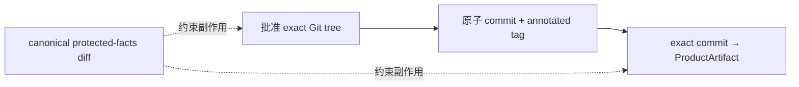

# 当前迭代

## 当前唯一版本：`v0.28.1`

父版本：v0.28.0 / `f7146bf654a9f6fd6467255746d6a07d9eec47c7`

parentStatus: local-blocked-unpublished
contentImpact: none
contentImpactReason: release-transaction-governance-only
affectedTargets: []
affectedRoutes: []
affectedFields: [candidateIdentity, approvalRecord, gitClosure, productArtifactIdentity, sideEffectGuard]
compatibilityEvidence: no-runtime-content-ui-or-publication-change

## 核心问题

v0.28.0 没有机器可消费的批准对象，导致 `READY_FOR_COMMIT` 后可以重算 scope 并提交另一套自洽 bytes。v0.28.1 R1～R3 又把批准、Git、制品、内容保护和 evidence 复制到同一 RT checklist，验收因此变成逐 validator 补丁。

本版本停止补丁路线，改为“单一事实权威 + 四条独立证明链 + 八条封闭不变量”。

## 正式方案

[v0.28.1 Release Transaction 单一权威与封闭验收方案](../design/v0.28.1%20Release%20Transaction%20%E4%B8%8D%E5%8F%AF%E5%8F%98%E6%89%B9%E5%87%86%E4%B8%8E%E6%8F%90%E4%BA%A4%E4%BA%8B%E5%8A%A1%E6%96%B9%E6%A1%88.md)

## 四条证明链

- Git `treeOid` 是全部 tracked bytes 的唯一身份权威；scope manifest 只负责路径分类，不再保存 pathHash。
- canonical ApprovalRecord 只回答“谁批准了哪个 tree”；不复制 build/closure PASS。
- `release.json` 是 ProductArtifact 唯一根 manifest；subordinate manifest 只保存领域事实并由根 hash 绑定，不重复 approval identity。
- 内容与旧 ProductArtifact 是否不变，必须由 closure 时现场 filesystem set diff 证明；ignored evidence 不能自证。

## 执行范围

- 将 R1～R3 Candidate/Approval/Closure 原型整体重构为最小 `CandidateIdentity`、`ApprovalRecord`、`ClosureReport`。
- 建立三类 observer、八个模块化 invariant predicate 与薄 `evaluateInvariants` 组合器，所有正式 CLI 复用。
- 固定 `I-01 Plan`、`I-02 Candidate`、`I-03 Approval`、`I-04 Precommit immutability`、`I-05 Git closure`、`I-06 Artifact provenance`、`I-07 Side-effect isolation`、`I-08 Recovery/read-only` 八条不变量及有限负向矩阵。
- 真实比较唯一 protected baseline 与 closure filesystem；身份/report 对象保持常量级，不复制完整 snapshot 或命令输出。
- 正常 release/content-only 路径不再复制或依赖 repository source；旧 artifact source bundle 只读保留，新 ProductArtifact record 只持久化 immutable `client/` 部署 bytes。
- scope manifest 只分类，`treeOid` 独占 tracked bytes 身份；`release.json` 独占 ProductArtifact 根身份。
- 同步冲突的版本/Engineering 规则、VERSION/history/scope 和正式测试；tracked history 不保存同一 commit 的自引用 hash。

## 明确不做

- 不增加第九条临时不变量，不沿 R4 继续叠加 validator 补丁。
- 不修改、移动、删除或重打 v0.28.0 commit/tag；不恢复其发布资格。
- 不修改页面 IA、组件、视觉、正文、媒体、ContentSet、ContentDataArtifact 或 SitePublication 事实。
- 不引入远程签名、PKI、多用户权限、branch/worktree 或新的发布服务。
- 不迁移或删除历史 base-site source bundle；不以兼容名义生成新的完整 source copy。
- 不执行 commit/tag/build/preflight/transport/content publish/EdgeOne，直到新方案获 Xing 确认并形成新 Candidate。

## 旧 Candidate 失效

R3 Candidate `tree=775bb1b19d7024f202a3b3e22ec0805ede72285c`、`scopeDigest=2cddff6e…`、`candidateHash=a01a73f6…` 因产品合同重构永久失效，不得生成 ApprovalRecord 或进入后置阶段。现有 staged bytes 只是不被批准的实现原型。

## 固定验收边界

Engineering 恢复后只能按正式方案一次性交付新的 exact staged tree、`I-01`～`I-08` 正向/负向测试和 CandidateIdentity。`elon` 只按这八条验收：同一不变量的新输入样例属于工程修复；需要新不变量则停止并回到 Xing/产品设计，不能在验收消息中继续扩展合同。
