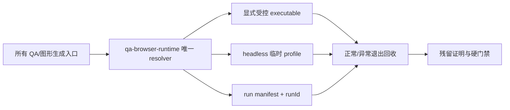

# 当前迭代

## 当前唯一版本：`v0.26.13`

父版本：`v0.26.12` / `e20335a79109c6dee1e3632a2e0ccba8ac649420`

## 正式方案

[`docs/design/v0.26.13 QA 浏览器运行时生命周期与残留治理方案.md`](../design/v0.26.13%20QA%20浏览器运行时生命周期与残留治理方案.md)

来源：当前项目 QA 使用 Puppeteer/Mermaid 默认缓存 Chrome for Testing，启动器退出后可能留下孤儿进程；缓存/偏好失配会触发 macOS reopen 混乱。本版本建立项目级唯一 QA Browser Runtime，不回写 v0.26.12。

## 根本目标



- 从根源上禁止 Puppeteer、Mermaid CLI、Playwright 静默使用自动下载的 Chrome for Testing 或其他缓存 App。
- 所有项目浏览器运行都使用同一个可验证 executable、一次性 profile、runId 和生命周期回收器。
- 正常完成、断言失败、SIGTERM、超时都必须清理本次 run；无法证明归属的残留只报告 Incident，不终止用户正常 Chrome。
- QA 证据必须包含 runtime identity、profile、run lifecycle、cleanup outcome 和 owned process count，避免出现“测试通过但浏览器状态失控”。

## 实现范围

1. 新增 `scripts/lib/qa-browser-runtime.mjs`，统一 resolver、受控 launch options、临时 profile、run manifest、超时/信号回收和 residue check。
2. `scripts/qa-v02511-showcase-spacing.mjs` 与 `scripts/generate-evergreen-figures.mjs` 只通过 resolver 启动 Puppeteer/Mermaid；后续入口不得裸调用 browser launch 或无 config 调用 `mmdc`。
3. 显式 `XINGBUILD_QA_BROWSER_PATH` 只允许指向存在且可执行的受控浏览器；默认 macOS 路径为 `/Applications/Google Chrome.app/Contents/MacOS/Google Chrome`。
4. 任何 `Google Chrome for Testing.app`、`.cache/puppeteer`、`Library/Caches/ms-playwright` 或非受控路径均在启动前硬失败，不自动下载、不打开 GUI、不修改 LaunchServices/Dock/macOS 偏好。
5. 增加静态、单元、正常/失败/SIGTERM/超时、重复运行和 Mermaid 图形生成测试；增加 `qa:browser:check` 运行前门禁。

## 明确不做

- 不修改页面 UI、IA、schema、视觉、ContentSet、正文、审核、媒体、内容身份或内容发布流程。
- 不修改 SitePublication Coordinator、EdgeOne transport、产品/内容快照语义。
- 不扫描、杀死或修改不属于本次 xingbuild QA run 的正常 Chrome 用户进程、用户 profile、ChatGPT 扩展或全局 Codex 配置。
- 不把一次性手工清理 Chrome Testing 进程或偏好文件当作工程完成。

## 产品—内容兼容声明

```yaml
contentImpact: none
contentImpactReason: qa-browser-runtime-governance-only
affectedTargets: []
affectedRoutes: []
affectedFields: []
compatibilityEvidence: content-set-and-content-cli-unchanged
```

## Engineering 合同

1. 浏览器 executable 缺失、不可执行、来自自动下载缓存、GUI 模式或 profile 不是本次临时目录时，返回明确 `QA_BROWSER_RUNTIME_*` Incident 并停止。
2. 每次 run 必须保存 `runId/pid/startTime/executablePath/userDataDir/parentTask/exitState`；成功或失败都必须进入 cleanup 和 residue verification。
3. cleanup 只允许按本次 runId/profile 回收本次进程组；无法证明归属时不得终止进程。
4. 静态检查阻止裸 `puppeteer.launch`、裸 `chromium.launch` 和无受控 Puppeteer config 的 `mmdc`。
5. 运行时失败不得生成或复用不可信截图/图形；不得继续 release QA 或 release preflight。
6. 不改变现有 ContentSet、内容检查、SitePublication、ProductArtifact 身份和线上内容事实。

## 验收门禁

- resolver/路径拒绝/launch options/cleanup 静态与单元测试通过。
- 正常、断言失败、SIGTERM、超时四条生命周期路径均无 owned orphan process、临时 profile 或失效 manifest。
- Puppeteer QA 与 Mermaid 图形生成使用相同 runtime identity；连续两次运行不启动 GUI Chrome Testing、不修改正常 Chrome 用户数据。
- 五路由现有 viewport/interactive/axe/视频/键盘/Reduced Motion 合同不回归；既有 retained failures 分层报告。
- `npm run check`、`release:prepare`、`qa:browser:check`、`release:qa`、`release:closeout-check`、exact `release:build`、`release:preflight`、`git diff --check` 通过。
- ProductArtifact 与 exact HEAD/tag 一致；产品/视觉确认工程证据可信后，才可按持续授权 product transport；内容 task 不因本版本被唤起。

## 当前责任

- 产品/视觉主线：维护本正式方案、审查治理边界和验收证据。
- Engineering 主线：`019fcbf2-20e3-7d51-a4de-87ad7c94b190`，实现唯一 runtime、测试、版本收口和 product transport（验收通过后）。
- 内容及发布主线：保持当前 ContentSet，不参与本版本，不运行 content prepare/build/transport/finalize。
- Ops：继续只负责采集和 EvidenceCandidate，不参与本版本。
