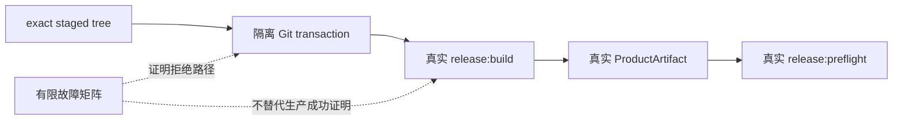

# 当前迭代

## 当前唯一版本：`v0.28.2`

父版本：v0.28.1 / `0fb5c24cc9c8851fd5fe44add9bd0bb7f2999dab`

parentStatus: blocked-commit-unpublished
contentImpact: none
contentImpactReason: canonical-release-build-recovery-only
affectedTargets: []
affectedRoutes: []
affectedFields: [releaseScopeContract, sideEffectPolicy, candidateCheckRouting, canonicalFinalBuild, productArtifactIdentity]
compatibilityEvidence: no-runtime-content-ui-or-publication-change

## 核心问题

v0.28.1 已按 ApprovalRecord 原子形成 commit/tag，但正式 `release:build` 在 canonical `scripts/prepare-sites-build.mjs` 中因未声明的 `productCommit` 变量失败。提交前 D6 正向链替换了真实 `build` 与 `release:prepare`，因此只证明事务门禁和 fixture build 可运行，没有证明 exact staged tree 的生产构建实现可运行。

同一现场还表明 release transaction 正常路径仍在 scope classifier、SideEffect policy 与 Candidate 自测入口中硬编码 `v0.28.1/v0281`，不满足 v0.28.1 方案已经确定的“后续版本直接复用已提交工具”。只改变量名会让 v0.28.2 scope 回到旧 pathHash 逻辑，不能形成可持续版本闭环。

v0.28.2 不增加新发布对象或第九条不变量；它在原有 `Bootstrap / I-01 / I-06 / I-07` 边界内完成两件事：事务内核版本无关化，以及提交前运行不替换生产脚本的 canonical final-build 证明。

## 正式方案

[v0.28.2 Canonical Final Build 提交前证明与阻断版本恢复方案](../design/v0.28.2%20Canonical%20Final%20Build%20%E6%8F%90%E4%BA%A4%E5%89%8D%E8%AF%81%E6%98%8E%E4%B8%8E%E9%98%BB%E6%96%AD%E7%89%88%E6%9C%AC%E6%81%A2%E5%A4%8D%E6%96%B9%E6%A1%88.md)

## 两条互补证明链

- canonical 正向链证明“批准的 exact staged tree 使用真实生产入口能够完成”；不得替换 `build`、`release:prepare`、`prepare-sites-build`、ProductArtifact adapter 或 preflight。
- 有限 fixture 矩阵只证明失败注入和拒绝语义；它不能再作为最终构建成功证据。
- 隔离仓库必须复用 canonical base commit 与 exact staged tree 的 Git objects，不得重新生成“等价”源码树。

## 执行范围

- 修复 `prepare-sites-build` 的 canonical ProductArtifact identity 传递，并验证 `release.json`、client bytes、artifact record 与 commit/tag/ApprovalRecord exact。
- 将 scope 正常行为从产品版本号分支改为显式 schema/contract；新版本写 classification-only schema，v0.28.1 legacy 只读兼容。
- 将 SideEffectBaseline 的 policy identity 从产品版本号改为稳定 policy identifier；创建器不再写当前产品版本，读取器只为 durable legacy tag 保留兼容。
- 将 Candidate 自测从 `tests/v0281-*` 硬编码迁移到稳定 `test:release-transaction` 入口；历史 v0.28.1 测试保留为回归实现，不再是正式路由名称。
- 新增不替换生产脚本的 canonical positive chain，并继续保留现有有限故障矩阵。
- 在同一新 Candidate 中同步 implementation、VERSION、current/design/history、scope manifest、测试和 machine evidence。

## 明确不做

- 不修改、amend、移动、删除或重打 v0.28.1 commit/tag/ApprovalRecord；v0.28.1 永久保持 `BlockedCommit`、未发布。
- 不把失败构建留下的 `dist/client/release.json` 当作 ProductArtifact、ClosureReport 或发布依据；ignored partial bytes 不是权威事实。
- 不只提交 `productCommit` 单点修复，也不为该错误增加 `I-09`、第二 authority 或新的 blanket checklist。
- 不修改页面 IA、组件、视觉、正文、媒体、active ContentSet、active ContentDataArtifact、SitePublication 或内容事实。
- 不执行 transport、content publish 或 EdgeOne；v0.28.2 只完成本地 transaction、artifact 与 closure。

## 固定验收边界

1. v0.28.1 commit/tag/ApprovalRecord 与全部 protected facts 保持逐字节不变。
2. 新版本 transaction core 对产品版本号无正常路径分支；新 scope/policy 由稳定 schema/contract 决定。
3. exact staged tree 的隔离正向链必须调用真实 `release:build`、`prepare-sites-build`、ProductArtifact adapter 与 `release:preflight`。
4. 正向链形成可读取、可恢复且 identity exact 的 ProductArtifact/ClosureReport；删除 ignored cache 后仍能由 annotated tag 恢复。
5. 既有 `I-01`～`I-08` 与有限故障矩阵继续通过；fixture 证据和 canonical 成功证据明确分层。
6. `npm run check`、`npm run release:prepare`、稳定 transaction tests 与完整 `test:sites` 分类均无本版本新增失败；retained failures 不得伪装为 PASS。
7. Engineering 一次性交付新的未提交 CandidateIdentity；`elon` 验收前不得在 canonical repository 生成 ApprovalRecord、commit、tag、final build、preflight 或发布；隔离正向链必须完整执行这些真实入口。
