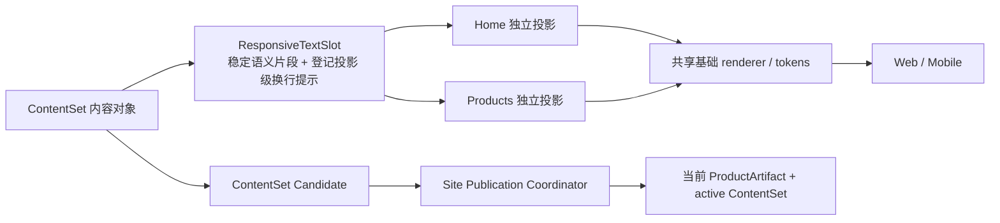

# 当前迭代

## 当前唯一版本：`v0.26.15`

父版本：`v0.26.14` / `375f0c885ddec940be6859336b4db94bc5654256`

## 正式方案

[`docs/design/v0.26.15 通用响应式内容表达与独立发布能力方案.md`](../design/v0.26.15%20通用响应式内容表达与独立发布能力方案.md)

来源：Xing 已确认需要把首页定位、首页 Robotaxi 说明、`/products` 作品说明、Why 原因和作品模块说明纳入同一类可运营内容表达能力；这不是新页面或跨页面共享投影，而是在现有页面组合中增加可选的通用 `ResponsiveTextSlot` 能力，并保持产品与内容独立发布。

## 根本目标



- 内容对象只保存一次语义文本；同一 `parts[]` 可被不同页面按需读取。
- `web` 与 `mobile` 是同一语义对象的两个已登记 presentation profile，不是两套文案事实；内容 task 可声明 `breakAfter`，不能写 HTML/CSS/DOM。
- Home 和 `/products` 保持独立 IA、布局、组件组合、CTA、ClosingAction 与生命周期，只共享 resolver、基础 renderer、tokens 和安全降级能力。
- 产品工程拥有字体、最大宽度、行高、gutter、关系间距和自然换行；内容 task 拥有经审核文本、稳定片段和已登记 break hints。

## 实现范围

### 1. 通用能力

新增有界 `ResponsiveTextSlot` / `responsive-text-slot-v1`：

```json
{
  "schemaVersion": "responsive-text-slot-v1",
  "parts": [{"id": "part-id", "text": "纯文本片段"}],
  "projections": {
    "products.productHero.intro": {
      "web": {"breakAfter": ["part-id"]},
      "mobile": {"breakAfter": ["part-id"]}
    }
  }
}
```

稳定 id 必须唯一且为 kebab-case；break 只能引用已有片段，不能放在最后一个片段之后；禁止空文本、重复/未知 id、HTML/CSS、未知 projection、连续空行和任意 DOM 选择器。没有 hints 时沿用自然换行。旧字符串仍合法，并按单一 legacy part 读取。

### 2. 初始登记的内容框

- `site.home.homeTitle`：首页“我是谁/定位”；
- `site.home.description`：首页定位辅助说明的 slot 兼容；本版本不因支持它而新增首页可见块；
- `products.robotaxi.intro`：Robotaxi 作品说明，Home 与 `/products` 可各自声明 projection；
- `products.robotaxi.why.eyebrow` 与 `products.robotaxi.why.item.{itemId}.text`：现有 ProductHero 内可选 Why 语义槽位；
- `products.robotaxi.module.{moduleId}.shortDescription`：展示模块说明。

后续同类说明框只需登记 source/field/valueType/projection，不复制页面组件。

### 3. Why 页面语义（不是新页面结构）

`why` 只属于 `/products` 既有 `ProductHero`：

```text
Robotaxi 标题 → 现有作品说明 → 为什么做/两条原因 → 现有两个 CTA
```

Why 缺失时不渲染、不留空白；存在时保持居中和原有紧凑节奏：标题→说明 `16px`、说明→Why `12px`、页眉→第一条 `4px`、两条原因 `8px`、原因→CTA `24px`。不改变首页、版本卡、CTA、媒体模块或 ClosingAction。

### 4. 内容发布兼容实现

- Practice/Home adapter、ContentSet projection、content target registry、ChangeSet value type、prepare/build/reconcile 和 renderer 均支持新 slot；旧字符串和既有 active ContentSet 不迁移、不重建即可读取。
- 新字段的 source/review proof、规范化值、before/after hash、changedTargets、ContentSet manifest、SiteSnapshot 和 Coordinator identity 继续走现有唯一链路。
- 产品 transport 复用现有 active ContentSet，不运行 content publish；产品公网完整验证后，ops-content 才能用新 slot 发布初始文案与 Web/Mobile break hints。
- ContentSet Candidate 失败只保留 Candidate/recovery/Incident，旧 active 内容和产品版本不变。

## 明确不做

- 不新增路由、导航、H1、页面级 Why 模块、第二套 renderer、第二个 ContentSet/Coordinator 或页面生命周期。
- 不把 Home 与 `/products` 变成共享页面投影；不使用页面私有 CSS 或硬编码 `<br>`。
- 不修改当前 active 内容事实、媒体、来源、审核、ContentSet 身份、SitePublication 语义、EdgeOne 目标或 v0.26.14 线上状态。
- 不在产品代码中写入 Xing 提供的初始新文案；该文案由产品上线后的内容 task 按独立合同发布。

## 文件与工程责任

| 层 | 正式落点 | 责任 |
|---|---|---|
| 产品/视觉 | 本方案、`current.md`、产品总案 | 定义 slot、页面责任、视觉关系、兼容边界和验收 |
| Engineering | `src/content/`、Practice/Home adapter、`scripts/lib/`、target registry、tests | 实现规范化、渲染、ContentSet/ChangeSet 兼容、QA 与产品版本闭环 |
| 内容 task | ignored `.content-workspace/`、ContentSet Candidate | 上线后更新文本、parts 和已登记 break hints；不改产品代码/版本 |
| Coordinator | 既有 Site Publication Coordinator | 唯一物理 transport、传播等待、整站公网验证和 atomic finalize |

## 验收标准

### 能力与兼容性

- 旧字符串与当前 38-entry active ContentSet 在新 ProductArtifact 上 prepare/build/manifest projection 通过，未产生非预期 hash/entry 变化。
- 新 slot 的重复/未知 id、非法 break、HTML/CSS、未知 projection、超长值在 prepare 阶段硬失败且零落盘；合法 Candidate 可原子 round-trip 和 rollback。
- Product build 不读取 ignored 内容；产品 transport 不运行 content publish；内容 Candidate 不修改产品版本。

### Web → Mobile 视觉

- 五路由 `/`、`/products`、`/business-observations`、`/observations`、`/about` × 1600/1280/390/320 无横向溢出、每页一个 H1、console/page error 为零。
- Home 定位、Home Robotaxi 说明和 `/products` 说明可证明同一语义来源、不同页面 projection；break policy 不互相污染。
- 新 intro 不产生孤立末行；无 hints 时自然换行可读。
- Why 出现时严格满足 `16/12/4/8/24px`；缺失时无空白；既有 CTA、媒体、安全外链、空状态、键盘、Reduced Motion 和 axe 合同不回归。

### 发布闭环

- `npm run check`、`release:prepare`、内容检查、slot/ContentSet/Coordinator targeted tests、分层 `release:qa`、`release:closeout-check`、exact `release:build`、`release:preflight` 和 `git diff --check` 通过。
- 产品/视觉独立验收通过后，才按持续授权执行一次 product transport；同一 deployment 完成 manifest、五路由和媒体公网验证。
- 产品线上验证完成后，再通知 content task 用以下初始值创建独立 ContentSet Candidate：
  - intro：`面向 Robotaxi 运营企业的 B 端运营平台，主要覆盖经营规划、需求预测、生产供应、服务订单、Robotaxi 调度、运维支持、经营分析和自动化运营模拟。`
  - Why 两条已确认原因；
  - Web/Mobile break hints 由内容 task 依据新合同提交，不写入 JSX/CSS。

## 产品—内容兼容声明

```yaml
contentImpact: compatible
contentImpactReason: responsive-text-slot-and-optional-product-hero-copy-capability
affectedTargets: [content-target-registry, content-set-v1, practice-content, home-content, responsive-text-slot, products.robotaxi.intro, products.robotaxi.why, site.home.homeTitle]
affectedRoutes: [/, /products]
affectedFields: [homeTitle, description, intro, why, modules.shortDescription, responsiveTextSlot.parts, responsiveTextSlot.projections]
compatibilityEvidence: v0.26.15-legacy-string-read-and-contentset-candidate-roundtrip
```

## 当前状态与下一动作

- 当前仍为产品方案阶段；v0.26.14 不回写、不重新发布。
- Engineering 主线按本文件实现 v0.26.15，并在本地完成 commit/tag/clean、ProductArtifact、preflight 和 Web→Mobile 证据。
- 产品/视觉独立验收通过后，按既有持续授权执行 product transport；收到公网完整验证后再通知 content task。
- 在产品上线前，content task/Ops 保持停止，不创建新 ContentSet Candidate，不重发既有内容。
