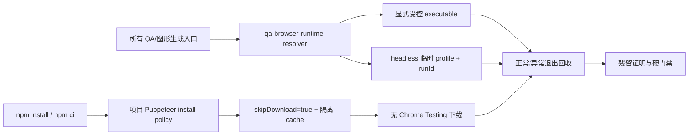

# 当前迭代

## 当前唯一版本：`v0.26.14`

父版本：`v0.26.13` / `62ab89f49771dde0bb6388add9874b83515d2299`

## 正式方案

[`docs/design/v0.26.14 QA 浏览器供应链与安装副作用治理方案.md`](../design/v0.26.14%20QA%20浏览器供应链与安装副作用治理方案.md)

来源：v0.26.13 已完成运行时治理并完成一次线上 transport，但复盘发现 Puppeteer `postinstall` 仍可能在依赖安装阶段自动下载 Chrome for Testing。本版本补齐安装/供应层，不回写 v0.26.13。

## 根本目标



- 依赖安装不自动下载 Chrome for Testing，也不写入用户全局 Puppeteer cache。
- 所有项目浏览器运行都使用 v0.26.13 的唯一 resolver、可验证 executable、一次性 profile、runId 和生命周期回收器。
- 安装 policy 与 runtime policy 必须同时通过；任何一层失败都停止。
- QA 证据必须包含 install policy、runtime identity、profile、run lifecycle、cleanup outcome 和 owned process count。

## 实现范围

1. 新增唯一项目级 Puppeteer 配置，明确 `skipDownload=true`、浏览器分项 skip 和项目 ignored 隔离 cacheDirectory；不得同时存在第二份配置。
2. 新增 `scripts/qa-browser-install-check.mjs` 与 `npm run qa:browser:install-policy`，验证真实 configuration API、环境变量、cache snapshot 和无安装副作用。
3. 保留 v0.26.13 `scripts/lib/qa-browser-runtime.mjs` 唯一 resolver；所有 Puppeteer/Mermaid 入口继续只经 resolver。
4. 增加安装模拟、配置缺失/漂移/全局 cache override、重复 install-policy、运行时生命周期和 Mermaid 同 runtime 测试。
5. 将 install policy 纳入 `release:prepare`、`release:qa`、closeout/preflight 证据，不自动下载、不打开 GUI、不修改 LaunchServices/Dock/macOS 偏好。

## 明确不做

- 不修改页面 UI、IA、schema、视觉、ContentSet、正文、审核、媒体、内容身份或内容发布流程。
- 不修改 SitePublication Coordinator、EdgeOne transport、产品/内容快照语义。
- 不扫描、杀死或修改不属于本次 xingbuild QA run 的正常 Chrome 用户进程、用户 profile、ChatGPT 扩展或全局 Codex 配置。
- 不把一次性手工清理 Chrome Testing 进程或偏好文件当作工程完成。

## 产品—内容兼容声明

```yaml
contentImpact: none
contentImpactReason: qa-browser-supply-and-install-governance-only
affectedTargets: []
affectedRoutes: []
affectedFields: []
compatibilityEvidence: content-set-and-content-cli-unchanged
```

## Engineering 合同

1. 安装配置缺失、skipDownload 漂移、cacheDirectory 指向全局/禁止路径或环境变量绕过时，返回 `QA_BROWSER_INSTALL_POLICY_*` Incident 并停止。
2. 浏览器 executable 缺失、不可执行、来自自动下载缓存、GUI 模式或 profile 不是本次临时目录时，返回 `QA_BROWSER_RUNTIME_*` Incident 并停止。
3. 每次 run 必须保存 `runId/pid/startTime/executablePath/userDataDir/parentTask/exitState`；成功或失败都必须进入 cleanup 和 residue verification。
4. cleanup 只允许按本次 runId/profile 回收本次进程组；无法证明归属时不得终止进程。
5. 静态检查阻止裸 `puppeteer.launch`、裸 `chromium.launch` 和无受控 Puppeteer config 的 `mmdc`。
6. 安装或运行时失败不得生成或复用不可信截图/图形；不得继续 release QA 或 release preflight。
7. 不改变现有 ContentSet、内容检查、SitePublication、ProductArtifact 身份和线上内容事实。

## 验收门禁

- install policy 真实 configuration API、配置漂移、环境变量和 cache snapshot 静态/单元测试通过；连续两次检查不下载浏览器。
- resolver/路径拒绝/launch options/cleanup 静态与单元测试通过。
- 正常、断言失败、SIGTERM、超时四条生命周期路径均无 owned orphan process、临时 profile 或失效 manifest。
- Puppeteer QA 与 Mermaid 图形生成使用相同 runtime identity；连续两次安装策略与运行策略不启动 GUI Chrome Testing、不修改正常 Chrome 用户数据。
- 五路由现有 viewport/interactive/axe/视频/键盘/Reduced Motion 合同不回归；既有 retained failures 分层报告。
- `npm run check`、`release:prepare`、`qa:browser:install-policy`、`qa:browser:check`、`release:qa`、`release:closeout-check`、exact `release:build`、`release:preflight`、`git diff --check` 通过。
- ProductArtifact 与 exact HEAD/tag 一致；产品/视觉确认工程证据可信后，才可按持续授权 product transport；内容 task 不因本版本被唤起。

## 当前责任

- 产品/视觉主线：维护本正式方案、审查治理边界和验收证据。
- Engineering 主线：`019fcbf2-20e3-7d51-a4de-87ad7c94b190`，实现唯一 runtime、测试、版本收口和 product transport（验收通过后）。
- 内容及发布主线：保持当前 ContentSet，不参与本版本，不运行 content prepare/build/transport/finalize。
- Ops：继续只负责采集和 EvidenceCandidate，不参与本版本。
