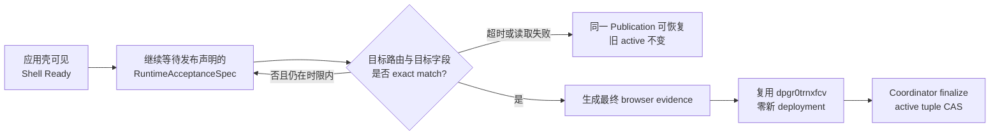

# 当前迭代

## 当前唯一版本：`v0.28.4`

父版本：v0.28.3 / `85e8c3d080f998449a4fefb0c8429b1e27beb36e`

parentStatus: local-closure-complete-deployment-success-publication-unfinalized
contentImpact: compatible-public-runtime-readiness-and-same-deployment-recovery
contentImpactReason: prevent-fallback-shell-from-being-captured-as-final-runtime-and-recover-existing-v0283-publication-without-redeploy
affectedTargets: [home:home]
affectedRoutes: [/]
affectedFields: [runtimeAcceptanceSpec, publicRuntimeVerification, publicationRecovery]
compatibilityEvidence: public-release-content-data-identities-exact-runtime-eventually-converges-existing-deployment-count-one-active-tuple-unchanged

## 已确认事实

v0.28.3 已完成 local commit/tag/build/preflight，随后 `elon ops` 通过唯一 Site Publication Coordinator 提交了首页内容差异。部署 `dpgr0trnxfcv` 的平台状态为 success；公网 `release.json`、`content-manifest.json`、`content-data/active.json`、immutable ContentDataArtifact 和最终首页文案均与同一 `SitePublication` 一致。

正式 `publicVerify` 仍失败，原因不是 EdgeOne 目标、ProductArtifact、ContentSet、ContentDataArtifact 或 transport 身份错误，而是浏览器验收时序错误：

- `publication-runtime.mjs` 只等待 `#root/main/h1` 存在便立即取样；
- 页面先同步渲染 repository fallback，再异步读取 active pointer、artifact manifest 和 38 个 immutable object；
- 实测 0～750ms 仍是 fallback 首页，约 1750ms 后才切换为 approved runtime 首页；
- 因此正式 verifier 把“应用壳已出现”误当成“发布内容已就绪”，并以旧 H1 形成失败证据。

当前 `SitePublication`、`PublicationRun` 和唯一 deployment 必须原样保留；旧 active ContentSet 保持不变，`content-data-active.json` 尚未在本地激活。v0.28.4 只修复验收和恢复能力，不重新发布内容。

既有 v0.28.3 事故记录早于 `RuntimeAcceptanceSpec`：当前持久化事实为 `SitePublication.state=failed`、`failure.phase=verified`、`runtimeAcceptanceSpec=null`，而 `PublicationRun.state=failed`、`deploymentCount=1`、`publicVerify=null`。v0.28.4 的恢复合同必须直接消费这组真实字节；只支持由 v0.28.4 新建的 `recoverable + runtimeAcceptanceSpec` 测试记录不算完成。

## 正式方案

[v0.28.4 公网内容 Runtime Ready 与同一 Deployment 恢复方案](../design/v0.28.4%20%E5%85%AC%E7%BD%91%E5%86%85%E5%AE%B9%20Runtime%20Ready%20%E4%B8%8E%E5%90%8C%E4%B8%80%20Deployment%20%E6%81%A2%E5%A4%8D%E6%96%B9%E6%A1%88.md)

## 实施范围

- 新增单一 `RuntimeAcceptanceSpec`，由既有 `ContentPublicationIntent`/`SiteSnapshot` 的 approved 内容值确定性派生；它只声明浏览器最终必须观察到的 route、target、selector、normalized value hash，不成为第二套内容事实。
- 浏览器 verifier 明确区分 `shellReady` 与 `runtimeReady`。只有全部声明 expectation exact match 后，才允许记录 route 的最终 DOM 证据并进入 finalize。
- readiness 必须采用有界条件等待与明确 timeout/abort；不得使用固定 sleep、单纯 `networkidle`、cache-buster 或“任意 H1 非空”作为成功条件。
- release/content/data/immutable object/ProductArtifact 等公网身份继续独立 exact 校验；DOM readiness 不能替代身份验证，身份验证也不能替代最终 DOM 验收。
- 为已经存在的 v0.28.3 SitePublication 增加正式 recovery：读取同一 publication/run/deployment，确认平台 deployment success 和全部 immutable identity 后，跳过 transport，只生成新的 verification attempt；成功后仍由 Coordinator 执行唯一 active tuple CAS。恢复分类以成功 deployment、唯一 deployment count、缺失 publicVerify、失败 evidence 和未激活 tuple 的组合事实为准，不以 `failure.phase` 字符串前缀代替状态判断。
- 新 publication 必须持久化 `RuntimeAcceptanceSpec`；仅对上述 exact v0.28.3 事故身份允许兼容适配：从其已持久化且 identity exact 的 `contentManifest` 确定性派生 spec，禁止 CLI/测试传入 expected 文本，并在 recovery attempt 中记录派生 spec/hash。其他缺失 spec 的 data-plane publication 一律 hard fail。
- recovery 必须证明 `deploymentId=dpgr0trnxfcv`、deployment count=1、transport calls=0；禁止新建 SitePublication、PublicationRun、SiteSnapshot、ContentSet、ContentDataArtifact 或第二 deployment。
- 增加真实慢速数据面测试：fallback H1 先出现，38 个 object 延迟超过 1 秒后 runtime 才收敛；正式 verifier 必须等待并取到 approved H1。另覆盖永不收敛、错误文本、object 失败、expectation identity 混用、timeout/abort、证据篡改和 cache recovery。
- v0.28.4 先完成正常 Candidate → Approval → local commit/tag/build/preflight。local closure 后先恢复并 finalize 既有 v0.28.3 publication，再允许 v0.28.4 ProductArtifact 进入独立产品发布；两个物理发布事实不得混写。

## 明确不做

- 不修改首页正文、媒体、ContentSet Candidate、ContentDataArtifact、ContentPublicationIntent 或 Xing 已确认的内容差异。
- 不修改、amend、移动或重打 v0.28.3 commit/tag/ApprovalRecord/ProductArtifact。
- 不重试 v0.28.3 transport，不创建第二 deployment，不手工写 active pointer，不手工 finalize。
- 不通过固定等待时长、无限轮询、全局 network idle、浏览器缓存规避或重复部署掩盖 readiness 缺陷。
- 不优化或重构 38 个 object 的读取性能；本版本只纠正“何时可判定发布完成”的责任边界。
- 不发布其他 pending 内容，不清理历史 SitePublication、PublicationRun、receipts 或 artifacts。

## 固定验收合同

1. `RR-01 One declared acceptance`：`RuntimeAcceptanceSpec` 由同一 ContentPublicationIntent/SiteSnapshot 确定性派生并绑定其 identity；手工传入、跨 publication 混用或 hash 漂移必须 hard fail。新 publication 缺失 spec 必须 hard fail；唯一例外是 exact v0.28.3 事故适配，它只能从旧记录已经持久化的 approved `contentManifest` 派生，并把 spec/hash 写入新的 recovery attempt evidence。
2. `RR-02 Two readiness states`：证据分别记录 `shellReadyAt` 与 `runtimeReadyAt`；仅 shell ready、fallback H1 或任意非空 H1 永远不能形成 verified 结果。
3. `RR-03 Exact runtime observation`：`/` 的 `home:home` expectation 以 approved normalized value/hash 为准；browser evidence 保存 observed normalized value/hash、匹配结果和完成时间。
4. `RR-04 Bounded convergence`：verifier 在统一 deadline、abort signal 和单 route budget 下条件等待；成功、timeout、读取失败与中止都有确定错误码、最终证据和 QA browser cleanup。
5. `RR-05 Identity remains independent`：release/content/data manifests、immutable object、ProductArtifact、SiteSnapshot、active tuple 与固定 EdgeOne target 继续 exact 校验；DOM 成功不得覆盖任何 identity 失败。
6. `RR-06 Delayed-runtime proof`：正式入口测试必须真实呈现 fallback shell，并让 data-plane object 延迟超过 1 秒；旧实现应在该场景失败，新实现只能在 approved 文案出现后 PASS。永不收敛、错误文案和 object failure 必须 FAIL。
7. `RR-07 Same-deployment recovery`：正式测试必须复制现有 v0.28.3 publication/run/deployment 的真实持久化形状（包括 `state=failed`、`failure.phase=verified`、`runtimeAcceptanceSpec=null`），执行 recovery 后精确复用 `dpgr0trnxfcv`，`deploymentCount=1`、`transportCalls=0`，追加 verification attempt 而不改写历史失败证据。由 v0.28.4 新建 publication 再注入故障的测试只能作为一般回归，不能替代该验收。
8. `RR-08 Coordinator-only finalize`：恢复成功后只由 Coordinator 以 `expectedPreviousTupleHash=null` 完成 active tuple CAS；验证前后旧 active 事实不变，CAS 冲突、证据缺失或重复 finalize 均保持原子与幂等。
9. `RR-09 Phase ordering`：v0.28.4 local closure、v0.28.3 same-deployment recovery/finalize、v0.28.4 独立产品 publish 是三个可区分阶段；前一阶段未完成不得冒充后一阶段。
10. `RR-10 One Engineering delivery`：Engineering 只回传一个覆盖 RR-01～RR-09 的未提交 exact CandidateIdentity；批准前不得 canonical commit/tag/final build/preflight/transport，测试不得写 canonical content/publication/active facts。
