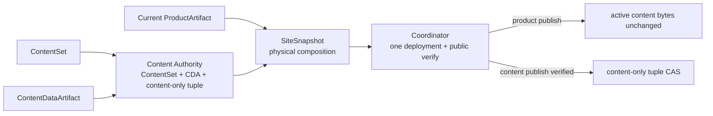

# 当前迭代

## 当前唯一版本：`v0.28.7`

父版本：v0.28.6 / `79ac64ae4effcc5e67aa600811ef68afc1c8145f`

parentStatus: local-closure-complete-product-publish-blocked-pre-transport
contentImpact: compatible-metadata-correction
contentImpactReason: v1 tuple manifest hash was incorrectly recomputed with the v2 content-only authority shape
affectedTargets: []
affectedRoutes: []
affectedFields: [SitePublication.legacyProductProvenance, ContentDataManifest.manifestHash]
compatibilityEvidence: v1-manifest-reconstructed-from-immutable-product-artifact-and-active-authority-bytes-unchanged

## 已确认事实

v0.28.6 已完成 exact commit/tag/ProductArtifact/preflight，并修复真实 active ContentSet 六类 capability。正式 product publish 仍在任何 Git push 或 EdgeOne transport 前被 `ContentData active tuple manifest hash drift` 阻断。

根因是当前 active tuple 为 `content-data-active-v1`：其 `manifestHash` 在激活时绑定 v0.28.3 ProductArtifact。发布器错误使用 v2 的 product-independent authority manifest 重算该 hash，因此合法 legacy tuple 必然不相等。现有 v0.28.3 ProductArtifact、ContentSet、CDA、tuple 与公网 ContentData manifest 可完整重建并 exact 证明原 hash。

## 正式方案

[v0.28.7 Legacy Active Tuple 最终只读发布适配方案](../design/v0.28.7%20Legacy%20Active%20Tuple%20%E6%9C%80%E7%BB%88%E5%8F%AA%E8%AF%BB%E5%8F%91%E5%B8%83%E9%80%82%E9%85%8D%E6%96%B9%E6%A1%88.md)

## 实施与验收

- v1 tuple 必须从其 `productArtifactId/productArtifactHash` 指向的不可变 ProductArtifact 重建历史 content manifest，并 exact 等于 tuple `manifestHash`；历史 artifact 缺失或任一 hash 漂移立即失败。
- v1 历史 manifest 只用于物化既有 ContentData manifest；当前 SiteSnapshot 继续显式记录 current ProductArtifact 与 `legacyProductProvenance`，不得把旧产品冒充当前产品。
- v2 tuple 继续使用 product-independent content authority manifest，不走 legacy adapter。
- `check`、`release:prepare`、current transaction、exact Candidate/Approval/commit/tag/build/preflight 全部复用既有流程。
- 正式 publish 必须在 transport 前成功组装当前 ProductArtifact + 既有 active ContentAuthority；active tuple bytes 不变。
- 公网必须证明 v0.28.7 release identity、五个页面、active observation 集合与 slug、Robotaxi 媒体、简历、robots/sitemap；完成后旧站 frozen。

## 明确不做

- 不改页面组件、文案、内容、媒体、ContentSet、CDA、active tuple、SitePublication 历史或旧 tag。
- 不修改或迁移 v1 tuple，不增加 hash bypass，不创建第二 content authority。
- 不继续旧站功能迭代；只有真实宕机或安全事件可解除冻结。

<!-- v0.28.5 archived implementation context below remains historical reference for the exact parent. -->

v0.28.4 已完成 exact Candidate、ApprovalRecord、commit/tag、ProductArtifact 与 preflight；随后 v0.28.3 既有内容事故使用同一 deployment `dpgr0trnxfcv`、`transportCalls=0` 完成公网验证和 active tuple CAS。v0.28.4 产品 publish 在 transport 前被 Coordinator 正确阻断，没有创建 deployment。

阻断不是内容不兼容，而是对象边界错误：当前 `content-data-active.json` 的 tuple 同时保存 `ContentSet + ContentDataArtifact + ProductArtifact`，其 `manifestHash` 也来自带 ProductArtifact 字段的 content manifest。`SiteSnapshot` 又要求 tuple 的 ProductArtifact 与当前产品 exact 相等。因此任何产品升级都会被迫重建或改写内容 active authority，违反既有“产品更新复用 active ContentSet/CDA、产品发布不写内容 active”的正式架构。

独立 QA 资源诊断同时确认：runtime/fault matrix 以多个子进程逐场景启动系统 Google Chrome；清理可以成功，但一次候选会高频创建多个 Dock Chrome 实例。隔离 worktree 原型已证明一个 Chrome 进程可串行服务多个独立 BrowserContext，并在结束后清理 owned profile/process；该原型尚未进入 canonical，也不是可直接合并的实现事实。

## 正式方案

[v0.28.5 内容 Authority 与产品 SiteSnapshot 解耦及 QA Browser 单会话方案](../design/v0.28.5%20%E5%86%85%E5%AE%B9%20Authority%20%E4%B8%8E%E4%BA%A7%E5%93%81%20SiteSnapshot%20%E8%A7%A3%E8%80%A6%E5%8F%8A%20QA%20Browser%20%E5%8D%95%E4%BC%9A%E8%AF%9D%E6%96%B9%E6%A1%88.md)

## 实施范围

- 将 active content authority 固定为 `ContentSet + ContentDataArtifact + content-only manifest/tuple`；ProductArtifact 只属于 ContentPublicationIntent 的兼容输入和 SiteSnapshot 的物理组合身份，不属于 active tuple。
- 新 canonical tuple 不再写 `productArtifactId/productArtifactHash`；`manifestHash` 只计算 product-independent content authority manifest。未来产品升级不得改变 tupleHash 或 active pointer。
- 既有 v0.28.3 active tuple 保持字节不可变。只读 legacy adapter 必须先验证原 tuple hash、ContentSet、CDA、objects 和旧 manifest provenance，再投影 content authority 供新 SiteSnapshot 组合；旧 ProductArtifact 字段只作 provenance，不再作为当前产品相等条件。
- `SiteSnapshot` 继续使用 `site-snapshot-v1`，独立保存当前 ProductArtifact identity 与 active content references；不得创建第二个 snapshot authority 或 `site-snapshot-v2`。
- 产品 publish 读取当前 ProductArtifact 和 active content authority，做 capability/slot/schema 兼容检查后组装 SiteSnapshot；公网验证成功不写 `content-data-active.json`。内容 publish 才能在同一 PublicationRun 公网验证后 CAS 新 content-only tuple。
- ProductArtifact 不兼容、ContentSet/CDA/object/hash 漂移、legacy provenance 不可复算、active CAS 冲突仍 hard fail；禁止以忽略 identity 的方式放宽门禁。
- QA browser 建立单一 batch session：一个 owning Node process、一个系统 Chrome、一个全局 filesystem lease；每个场景使用新的隔离 BrowserContext并串行执行。
- browser session 统一处理 timeout、AbortSignal、SIGINT/SIGTERM/SIGHUP、context close、browser/process-group close、profile cleanup 和 lease release；machine receipt 记录 launch/context/peak/cleanup 计数。
- runtime QA runner 不再为每个 browser 场景启动新的 `node --test`/Chrome。每个设计场景仍有独立 machine row、正式生产入口和 outputHash；非 browser fault 可以保持定向子进程，但不得隐式启动 Chrome。
- canonical Candidate 正向链必须从 exact staged tree 和当前 v0.28.3 active content bytes 构造隔离发布，证明新 ProductArtifact 可复用旧 active 内容且 active bytes before/after exact；Candidate 阶段不 transport、不写 canonical content authority。
- 旧站只做最后一次可用性稳定化：运行时 observation records 必须投影到首页、经营观察侧栏和 `/observations` 集合；已发布 observation slug 必须从同一 CDA 解析；Robotaxi 模块必须投影当前已批准且公网存在的唯一媒体；runtime 尚未 ready 时只显示加载状态，不得先显示“暂无已发布内容”。
- `robots.txt` 与 `sitemap.xml` 必须作为真实静态文件进入 ProductArtifact，禁止继续由 SPA HTML fallback 冒充成功响应。

## 明确不做

- 不修改首页正文、媒体、ContentSet、ContentDataArtifact、现有 active tuple、SitePublication、PublicationRun 或任何线上内容事实。
- 不 amend、移动或重打 v0.28.4 及更早 commit/tag/ApprovalRecord/ProductArtifact。
- 不把 legacy ProductArtifact binding 静默删除或回写 active pointer；兼容只读、可复算、可拒绝。
- 不创建第二套 ContentAuthority 数据库、registry、event bus、SiteSnapshot schema 或发布器。
- 不以关闭 Chrome、隐藏 Dock 图标、固定 sleep 或放宽 cleanup 断言代替 browser lifecycle 修复。
- 不直接 merge `/private/tmp/xingbuild-qa-browser-session-v0285`；只允许 Engineering 对照正式方案审阅后移植必要实现。
- 不新增页面、栏目、内容、媒体或视觉功能；本次公网逐页通过后，旧站进入冻结状态，不再继续产品迭代。
- Candidate/Approval 前不 commit/tag/build/preflight/transport/content publish/EdgeOne；不发布其他 pending 内容。

## 固定验收合同

1. `CA-01 Authority boundary`：active tuple 的 canonical identity 仅含 ContentSet、CDA、content-only manifest；新 tuple 不得含 ProductArtifact 字段。
2. `CA-02 Legacy read-only adapter`：当前 v0.28.3 active tuple bytes/hash before/after exact；旧 product binding 只作 provenance，任一原始 hash/object/manifest 漂移 hard fail。
3. `CA-03 Product reuse`：用 v0.28.5 ProductArtifact + 当前 legacy active content 生成合法 `site-snapshot-v1`；不生成 ContentSet/CDA/tuple，不写 active pointer。
4. `CA-04 Content independence`：未来 content intent 生成 content-only candidate tuple；内容 publish 仍只在公网 exact verified 后 CAS，失败保持旧 authority。
5. `CA-05 Manifest separation`：content authority manifest hash 不含产品字段；公网 content manifest 可引用当前 ProductArtifact，但必须与相同 ContentSet/CDA/object identity 交叉验证。
6. `CA-06 Compatibility gate`：产品只通过 capability/slot/schema 合同判断内容兼容；incompatible/unknown、legacy 不可复算、cross-mix 均在 transport 前拒绝。
7. `CA-07 Exact product publication chain`：隔离链使用 exact staged tree、真实 ProductArtifact build、当前 active content 只读副本、Coordinator、固定目标模拟、一次 deployment 和 public verifier；active content bytes 零变化。
8. `CA-08 One authority`：正常运行只读 `content-data-active.json`；legacy adapter 不写、不迁移、不成为第二 active 判定，SiteSnapshot 仍为 v1。
9. `BR-01 One browser per batch`：正式 runtime QA batch 的 `browserLaunchCount=1`，所有 browser 场景使用同一 browser process；不得逐场景启动 Chrome。
10. `BR-02 Isolated contexts`：每个场景新建/关闭 BrowserContext，`peakContextCount=1`，cookie/storage/page/console 状态不串场。
11. `BR-03 Global lease`：并行 batch 在启动 Chrome 前被 lease 串行或有界拒绝；stale lease 只有 owner 已死且 TTL 到期才可清理。
12. `BR-04 Bounded cleanup`：成功、assert fail、timeout、abort 和 signal 后 `ownedProcessCount=0`、profile removed、lease released；禁止终止未知 Chrome。
13. `BR-05 Machine receipt`：证据记录 browser PID、launch/context/peak、lease wait、deadline、cleanup、场景 outputHash；无计数或残留不能 PASS。
14. `BR-06 Formal integration`：一次正式 candidate gate 证明 CA 与 BR 全部通过，完整 `test:sites` 继续按 A/B/C 分类，C 必须为0；Engineering 只回传一个新 CandidateIdentity。
15. `FS-01 Runtime collections`：33 条 active observation records 能被集合页、首页和经营观察侧栏读取；任一 active observation slug 不得因构建时仓库为空而进入 NotFound。
16. `FS-02 Approved media`：Robotaxi 运行时 practice 的 `mediaId` 必须投影到已批准公网 MP4，页面不得在资产 200 时显示“暂无可用媒体”。
17. `FS-03 Honest loading`：CDA 未 ready 时显示明确 loading；不得把等待过程表述成没有已发布内容。
18. `FS-04 Public access files`：五个 canonical 页面、简历、Robotaxi 外链、媒体、`robots.txt` 与 `sitemap.xml` 均需真实公网验证，crawler 文件 MIME/内容不得是 SPA HTML。
