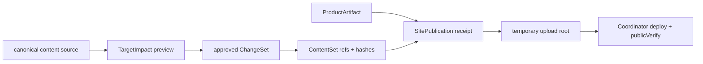

# XBUILD-CONTENT-LIFECYCLE-GOVERNANCE-001

状态：`archived-transformed`。
归档原因：`DL-01`～`DL-04`、`CL-01`～`CL-04` 已纳入 v0.27.0 formal design/current；`CL-05` 保留为单独授权门禁。

## 内容数据生命周期

| 编号 | 必须完成 |
| --- | --- |
| `DL-01` | 每个 `logicalContentId` 只有一个 current 指针，另保留最多两个历史 revision；revision 记录 source/value hash 和前序引用，不复制整站。 |
| `DL-02` | 内容、媒体、静态资源按 hash/稳定引用复用；ChangeSet 只产生变化 target 的新 revision，未变化 target 的 identity/hash 不变。 |
| `DL-03` | SitePublication 只保存 ProductArtifact、ContentSet、manifest、deployment、publicVerify、recovery 引用；完整 client 只在临时 upload root 物化。 |
| `DL-04` | 同一 ProductArtifact + ContentSet + manifest 可确定性重建；失败保持 active 不变，并有可验证 resume、rollback 和保留窗口。 |

## 历史派生物治理

| 编号 | 必须完成 |
| --- | --- |
| `CL-01` | 生成可重跑 inventory：path、owner、object kind、logicalContentId/artifactId、hash、bytes、references、lease、retainUntil。 |
| `CL-02` | 交叉 active ContentSet、receipt、registry、lineage、SitePublication、recovery、Incident 和 lease；引用不明一律保留。 |
| `CL-03` | 输出带理由和证据的 `keep`、`review`、`archive-dry-run`、`delete-never` 清单。 |
| `CL-04` | 仅对无 lease、无引用且可由 canonical source 重建的对象生成零写入、可恢复 dry-run；不直接删除。 |
| `CL-05` | Xing 明确保留窗口并单独授权后，才执行可恢复归档或物理清理；不自动进入版本发布。 |

## v0.27.0 架构合同

必须保持：

- 预览继续按 target → `consumerViews` 局部刷新；不触发无关 route、全站 reload/build、ProductArtifact 或 ContentSet 写入。
- 内容发布只提交变化 target；未变化内容、媒体、静态资源继续复用原 hash/ref，不生成整站内容副本。
- ProductArtifact、ContentSet、SitePublication 各自独立；SitePublication 是发布收据，不是内容数据库。
- 只有一个 ContentSet 流程和一个 SitePublication Coordinator；不新增 CMS、第二套发布器、数据库或事件系统。
- 本版本不改页面 IA、组件、视觉、正文事实、审核事实、active ContentSet 或线上状态；无页面表现变化时不触发 `elon ui`。

验收必须逐项证明：

1. 一个 target 变化时，只有该 target 的 revision/ref 改变，未变化 identity/hash 不变。
2. 相同 ProductArtifact + ContentSet + manifest 可重建相同 snapshot/hash。
3. SitePublication 长期记录只含引用、manifest、deployment、publicVerify 和 recovery 事实。
4. inventory 可重跑，引用来源完整；dry-run 前后 active/review/recovery/release/SitePublication hash 不变。
5. 任意中断或失败不改变 active，能从同一 publication/deployment 恢复；未知引用不得清理。
6. v0.27.0 不执行物理删除；`CL-05` 另行授权。

## 本轮核对（2026-08-15）

基线：`v0.26.32` / `50643e6ea1edac080759e292d30b447aff64b293`。

已完成、无需重复进入候选：

- `v0.26.20`～`v0.26.28`：本地内容工作台、页面导航选择、正文/列表编辑、TargetImpact 局部刷新、非法输入保留 last-valid、固定 4317 产品化入口；不全站 reload/build，不写发布事实。
- `v0.26.29`：Home canonical source mapping、Home/Practice/Article/Profile Candidate 合并和 unchanged identity。
- `v0.26.30`：五路由 target 覆盖、统一长文结构、可选区空投影、父级节奏、目标级内容表达。
- `v0.26.31`：career 唯一 PDF ResumeArtifact 引用、精确 tag 预览证据、实际使用闭环。
- `v0.26.32`：任务注册表 host 身份治理的 record-only 版本收口。

未实现且仍保留在本候选：仅 `DL-01`～`DL-04`、`CL-01`～`CL-05`。本轮未发现其他活动候选或未登记的产品能力缺口。

## 后续计划

1. 下一正式版本：一次完成本合同的 `DL-01`～`DL-04` 与 `CL-01`～`CL-04`；只做生命周期模型、ChangeSet/ref 复用、引用 inventory、保留分类和可恢复 dry-run，不删除、不迁移、不改变线上事实。
2. `CL-05`：待 Xing 明确保留窗口和授权后，作为独立清理动作执行；不默认并入版本，不自动删除。
3. 未经 Xing 确认，不更新 `current.md`、不启动 Engineering、不执行 inventory、归档、删除或发布。

## 边界

- 不删除或迁移现有内容、active ContentSet、SitePublication、recovery、历史证据或 career 源。
- 不把生命周期模型带入产品页面、预览或内容发布功能；不创建第二套发布引擎。
- 先完成 DL 模型和引用 inventory，再决定 CL 的可恢复归档；物理清理必须单独授权。
