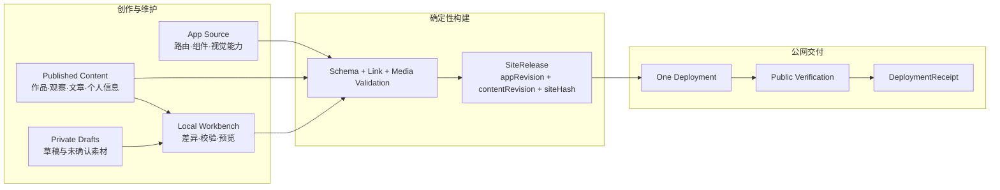
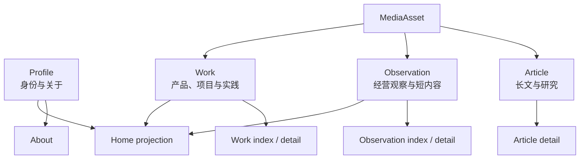
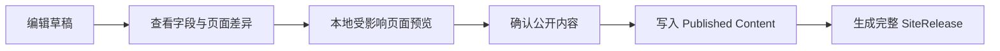
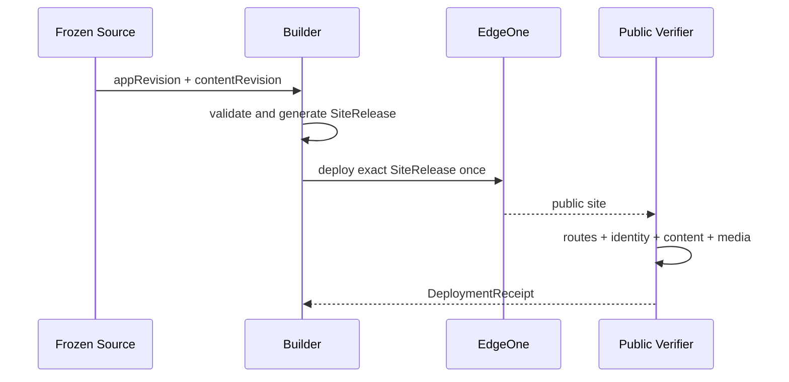
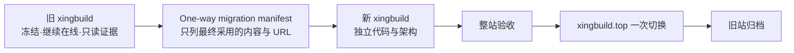

# xingbuild 新网站目标架构

状态：`DRAFT / 架构讨论中`

本文定义完全重写后的目标架构，不描述旧站修复方案，也不授权 Engineering 编码、版本、提交、构建或发布。

旧站只作为三类事实来源：已核验的内容、已确认的产品经验、需要保持的公网 URL。旧代码、旧发布内核、旧运行状态和历史设计迭代不是新站实现基线。

## 1. 架构目标

新站是作者主导的个人网站和持续演进的作品集合，不是 CMS、企业内容平台或通用建站系统。

架构只解决五件事：

1. 清楚表达 Xing 是谁、做过什么、如何思考；
2. 让作品、经营观察、长文和个人信息拥有清楚的内容对象；
3. 让内容可以本地编辑、查看差异并预览；
4. 让产品变化和内容变化可以独立识别，但始终生成一个一致的公网网站；
5. 让构建、发布、验证和回退足够简单，问题在上线前被发现。

衡量架构是否正确的标准不是“兼容多少旧对象”，而是：对象少、责任单一、依赖方向明确、能够从源文件重建、一次发布只有一个公网结果。

## 2. 总体架构

核心结论：新站没有独立的运行时内容数据平面。产品变更和内容变更是两种源变更，但它们共用一条物理构建与发布链，最终只产生一个完整、可回退的静态 `SiteRelease`。

## 3. 最小对象模型

| 对象 | 唯一责任 | 身份 | 不负责 |
| --- | --- | --- | --- |
| `AppSource` | 路由、页面模板、组件、视觉 token、交互能力 | `appRevision`，由应用源树确定 | 保存正文、审核状态或公网运行状态 |
| `ContentItem` | 一个可独立编辑和引用的公开内容对象 | 稳定 `contentId` + 源文件历史 | 决定页面布局、部署或产品版本 |
| `MediaAsset` | 内容引用的图片、视频、文件及其元数据 | 路径或内容 hash | 保存页面逻辑或发布状态 |
| `ContentRevision` | 一次已审核公开内容集合的精确身份 | 由所有已发布内容与媒体清单确定 | 绑定某个产品版本 |
| `SiteRelease` | 可部署网站的唯一不可变制品 | `appRevision + contentRevision + siteHash` | 审核内容、修改源文件或代表部署成功 |
| `DeploymentReceipt` | 一次目标部署及公网验证结果 | `siteReleaseId + target + deploymentId` | 成为第二份内容或产品事实源 |

不再保留 `ProductArtifact → ContentSet → ContentDataArtifact → active tuple → SiteSnapshot → SitePublication` 这一串相互绑定的正常运行对象。旧对象只在迁移记录中保留来源说明，不进入新站运行时。

## 4. 内容与页面边界

新站只定义少量长期内容类型，页面是这些对象的投影，不复制内容事实。

固定边界：

- 首页只做精选投影，不拥有另一份作品、观察或个人信息；
- 导航和路由属于 `AppSource`，正文属于 `ContentItem`；
- 内容只选择已存在的表达能力，不在正文中定义任意布局和视觉；
- 页面使用少量明确模板，不建立通用 Page Builder、万能 block schema 或运行时页面编排器；
- 上游 career 与 Robotaxi 仍是事实来源，新站只保存核验后的公开表达快照。

具体 IA、页面数量、模板和视觉方向在本架构确认后单独设计。

## 5. 内容工作方式

推荐基线：

- 草稿、临时素材和未确认内容留在私有工作区，不参与构建；
- 已审核、准备公开的内容进入版本控制，Git 直接提供差异、历史和恢复，不再自建每对象 current/history/CAS；
- 内容只修改一个 target 时，本地工作台只刷新受影响页面；
- 真正上线时仍重建完整静态站点。网站规模小，完整构建的成本远低于维护运行时增量数据平面的成本；
- 内容更新不需要修改应用代码或增加产品版本，`appRevision` 保持不变，仅 `contentRevision` 和 `siteHash` 变化；
- 产品更新不需要复制或重写内容，`contentRevision` 保持不变，仅 `appRevision` 和 `siteHash` 变化。

## 6. 构建、发布与回退

发布合同：

1. 构建输入必须被冻结且可复算；
2. 构建输出只有一个根 `release.json` 和静态站点文件；
3. `release.json` 只记录 `appRevision`、`contentRevision`、`siteHash`、构建时间和 schema 版本；
4. 产品和内容不拥有两套 deploy 命令，只有一个 `publish` 入口；
5. 每次 publish 最多创建一个 deployment，不在失败后自动创建第二个；
6. 公网验收必须核对 release identity、核心路由、关键内容、资源和媒体；
7. 回退直接重新部署上一个已验证 `SiteRelease`，不改写内容指针、tuple 或旧 release；
8. 浏览器 QA 一次验收只启动一个受管浏览器进程，每个场景使用隔离 context，结束后统一清理。

## 7. 明确废弃的旧架构

新站不迁移以下实现：

- `.content-workspace` 作为正常公开内容 authority；
- `ContentSet`、`ContentDataArtifact`、product-bound active tuple；
- ProductArtifact 与内容 authority 的交叉绑定；
- `SiteSnapshot`、`PublicationRun`、recovery history 组成的多层正常发布状态机；
- 逐版本 QA runner、版本专用兼容分支和 fault-matrix 累积；
- 运行时 fetch 内容 manifest、fallback shell 和 legacy reader；
- 通用页面编排器、为兼容历史结构存在的 adapter；
- 以聊天消息、ignored evidence 或当前工作区状态充当长期事实源。

需要保留但只作证据的内容：旧 Git 仓库与 tag、已发布内容和媒体来源、当前公网 URL、可验证的 SEO/域名事实、历史 deployment receipt。

## 8. 新旧系统关系

- 新站必须在独立项目/仓库建设，不能放入旧仓库子目录，也不能继承旧 Git 历史和发布脚本；
- 旧站在新站完成前保持当前线上状态，不继续产品编码；
- 迁移是单向导入，不提供长期 legacy adapter；
- 只迁移最终采用的内容对象、媒体、来源和 URL 映射，不迁移运行 evidence、候选、失败状态和旧生成物；
- 新站完成本地、视觉、内容、可访问性、性能和发布演练后，才切换正式域名；
- 域名切换验证成功后，旧项目转为只读归档，不删除历史证据。

## 9. 架构红线

1. 新增一个长期对象前，必须证明现有对象无法承担该责任；
2. 同一事实只能有一个源，投影和构建产物不得反向成为源；
3. 不为可能出现的多用户、实时协作、海量内容或多站点需求预建 CMS、数据库、事件总线或分布式发布系统；
4. 不用兼容层连接新旧运行时；迁移完成后删除 importer，而不是永久保留 adapter；
5. 不把验证证据设计成业务对象；测试输出有生命周期和上限；
6. 任何失败都应停在部署前，部署后失败只能回退已验证 SiteRelease；
7. 架构、产品设计、视觉设计和工程实现分阶段确认，Engineering 不从聊天摘要猜测。

## 10. 当前待确认的架构决策

以下问题在进入 IA 和视觉细节前由 Xing 确认：

1. 是否接受“内容本地按 target 增量预览，但上线统一生成完整静态 SiteRelease”；
2. 已公开内容是否进入 Git 作为唯一长期事实，草稿继续私有；
3. 是否确认新站使用独立项目/仓库，旧站只读冻结并保持在线至切换；
4. 是否确认第一版不使用 CMS、数据库、运行时内容 API 和独立内容部署系统；
5. 是否确认新站只保留少量明确页面模板，不建设通用页面编排器。

上述五项确认后，下一阶段才定义产品定位、内容对象字段、IA、页面组合与视觉系统。
