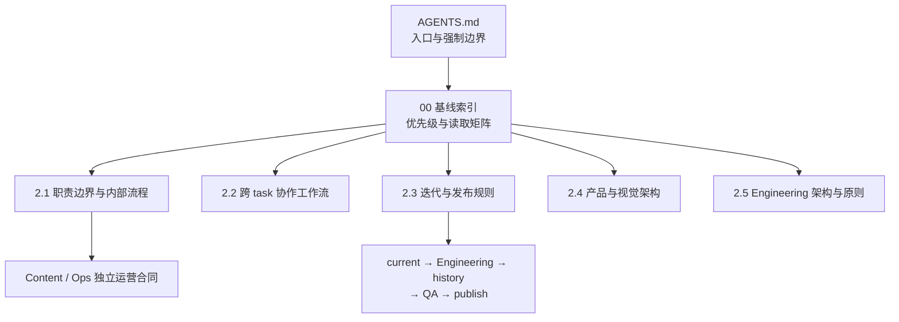

# xingbuild 产品工程协作基线索引

状态：生效。本文只负责规则路由、优先级和读取矩阵，不复制产品、工程或运营正文。

新 task 入场先读 [`task-onboarding.md`](task-onboarding.md)，再按本索引进入对应责任域；该文件只做入场路由和协作门禁，不替代下列规则正文。

## 一、唯一基线结构



五层各自只回答一个问题：

| 层 | 唯一问题 | 事实源 |
| --- | --- | --- |
| 2.1 | 谁负责什么，内部如何分流和收口？ | [`responsibility-and-workflows.md`](responsibility-and-workflows.md)；动态 task 身份见 [`task-registry.md`](task-registry.md) |
| 2.2 | 已存在的 task 如何一次性交接和回传？ | [`collaboration-workflow.md`](collaboration-workflow.md) |
| 2.3 | 产品版本如何从方案走到线上证据？ | [`iteration-and-release.md`](iteration-and-release.md) |
| 2.4 | 网站应该是什么，页面和视觉能力边界是什么？ | [`../product/xingbuild 网站产品架构与视觉系统总案.md`](../product/xingbuild%20网站产品架构与视觉系统总案.md) |
| 2.5 | 当前工程如何组织、构建和发布，不能越过哪些边界？ | [`engineering-architecture-and-principles.md`](engineering-architecture-and-principles.md)；站点物理发布由 `scripts/lib/site-publication-coordinator.mjs` 实现 |

新 task 入场与并行资源门禁：[`task-onboarding.md`](task-onboarding.md)。

运营事实不并入产品工程五层：内容运营以 [`../operations/内容运营与发布规则.md`](../operations/内容运营与发布规则.md) 为准，经营观察采集以 [`../operations/经营观察信息源与覆盖合同.md`](../operations/经营观察信息源与覆盖合同.md) 为准。

## 二、规则优先级

1. `AGENTS.md` 是项目入口和不可违反的强制边界。
2. 本索引决定任务读取路径和文档职责；它不替代任何正文。
3. 具体责任域的专门文件优先于通用说明：产品事实看产品总案，运营事实看运营合同，工程发布看迭代与发布规则。
4. `docs/iterations/current.md` 只定义当前正式产品方案；`docs/iterations/candidates/` 只保存未确认候选；`docs/iterations/history/` 与 `docs/qa/` 只保存历史或证据，不反向授权当前实现。
5. 旧设计、旧 task 消息和旧问题清单不能覆盖现行基线；有冲突先报告，不自行合并解释。

同一条规则只允许有一个正文 owner。其他文件只能引用该 owner；新增规则先判断是否已有 owner，只有确实出现新类别才新增文件并回到本索引登记。

## 三、按任务类型读取

| 任务类型 | 必读基线 | 需要时补读 |
| --- | --- | --- |
| 治理/协作 | `AGENTS.md`、本索引、2.1、2.2 | 当前版本、相关测试 |
| 产品/视觉 | `AGENTS.md`、本索引、2.1、2.3、2.4 | `current.md`、活动 candidates、相关方案 |
| Engineering | `AGENTS.md`、本索引、2.1、2.2、2.3、2.5 | `current.md`、活动 candidates、相关代码/测试 |
| 内容发布 | `AGENTS.md`、本索引、2.1、内容运营规则、2.4 | 当前 B 端内容对象、媒体 manifest |
| Ops 采集 | `AGENTS.md`、本索引、2.1、经营观察合同 | 当前运营证据与来源注册表 |
| 简单事实/命令 | `AGENTS.md`、直接相关文件 | 不扩展读取范围 |

读取顺序固定为：

```text
AGENTS.md → 00-baseline-index.md → 任务类型对应规则 → current/candidates/代码证据
```

涉及跨 task 交接时，在对应规则之后必须读取 `task-registry.md`；它只提供当前通信身份，不替代职责或协作正文。

不因“完整理解”而读取冷档案、无关项目或历史 task；缺少关键事实时只报告缺口。

## 四、文件与动作 owner

| 对象 | 唯一 owner | 其他责任域可做什么 |
| --- | --- | --- |
| 产品总案、current、候选转化 | 产品与视觉 | 提供事实、验收和短检查点 |
| 产品代码、测试、VERSION、commit/tag | Engineering | 读取已确认方案、回传收口证据 |
| Brief/Article/Practice 与独立内容发布 | 内容与发布 | 消费产品能力，不改产品版本 |
| 采集候选、来源覆盖、运行记录 | Ops | 提供 EvidenceCandidate，不写稿不发布 |
| 线上 transport 与公网验证 | Engineering（用户明确授权后） | 产品验收、用户授权 |

每个文件、版本和发布动作只有一个执行 owner。任务协作使用 2.2 的一次性交接，不通过共享脏工作区或聊天历史补全事实。

## 五、基线变更

基线变化属于产品工程治理版本，必须按 2.3 的版本闭环完成：写入当前正式方案 → Engineering 自 QA → local commit/tag/clean → history → 产品/视觉验收 → 按 Xing 持续授权直接 publish。Xing 明确暂停/撤销时才停止；内容运营和 Ops 的独立规则变化不制造产品版本，除非它改变产品能力或产品工程合同。
