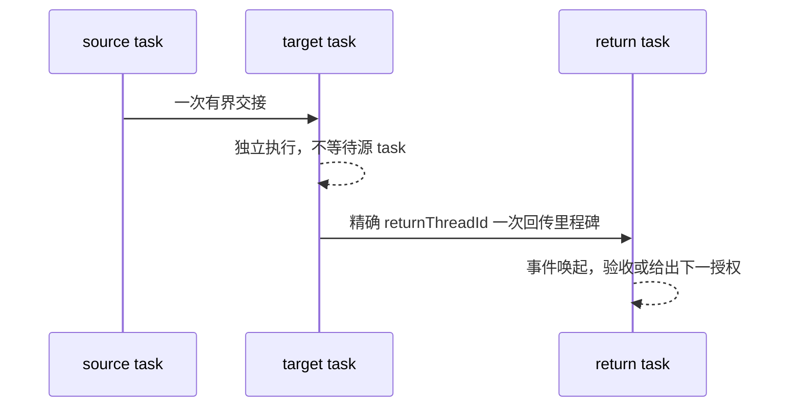
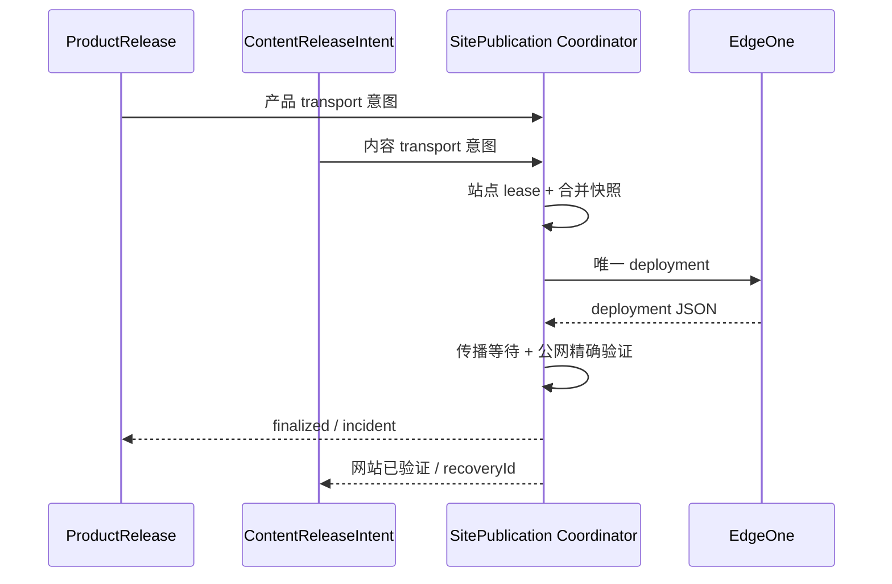

# xingbuild 跨 task 协作工作流

状态：生效。本文是 2.2 跨 task 协作唯一正文；职责和版本边界分别见 [`responsibility-and-workflows.md`](responsibility-and-workflows.md) 与 [`iteration-and-release.md`](iteration-and-release.md)。

## v0.28.3 内容数据交接边界

内容 task 回传的是已审核 Candidate 与 `ContentPublicationIntent` 引用，不回传可直接激活的 active pointer 或部署事实。Engineering 只实现 intent、tuple-aware SiteSnapshot/materializer/Coordinator/verifier 并交付一个未提交 Candidate；只有公网证据完成后 Coordinator 才能执行 active tuple CAS。产品、内容与 Engineering 的 identity 不能互相替代，legacy `active.json` 不得作为 cutover 后的第二 authority。

v0.28.4 交接新增 `RuntimeAcceptanceSpec` 与同一 deployment recovery 事实：Engineering 只回传未提交 Candidate、runtime/fault evidence 和 recovery-ready 入口，不回传或改写 v0.28.3 SitePublication/PublicationRun/deployment/active tuple。需要 recovery 时必须携带 exact publication、snapshot/tuple/spec identity、deploymentCount=1 与 `transportCalls=0`；Coordinator finalize 与内容公网发布仍由对应 owner 独立确认。

## 一、一次性交接模型



三个身份必须分开：

| 字段 | 含义 | 禁止混用 |
| --- | --- | --- |
| `sourceThreadId` | 发起交接的来源 task，仅用于溯源 | 不能自动当作目标或回传地址 |
| `targetThreadId` | 已由用户指定并真实存在的执行目标 task | 不能用猜测、新建或替代 task 代替 |
| `returnThreadId` | 目标 task 完成后回传检查点的既有责任 task | 不能从外层 delegation 的 `source_thread_id` 推断 |

外层 delegation 的 `source_thread_id` 只提供来源证据，不自动提供可调用的目标或回传地址。

## 二、交接前门禁

发送前必须确认并写明：

```text
project / canonical cwd / canonical HEAD
sourceThreadId / targetThreadId / returnThreadId
事实源路径与当前版本
允许范围
禁止范围
目标里程碑与验收合同
阻断条件
完成后的下一授权方
```

目标 task 必须是用户已明确指定且可确认存在的 task。找不到、身份不明、责任不清或回传工具不可调用时，当前动作立即报告阻断；不得创建、fork、猜测、@mention、替代、轮询或后台等待。

## 三、执行与回传

- 源 task 发送一次交接后结束当前回合，不通过 `wait`、`wait_threads`、sleep、重复读取或空轮询维持协作。
- 目标 task 对允许范围内的普通判断负责并连续执行，不因汇报节点暂停；只有事实缺失、合同冲突、破坏性操作、新外部授权或用户必须决定的选择才停止。
- Engineering 实现完成后必须先按 `current.md` 的逐项 checklist 自 QA，回传未提交的 diff/scope digest、测试和实际运行证据；不得先 commit/tag/build/preflight。
- `elon` 收到未提交证据后逐项复核同一 checklist。发现范围内问题，回传明确缺陷、证据和修复条件，Engineering 在同一版本继续修复并重新自 QA；在全部通过前不得进入提交阶段。
- `elon` 只有在方案目标全部通过后回传 `READY_FOR_COMMIT`。该回传是 Engineering commit/tag/build/preflight 的必要门禁，不代表已部署或已上线。
- 涉及页面 IA、组件、视觉 token、响应式、交互或可访问性时，`elon ui` 在提交前对同一未提交范围做独立只读验收；提交后只核对 approved scope digest 与 exact ProductArtifact，不重新扩大范围。
- 长任务在开始或关键里程碑可以发送一次简短 ACK；ACK 不是新的授权，也不要求源 task 同步等待。简单事实交接不增加 ACK。
- 到达约定里程碑后，目标 task 必须向精确 `returnThreadId` 主动回传一次不超过 20 行的检查点；若工具不可调用，回传“工具阻断”事实，不把其他 ID 当目标。
- 检查点只传决策摘要、文件路径、版本/commit/tag、验证证据、阻断 ID 和下一动作；消息不能替代项目文件、候选或版本 history。
- Engineering 提交前的 scope manifest 必须固定在 `docs/iterations/scopes/v{版本号}.json`，只保存 pre-commit phase/baseHead/scope digest，并列出 `implementation`、`record-only` 和 `excludedExternal`（owner/reason）路径；post-commit 证据另带 committedHead 且 firstParent(committedHead)=baseHead，不得回写 tracked manifest。已确认的 record-only 必须随本次 Git commit 收口，`excludedExternal` 不豁免 dirty，未分类或未收口 excludedExternal 时不能继续。
- 没有新事件时，责任 task 不自行唤起其他 task；用户查询只做一次即时快照，不自动进入监控。
- 每次交接前后都必须执行 task 标题状态转换：源 task 只有责任范围彻底完成才标记 `✅`；目标 task 开始执行即移除前缀、由 Codex 动态圆圈表示进行中；目标 task 未完成而阻断时在回传前自行标记 `⚠️`，并写明 `阻断类型`、是否需要 Xing 决策、恢复 owner/条件。状态不能只靠消息表达，也不能把未完成 task 标成 `✅`。

### 站点发布协调顺序



- 产品和内容可以独立准备，但不能并行调用物理 transport；Coordinator 是唯一 EdgeOne deploy owner。
- 内容 task 不因产品版本变化自动重写或重建内容事实；它只提交 `ContentReleaseIntent`/ContentSet Candidate 与 ContentDataArtifact intent，由 Coordinator 使用当前稳定 ProductArtifact 与 active data tuple 组装既有 site-snapshot-v1 引用。
- Coordinator 未返回 `finalized` 前，不得通知下游“已上线并可继续依赖”；失败只回传 Incident/recoveryId，不能让内容和产品进入并行发布。
- 传播等待是一次有界执行，不以固定 30 秒假定成功或失败；有 deploymentId 时恢复只查询和验证同一 deployment，不创建新 deployment。

## 四、标准消息模板

```text
交接类型：handoff | ACK | milestone
project：xingbuild
canonical：<cwd> / <HEAD>
sourceThreadId：<来源 task>
targetThreadId：<执行目标 task>
returnThreadId：<回传责任 task>
事实源：<current/candidate/方案/代码/证据路径>
允许范围：<本次可执行内容>
禁止范围：<不可修改/不可发布/不可创建的内容>
里程碑：<完成条件>
阻断：<无或阻断 ID>
下一动作/授权方：<明确动作>
```

完成回传只保留：

```text
版本/身份；已完成证据；未完成或阻断；下一授权
```

Engineering 提交前回传必须另外包含：current/design、未提交 scope digest、Engineering checklist 结果、真实运行/测试证据和“禁止 commit”状态。

`elon` 验收回传必须明确：`READY_FOR_COMMIT` 或 `BLOCK`、逐项 checklist 结果、缺陷证据、是否需要 Xing 决策和 Engineering 修复条件。

## 五、正常阻断与停止条件

| 情况 | 唯一动作 |
| --- | --- |
| 找不到目标 task | 报告用户，请求确认身份或明确授权创建 |
| 无法调用回传工具 | 报告工具阻断，不猜测、不等待 |
| 事实源缺失或合同冲突 | 停止越界动作，报告缺口/冲突 |
| 需要新 branch/worktree/task/自动化 | 报告并请求用户明确授权 |
| 普通实现、审核或发布命令 | 复用现有责任 task，不隐含创建协作资源 |

“待用户授权”是一次明确的停止事实，不是后台等待；条件解除后由新用户指令或新检查点恢复。
