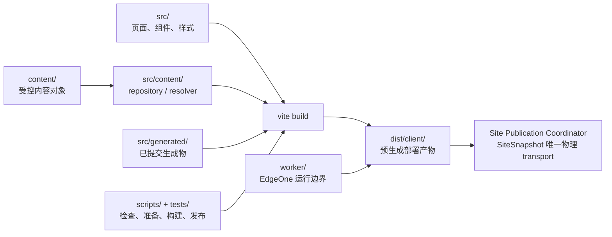

# xingbuild Engineering 架构与原则

状态：生效。本文只记录当前项目已经存在的工程边界，不定义产品业务、页面文案或运营事实；产品能力以产品总案为准，版本和发布以 [`iteration-and-release.md`](iteration-and-release.md) 为准。

## 一、当前工程边界



| 路径 | 当前责任 | 边界 |
| --- | --- | --- |
| `src/` | 网站页面、组件、样式和展示运行时 | 只实现已确认进入 `current.md` 的产品能力 |
| `content/` | 受控产品/观察/文章/Profile 内容对象与 schema | 内容事实必须经过对应内容合同，不能把 workspace 草稿当生产源 |
| `scripts/` | 检查、内容准备、业务准备、构建和发布工具 | 工具不能越过产品/内容责任边界；兼容入口只提交 intent，只有 SitePublication Coordinator 调用 EdgeOne |
| `worker/` | EdgeOne Worker 与访问资格运行边界 | 不在页面组件中复制服务端逻辑 |
| `src/generated/`、`public/` | 由显式生成命令产出的受控文件 | 源/产品方案变更后、local commit 前生成并纳入同一提交 |
| `dist/client/` | 产品 ProductArtifact 的已验证静态产物 | 在最终 commit/tag 后由 `release:build` 生成；Coordinator 在独立 staging 中将 ProductArtifact 与 active ContentSet 组成 SiteSnapshot，普通产品 build 不读 ignored 内容 |
| `tests/` | 结构、内容、发布、运行时和治理合同验证 | 测试失败不得被发布命令自动绕过 |

## 二、工程执行原则

- 官方项目目录与 canonical `main` 是唯一工程基线；默认 direct-local，不自动创建 branch/worktree/detached checkout。
- Engineering 只实现 `current.md` 的正式方案；产品目标、对象边界、视觉合同或上游事实不成立时停止并回到责任 task。
- `current.md`/design 只定义 `implementation`，不是 Git 提交清单；一次提交还必须收口 owner 已确认的 `record-only` tracked 项目记录。两类都进入同一 commit/tag；未分类、未授权或未收口的 `excludedExternal` 变更阻断；Content/Ops ignored 事实另走内容生命周期。不得只暂存 current/design 文件，也不得把 ProductArtifact 运行输入范围当成 Git 提交范围。
- scope manifest（`docs/iterations/scopes/v{版本号}.json`）是本次提交的唯一范围事实；它只保存 pre-commit baseHead。closeout、release-build、preflight 和 unified-publish 必须调用同一个 path classifier；post-commit committedHead 放在独立 machine evidence，并按 phase 校验 firstParent(committedHead)=baseHead、声明集合、owner/reason、scope digest 和工作区实际路径一致。`excludedExternal` 只记录不属于本次范围的 owner，不绕过 dirty；目录 allowlist 或单独 gate 例外均无效。
- 生成器 `architecture:views`、`framework:data`、`framework:layout`、`article:figures` 只在源/方案变化后显式运行；构建和发布不无条件调用会回写 tracked 输出的生成器。
- `npm run release:prepare` / `release:build` 负责产品业务准备、构建和验证；最终 build 必须发生在 commit/tag 后；`publish-xingbuild.command` / `unified-publish --kind product` 只校验 classifier-confirmed scope-clean 的 exact HEAD/tag 与 ProductArtifact，随后由 Coordinator 按授权执行 push、唯一 deploy、传播和公网验证，不包含网站业务逻辑。
- 产品 publish 与内容 publish 是两个独立责任边界：产品 publish 提交 ProductRelease intent；内容 publish 生成 ContentSet Candidate（包括 `home` 首页内容入口）；两者都不能直接调用 EdgeOne，统一由 Coordinator 取得站点 lease、组装一个 SiteSnapshot、部署、等待传播和精确验证。旧 receipts、ContentSlotRegistry、PublicationLineageBinding、projection 和 package 只读保留为迁移/审计证据，不再进入正常运行路径。
- 任一构建后未分类 tracked dirty、版本身份不一致、产物缺失或发布目标不明确，必须停止并形成 Publish Incident；已由 owner 明确标记为 `record-only` 且纳入版本暂存/history 的候选不属于未分类 dirty。closeout、build、preflight、publish 不得自行读取全局 dirty 作为结论，只能使用同一 classifier 的分类结果；不得自动 patch、commit、tag、重试或继续后续阶段。

## 三、代码与事实边界

- 页面层投影受控内容对象和已确认产品能力，不为了页面便利复制 career/Robotaxi 上游业务事实。
- `content/` 与 `.content-workspace/` 分离；后者是内容草稿、审核、recovery、Ops 运行和独立发布包的 ignored 工作区，不能进入产品 bundle 或产品版本事实。
- 生成物、构建产物、Git commit/tag、EdgeOne 部署和公网 manifest 是不同事实，不互相代替；每次收口分别报告。
- 不在本文件重写产品 IA、视觉系统、内容 schema 或运营来源合同；需要这些事实时沿索引读取各自 owner。

## 四、验证最小闭环

```text
方案/current → release:prepare + Engineering 自 QA
→ 未提交证据 → elon checklist 验收
→ READY_FOR_COMMIT → commit/tag/clean → final release:build/preflight
→ 必要的 elon ui/内容分流 → SiteSnapshot Coordinator
→ 唯一 deployment → 公网证据 → active ContentSet 原子切换
```

Engineering 自 QA 不能替代 `elon` 的方案验收；`READY_FOR_COMMIT` 前不得提交版本或生成最终 ProductArtifact。范围内问题必须在同一版本未提交阶段修复，不能因为提前提交而被迫拆成下一版本。
内容运营和 Ops 不进入这条产品版本闭环；它们使用各自合同和独立身份。Engineering 的交接使用 [`collaboration-workflow.md`](collaboration-workflow.md) 的一次性模板。
