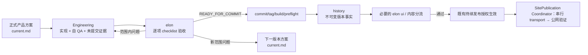

# xingbuild 迭代与发布规则

状态：生效。本文只负责产品工程版本从正式方案到线上证据的生命周期、验证、Git、部署和回退；职责正文见 [`responsibility-and-workflows.md`](responsibility-and-workflows.md)，跨 task 消息见 [`collaboration-workflow.md`](collaboration-workflow.md)，内容和 Ops 见 `docs/operations/`。

## v0.28.3 内容数据发布门禁

内容发布不是 ContentSet-only 的站点发布。正式 CLI、`SiteSnapshot`、`PublicationRun`、materializer、Coordinator 和 public verifier 必须消费同一 `ContentPublicationIntent`，并共同校验 `ProductArtifact + ContentSet + ContentDataArtifact + active tuple`。`content-data-active.json` 只在同一 `PublicationRun` 的公网证据完成后以 expected tuple hash 原子切换；legacy `active.json` 仅为首次 baseline 的只读输入。任何缺少 CDA/tuple、identity 交叉替换、public data object/hash 漂移或 active CAS 冲突都停止，不得 transport 或把 partial dist 当制品。

## v0.28.4 Runtime Ready 与恢复门禁

正式内容公网验收必须携带从同一 intent/SiteSnapshot 派生的 `RuntimeAcceptanceSpec`，按 `shellReady → runtimeReady → identity exact → Coordinator finalize` 顺序形成证据。fallback shell、非空 H1、只匹配 substring、固定 sleep 或单纯 network idle 均不能替代 approved normalized value/hash。timeout、abort、错误文案、active/manifest/object 失败与 spec identity drift 必须产生可复算的失败 attempt 并清理 QA browser。

v0.28.3 已成功 transport 但 verifier 失败时，只能走正式 existing-publication recovery：读取 exact SitePublication/PublicationRun/deployment，确认固定 EdgeOne target、status=success、唯一 deployment，跳过 materialize/transport/create deployment，追加新的 verification attempt；成功后仍由 Coordinator 以 `expectedPreviousTupleHash=null` 完成 active tuple CAS。恢复不能覆盖旧失败 evidence、创建第二 deployment 或把 v0.28.4 ProductArtifact 与 v0.28.3 内容 publication 混为一条事实。

## 1. 产品工程闭环



版本号用于可辨识的产品能力、页面结构、内容模型、视觉系统、作品详情、共享展示能力或发布架构变化；局部快速修订可在同一未提交版本内完成后形成一个稳定版本，不为每次对话、范围内缺陷或未完成试验增加版本。

## 2. 事实源和范围

- 上游事实：career、Robotaxi 的权威事实源；xingbuild 只保存核验后的网站表达快照。
- 产品/视觉事实：`docs/product/xingbuild 网站产品架构与视觉系统总案.md`。
- 当前正式方案：`docs/iterations/current.md`；未确认候选：`docs/iterations/candidates/`；历史版本和候选归档：`docs/iterations/history/`。
- 工程事实：代码、测试、Git commit/tag、构建产物、EdgeOne 部署和公网 manifest，按不同阶段分别记录。
- 内容事实：`docs/operations/内容运营与发布规则.md`；经营观察采集事实：`docs/operations/经营观察信息源与覆盖合同.md`。它们不进入产品版本闭环。

本文不复制上述文件的职责正文。发生冲突时，按 [`docs/rules/00-baseline-index.md`](00-baseline-index.md) 的优先级和 owner 处理；不通过旧 task 消息猜测缺失事实。

## 3. 当前版本和候选入口

唯一当前指针是 `docs/iterations/current.md`。它只记录当前可执行产品方案，不保存 `pending`/`complete`、验收、授权或线上状态字段。

版本开始至少写明：问题、范围、明确不做、页面/对象/工程文件、验收标准和当前正式方案。Engineering 只实现已写入 current 的范围；活动候选不是实现清单。候选文件与版本实现范围分开判定：版本期间新增或修改、且 owner 确认必须保留的 tracked candidate，可以作为 `record-only` 纳入同一版本 commit/history；它仍保持 `DRAFT`，不进入 `current.md`、Engineering、ProductArtifact 的运行输入或发布范围。规则、候选、history 等其他已确认项目记录同样按 `record-only` 收口；只有未分类、未授权或仍由其他 task 修改中的 tracked candidate 才阻断 closeout。

候选属于产品设计前阶段：

- 活动目录只保留未确认 `pending`/`DRAFT`；已转化或关闭的候选必须进入 `docs/iterations/history/candidates/` 并保留来源、目标版本、方案路径和理由。
- 当前版本完成后由产品与视觉 task 清点候选；已确认候选先转正式设计方案、写入 current，再在同一动作中归档来源候选。
- 提交后产品/视觉验收问题不走普通候选，直接定义下一 patch/小迭代/大迭代并写入 current；不回写旧版本。

## 4. 本地版本收口

Engineering 按以下顺序形成一个本地提交版本。`READY_FOR_COMMIT` 前禁止 commit/tag/build/preflight；最终 ProductArtifact 必须绑定提交后的精确 HEAD/tag：

1. Engineering 完成实现、记录、生成器、`VERSION.md`、current/history 和 scope manifest，按 manifest 完整暂存全部 `implementation` 与 `record-only` 路径；
2. 运行 `npm run release:candidate-check` 与 `release:candidate-freeze`：覆盖 `release:prepare`、分层 QA、正式入口负向测试和 read-only identity 检查，以 staged tree OID 形成最小 CandidateIdentity 与唯一 SideEffectBaseline；
3. `elon` 对精确 CandidateIdentity 独立复核。范围内问题回到 Engineering 同版本修复并重新 freeze；通过后由正式 approval 入口形成 `READY_FOR_COMMIT` ApprovalRecord。Candidate/Approval 阶段不得把尚未发生的 commit/tag/build/preflight 事实提前标为 PASS；
4. 收到 ApprovalRecord 后只执行只读 `npm run release:closeout-check -- --approval <ApprovalRecord>`，不得再 materialize、修改、生成或 stage tracked 文件；
5. 以无部分 refs 状态的 transaction 创建带 `Xingbuild-Approval` trailer 的 exact commit 和 annotated tag，确认 parent/tree、tag 中可恢复的 canonical ApprovalRecord/CandidateIdentity/SideEffectBaseline 与同一批准身份一致且 tracked clean；
6. 在该精确 HEAD/tag 上执行最终 `npm run release:build -- --approval <ApprovalRecord>`，生成只含 immutable client 的 ignored ProductArtifact；post-commit gate 应能从 annotated tag 恢复 authority，不以 ignored 缓存为唯一依赖；
7. 执行 `npm run release:preflight -- --approval <ApprovalRecord>`，同时校验 Git/版本、批准身份、单一 `release.json` 根 manifest、subordinate hash 与现场 protected diff，形成 I-01～I-08 ClosureReport；
8. 只有 preflight、ReleaseClosureEvidence 和必要分流验收通过的同一 ProductArtifact 才能 transport。

closeout 必须按版本 scope manifest、owner 和路径核对全部 tracked dirty，并形成三类清单：`implementation`（进入产品实现和 ProductArtifact 输入）、`record-only`（进入 Git/history 但不进入 ProductArtifact 运行输入）和 `unclassified`（未确认、未授权或其他 task 未完成）。tracked manifest 只保存 pre-commit baseHead；post-commit 的 committedHead 写入独立 machine evidence，并验证其 first parent 等于 baseHead，不能回写 manifest 或要求新 HEAD 仍等于旧 baseHead。manifest 可声明 `excludedExternal` 作为外部 owner 记录，但必须逐路径写 owner/reason；它不豁免 dirty，发生变化时必须由 owner 收口或归入本次 record-only，不能从目录或“external”自动推断。自 QA 可保留 manifest 已声明且 state=added 的未 tracked/staged 新路径；未知 untracked 一律阻断，READY 后 closeout 必须要求声明路径全部 staged。前两类必须在本次 commit 前全部收口，只有未声明或未收口路径阻断。内容 Ops 的 ignored `.content-workspace` 不纳入产品 commit。`git clean` 表示已确认变更全部已提交，不表示所有变更都必须属于 current/design；closeout、build、preflight 和 publish 必须使用同一 classifier。

Engineering 同一轮一次性更新 `VERSION.md`、`current.md` 和 `docs/iterations/history/v{版本号}.md`；history 记录版本号、commit、annotated tag、clean、父版本、范围和验收合同，提交后不可回写。

生成器 `architecture:views`、`framework:data`、`framework:layout`、`article:figures` 只在源/方案变化后、local commit 前显式运行并把输出纳入同一提交。`build`、`release:prepare`、`release:build`、`release:check` 和 publish 不无条件调用会回写 tracked 输出的生成器；构建后 tracked dirty 是硬阻断。`release:build` 只负责确定性构建与身份产物；`release:qa` 保留 Mermaid/Puppeteer、桌面/手机等环境型 QA，环境 incident 单独记录，不得伪装成产品实现失败。

## 5. 本地预览与验证

- 标准启动入口：`./start-xingbuild.command`；固定预览 `http://127.0.0.1:4317/`。
- 预览资源必须绑定当前 worktree、HEAD、版本、PID 和 task；端口冲突或归属不明时停止，不换端口、不终止未知进程。
- 涉及页面 IA、组件、视觉 token、响应式、交互或可访问性变化时，必须做桌面和手机真实页面验证；纯内容变更只做受影响页面的内容/溢出 smoke，构建通过不等于对应验收通过。
- Engineering 的自 QA 不是最终产品验收；它必须先于 `elon` 的逐项方案验收，且两者都在 commit 前完成。验收只覆盖当前方案范围，不把未列入方案的偏好或新需求混入本版本。
- `npm run release:check` 仅作兼容性/诊断命令，不替代四阶段门禁，不由 transport publish 调用。

## 6. 产品线上发布

入口：

```bash
./publish-xingbuild.command
```

产品 publish 是线上 transport 意图入口，不是版本创建器或业务执行器。它只消费已完成对应验收分流的现有 clean `main` HEAD、annotated tag 和预生成 `dist/client`，不得自动递增版本、写 package/VERSION/current/history、commit、tag、修复脏改或运行网站业务逻辑；整站物理发布统一由 `SitePublication Coordinator` 负责。

transport 顺序固定：

1. 读取 source cwd、`current.md`、`VERSION.md`、package、history、HEAD/tag，确认版本身份一致；
2. 确认官方 direct-local clean `main`，记录 source HEAD；
3. 校验 `dist/client/release.json` 与版本/commit 匹配；
4. 执行 `release:preflight`；
5. Xing 已授予产品闭环持续发布授权；`elon` 在 commit 前回传 `READY_FOR_COMMIT`、Engineering 完成精确 commit/tag/build/preflight、必要的 `elon ui` 或内容分流通过后，Engineering 直接使用显式 `--authorize-publish` 执行，不再逐次向 Xing 询问；除非 Xing 明确暂停、停止、撤销或要求人工接管，否则自动完成后续 push、deploy、public verify；硬失败仍立即停止；
6. 由协调器将当前 ProductArtifact、active `ContentSet` 与 active `ContentDataArtifact` 以既有 `site-snapshot-v1` 引用合并，取得站点 lease 后部署到固定 EdgeOne 目标：`name=xingbuild-nochina`、`projectId=makers-ze0f6txvlhco`、`domain=xingbuild.top`；内容-only 变更只使用临时 upload root，不持久化完整 client。
7. 持久化 machine-readable deployment JSON，按有界退避等待传播，校验 `release.json`、`content-manifest.json`、目标页面/媒体与 active/candidate 集合；
8. 只有 `SitePublication` finalized 才报告线上统一产品和内容结果；Deploy Success、push 或单页 HTTP 200 均不等于完成。

失败立即停止并保留未发布/部分完成事实；不得继续后续阶段或写入完成声明。push 成功而 deploy/verify 失败时，只报告“代码已同步、网站未上线”。EdgeOne 目标合同未来若需调整，必须在新治理版本中同时更新本文件、发布脚本、测试和目标验证；旧目标和历史证据不得静默改写。

## 7. 内容运营边界

内容 Observation、Article、Practice、Profile、Business Observation 和不改变页面能力的 B 端产品内容不进入产品版本；它们使用独立 `ContentSet Candidate`、`ContentDataArtifact`、ignored `.content-workspace/` 和独立运营生命周期。内容 task 不读取当前产品 HEAD/tag 作为内容身份，不创建产品 commit/tag；它提交 Candidate/DataArtifact intent 给唯一 `Site Publication Coordinator`，由协调器选择当前稳定 ProductArtifact 并与 active ContentSet/active data tuple 组装既有 SiteSnapshot，不使用旧产品 dist 作为内容事实。详细阶段、日志和内容事实以内容运营规则为准。

产品与内容可以独立准备，但不能并行 transport：产品 transport 中 ContentSet Candidate 保持 queued；内容 transport 中 ProductArtifact 保持未部署。产品方案必须声明 `contentImpact`、`affectedTargets`、`affectedRoutes`、`affectedFields` 和 `compatibilityEvidence`，缺失或为 breaking/unknown 时发布前形成 Product Incident 并阻断。产品能力只要保持已有 content slot 合同，内容无需重新准备；删除或改变被使用的必需 slot 时，必须先完成产品版本迁移或合法 fallback。

详细内容准备、审核、构建、发布、失败保留 draft/review/recovery 和公网内容验收只以 [`docs/operations/内容运营与发布规则.md`](../operations/内容运营与发布规则.md) 为准。经营观察定时/按需采集只以 [`docs/operations/经营观察信息源与覆盖合同.md`](../operations/经营观察信息源与覆盖合同.md) 为准；内容 task 不得创建、复制或替代 scheduler。

## 8. Publish Incident 故障决策门

任一 prepare、build、closeout、preflight 或 SitePublication transport/verify 阶段失败，立即停止。协调器只提交一份最小故障检查点（可追加到 `docs/qa/`，不回写已打 tag 的 current/history）：

```text
Publish Incident
失败阶段：prepare | build | closeout | preflight | transport-push | transport-deploy | public-verify
事实证据：命令、HEAD/tag、工作区 dirty paths、manifest、远端/EdgeOne/公网响应
根因分类：产品验收问题 | 工程实现 | CLI/工具 | prepare/build | transport | 环境
影响：已完成与未完成的阶段、线上是否变化
方案：可选修复或回退路径
推荐：唯一推荐动作及理由
owner：唯一执行责任人/task
授权：已有授权、缺失授权或需用户重新授权
下一动作：停止条件解除前不得继续发布
```

固定路由：产品验收问题进入下一版本；工程实现问题在当前未提交版本内修复；CLI/工具问题登记候选评审；prepare/build 问题回准备阶段修复；transport 问题修发布执行器；环境问题由环境责任人解除。

## 9. 产品版本状态和报告

产品工程阶段严格区分：实现完成、Engineering 自 QA 完成、`elon` checklist 验收完成并 `READY_FOR_COMMIT`、本地提交版本完成、可发布、部署完成、域名生效、公网验收完成。前一状态不能替代后一状态。

每次产品/视觉或 Engineering 收口报告：本地版本状态、本地 URL、线上版本状态、线上 URL、已确定项、未确定项、候选状态、阻断 ID、下一动作和授权边界。内容与 Ops 按自己的合同报告内容身份或采集状态，不把运营状态写成产品版本状态。

## 10. Git、域名与回退

- 本地 Git 是差异、历史、回退和稳定版本事实源；GitHub 是远程备份/协作；EdgeOne 是生产部署和公网运行事实源。
- 本地 commit/tag 不等于 push；push 不等于部署；部署不等于公网验收。产品 publish 不创建或移动 tag。
- `xingbuild.top` 是正式主域名，`www.xingbuild.top` 只跳转到主域名，`robotaxi.xingbuild.top` 由 Robotaxi 独立发布；两个项目不共用构建产物、发布脚本或版本号。
- 不删除稳定 tag/history。线上问题优先回退到上一个成功部署，并记录失败版本、现象、影响范围和修复条件；未完成公网验证前不宣称恢复。
## v0.28.5 内容 Authority 与单会话 QA 门禁

产品发布复用当前 active ContentAuthority，不因 ProductArtifact 变化重建或激活内容 tuple；SiteSnapshot v1 只保存一次 ProductArtifact + ContentAuthority 组合。内容 tuple 的 CAS 只能发生在 Coordinator 完成公网 exact verification 之后，产品 publish finalize 必须证明 active pointer bytes/hash unchanged。

旧 v0.28.3 v1 tuple 只能按精确 incident/持久化 provenance 只读适配；未知 schema、hash、manifest、CDA、object 或 capability/slot/schema cross-mix 必须在 transport 前 hard fail。禁止版本白名单兼容、第二 authority、SiteSnapshot v2 或 fallback 自证。

runtime QA 的正式入口是一个 batch/一个 global lease/一个 Chrome；场景使用新 BrowserContext 串行执行并记录机器计数。candidate 阶段禁止 canonical active tuple、ContentSet、CDA、SitePublication、ProductArtifact roots 与 EdgeOne 写入。
