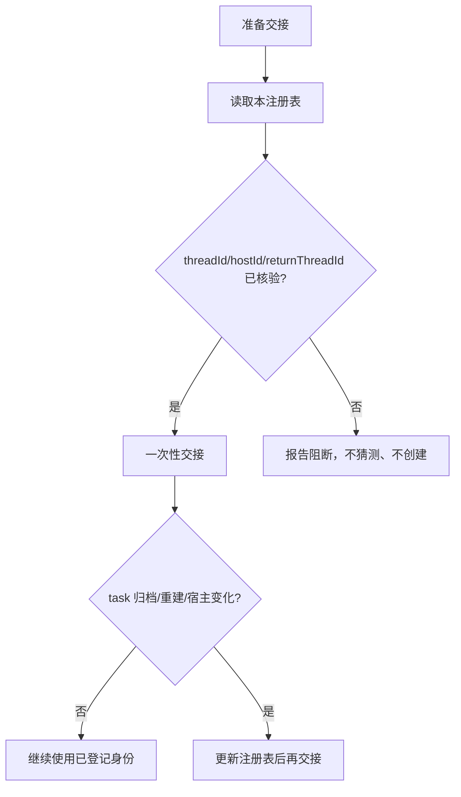

# xingbuild 活动 Task 注册表

状态：生效。本文只记录当前活动 task 的身份与通信地址，不保存任务正文、方案或执行日志。

## 当前登记

| 当前 task 别名 | 原职责/兼容标识 | threadId | hostId | returnThreadId | 状态 | 最后核验 |
| --- | --- | --- | --- | --- | --- |
| `elon` | 原产品/视觉主线 | `019fc260-e14e-7211-97f1-44e075d0cc0f` | `local` | `019fc260-e14e-7211-97f1-44e075d0cc0f` | active | 2026-08-15 |
| `elon1` | 历史过程文件与清理治理，只读分析 | `019ff905-7298-7bf0-b3fb-ba3fc10a40c2` | `local` | `019fc260-e14e-7211-97f1-44e075d0cc0f` | active | 2026-08-15 |
| 历史归档 | 原 Engineering 主线（旧） | `019fc263-abf9-7732-84ef-73914e6a0a85` | `local` | `019fc260-e14e-7211-97f1-44e075d0cc0f` | archived | 2026-08-04 |
| `elon engin` | 原 Engineering 主线 | `019fcbf2-20e3-7d51-a4de-87ad7c94b190` | `local` | `019fc260-e14e-7211-97f1-44e075d0cc0f` | active | 2026-08-15 |
| `elon ui`（slug：`elon-ui`） | 原 `design-ui` 视觉方向 | `019fd068-cd5d-7f30-9642-32d0589a4953` | `local` | `019fc260-e14e-7211-97f1-44e075d0cc0f` | active | 2026-08-15 |
| `elon ops` | 原内容及发布主线；兼容标识 `ops-content` | `019fa166-9645-7532-87f6-99ae4cf9508a` | `local` | `019fc260-e14e-7211-97f1-44e075d0cc0f` | active | 2026-08-15 |
| 历史归档 | 原 Ops 采集主线（旧） | `019fb57b-e90e-75a3-8898-ce380d6dc1fa` | `local` | `unverified` | archived | 2026-08-05 |
| `elon ops1` | 原 Ops 采集主线 | `019fd012-6699-7b90-aadf-c2da6b097644` | `local` | `019fa166-9645-7532-87f6-99ae4cf9508a` | active | 2026-08-15 |

## 命名规则

- `elon` 是产品总负责人；`elon ui`、`elon engin`、`elon ops` 是三个首席职责域负责人。
- 编号 task 是对应负责人之下的实际子 task：`elon1`/`elon2`、`elon ui1`/`elon ui2`（slug 可写作 `elon-ui1`/`elon-ui2`）、`elon engin1`/`elon engin2`、`elon ops1`/`elon ops2`。
- 只有真实创建并核验 threadId、hostId、returnThreadId 后，编号 task 才能登记；不能提前创建占位身份。
- 历史文档、旧版本、旧 deployment 和旧消息保留原名称作为 provenance；当前交接使用本表的 task 别名。

## 使用规则

- 普通消息、执行进度和回传不重复登记。
- 新建、归档、替代、宿主变化或回传地址变化时必须更新。
- `sourceThreadId` 只作来源追溯；发送目标只能使用登记的 `threadId`，回传只能使用登记的 `returnThreadId`。
- ID、宿主或责任无法核验时立即报告用户，不得按职责名称猜测、轮询、替代或创建 task。
- 归档 task 必须标记 `archived`；新 task 完成登记后才能成为 active。

## Xing 注意状态的来源

任务状态以 Codex 动态运行状态和任务标题前缀共同表达，详细转换只以 [`task-onboarding.md`](task-onboarding.md) 第十一节为准：进行中不加前缀、由 Codex 圆圈表示；`✅`=责任范围彻底完成；`⚠️`=未完成且停止/阻断。这里不复制动态标记，避免注册表变成第二个易过期状态源；本表只核验 task 身份、通信地址和 active/archived 生命周期。每次跨 task 交接前后必须按该章节更新标题，不能只更新消息而留下过期状态。标记不等同于测试、验收、提交、部署或发布事实。
