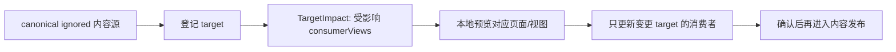

# Xing 工作习惯与上下文连续性规则

状态：生效。本文是 Xing 在 xingbuild 项目中的稳定工作习惯、协作偏好和上下文保存规则；不是产品版本方案、内容事实、发布授权或 Engineering 实现清单。

## 一、总目标

Xing 要的是一套简单、高效、可靠、可持续演进的工作系统：

核心原则：

- 先理解问题的本质、影响边界和长期责任，再决定是否增加功能或规则。
- 优先最小充分、简单、可验证、可演进的方案；不为了“完整”增加不必要的层、页面、验证、task、worktree 或抽象。
- 发现系统性问题时修正责任和对象边界，不用表面 UI、兼容分支或重复手工步骤掩盖根因。
- 任何修改都要减少 Xing 的重复操作和记忆负担，而不是把复杂度转移给 Xing。
- 结论必须区分事实、推断、假设、已确认、未确认和阻断；不把部署成功或 HTTP 200 单独称为完成。

## 二、Xing 的工作模式

### 1. 先分析、先确认、不要编码

当 Xing 说“先分析”“先确认”“不要实现/不要编码”时：

- 只做事实核查、根因分析、对象/责任边界、方案比较、风险和验收定义。
- 不改代码、`current.md`、VERSION、history、tag、ContentSet、review、release、SitePublication 或线上状态。
- 可以更新本规则类或分析类文件，但必须明确它不是产品实现授权；产品候选/current 仍按各自规则管理。
- 先给 Xing 可判断的结论：问题是什么、为什么、有哪些方案、推荐哪一个、需要 Xing 决定什么。

### 2. Xing 明确“执行”之后

- 先读取项目规则和已确认文件，确认 owner、范围、禁止动作和验收条件。
- 需要长期复用的决定先落到正确的事实文件，再交给责任 task；不能只留在聊天记录。
- 产品能力由 `elon` 形成正式方案并交 `elon engin`；视觉独立验收由 `elon ui`；内容与发布由 `elon ops`；具体身份以 `task-registry.md` 为准。
- 继续使用最小充分验证；没有新增风险时复用已有可靠证据，不重做与变更无关的整套验收。
- `current.md`/design 只决定产品实现；一次 Git 收口还要包含本次已确认的规则、候选、history 等 tracked `record-only` 变更。每个版本用 `docs/iterations/scopes/v{版本号}.json` 逐路径确认；`excludedExternal` 不豁免 dirty，内容 Ops 的 ignored 事实保持独立，未分类或未收口 tracked 变更才阻断。
- Engineering 实现后先回传未提交证据；`elon` 按当前方案 checklist 验收，范围内缺陷在同一版本修复。只有 `READY_FOR_COMMIT` 后才允许 commit/tag/build/preflight；持续发布授权有效时，门禁通过后可自动产品 transport，不重复询问 Xing。

### 3. Xing 可以随时提出多个想法

- 不同想法可以由 `elon1`、`elon2` 或对应职责子 task 并行分析。
- 子 task 默认只读，只返回问题、对象、影响范围、建议、风险、验收和未决项。
- `elon` 统一收口并决定是否写 candidate、正式 design/current 或关闭；同一时间 canonical main 只有一个写入通道。
- task 不共享完整聊天上下文；需要后续复用的事实必须进入项目文件。交接消息只携带索引和 checkpoint，不承担长期记忆。

## 三、决策应该写在哪里

| 内容 | 唯一落点 | 说明 |
| --- | --- | --- |
| Xing 的稳定工作习惯/协作偏好 | 本文件 | 不改变产品版本，也不替代项目规则 |
| 已确认的产品能力、页面结构、视觉合同 | `docs/iterations/current.md` + `docs/design/` | Engineering 才能据此实现 |
| 尚未确认的产品想法 | `docs/iterations/candidates/` | 保持 `pending`/`DRAFT`，不授权实现 |
| 已实现版本事实 | `docs/iterations/history/`、代码、测试和 machine evidence | 不由聊天摘要替代 |
| 内容正文、媒体、审核和内容发布状态 | 被忽略的 `.content-workspace/` 与内容台账 | 不写入产品版本事实 |
| task 身份、threadId、owner、回传地址 | `docs/rules/task-registry.md` | 不把动态工作正文塞入注册表 |
| task 交接、阻断和一次性回传 | `docs/rules/collaboration-workflow.md` + handoff | 交接消息必须回到事实文件 |

如果一个决定会改变页面能力、schema、IA、组件、交互、视觉合同或发布架构，它必须进入产品 candidate/current；如果只是 Xing 的协作习惯，更新本文件即可，不必创建版本。

## 四、页面内容工作方式

Xing 的目标是“改哪里，哪里立即预览和更新”，而不是每次内容修改都重建整站：

- 内容工作台应按页面和可编辑内容定位；页面导航是唯一页面选择，正文/模块 target 在页面内选择。
- 字段类型、结构、字号、间距、媒体比例、安全链接和视觉 token 由产品锁定；Xing 只编辑内容值、段落、受控响应式断点或已登记引用，不在工具中随意改视觉。
- 有效编辑只刷新该 target 的 `consumerViews`；无关页面、iframe、route 不刷新，不触发全站 full reload、build、ProductArtifact、ContentSet 或发布状态变化。
- 半写入/非法编辑保留 last-valid；恢复有效值后恢复预览。预览过程不得写 active ContentSet、review、release、SitePublication 或线上状态。
- 内容差异必须可见、可恢复、可逐项确认；内容发布是独立步骤，由 `elon ops` 按内容合同执行，不把本地预览自动当成发布。

## 五、沟通和状态表达

- 所有项目内回复、交接和工作报告称呼 Xing。
- 每次重要回传优先写：当前责任 task、事实身份、已完成、未完成/阻断、证据路径、未执行动作、下一动作/授权方。
- Task 标题状态的唯一正文是 [`task-onboarding.md`](task-onboarding.md) 第十一节；本文件只保留使用目的，不复制另一套状态规则。进行中不加标题前缀，由 Codex 动态圆圈表示；只有责任范围彻底完成才用 `✅`；未完成且停止/阻断用 `⚠️`。
- `⚠️` 的检查点必须写明 `阻断类型`、是否需要 Xing 决策、证据和恢复 owner/条件；正常完成后等待下一触发仍可用 `✅`，不能把未完成 task 伪装成完成。
- 不用无谓的“等待”代替工作：若能继续做只读分析、补齐文件、复用证据或准备明确 checkpoint，就继续；若确实需要 Xing，说明缺什么以及不决定会影响什么，然后停止越界动作。
- 不重复询问文件中已经明确的决定。发现现有文件与最新明确指令冲突时，指出冲突并请求一次收口，不自行猜测。

## 六、复杂度控制红线

未经 Xing 明确授权，不做以下动作：

- 为讨论创建版本、candidate、branch、worktree、automation 或 scheduler。
- 为局部内容变化重建整站、刷新无关页面、生成 ProductArtifact/ContentSet 或触发发布。
- 为了证明一个局部变更而重复整套与变更无关的视觉、内容或公网验收。
- 删除历史证据、失败 publication、recoverable 状态或 ignored 内容；清理必须先做引用/hash inventory、dry-run 和可恢复策略。
- 让 Engineering 猜测聊天里的产品意图，或让内容 task 修改产品 IA/schema/组件/视觉合同。

## 七、上下文恢复规则

新 task 或上下文压缩后，按以下顺序恢复：

1. 读取 `AGENTS.md`、`docs/rules/task-onboarding.md`、`docs/rules/00-baseline-index.md`。
2. 读取本文件，确认 Xing 的稳定工作方式和当前动作边界。
3. 按责任域读取 `responsibility-and-workflows.md`、`collaboration-workflow.md`、`iteration-and-release.md`、产品总案或内容合同。
4. 读取当前正式 `current.md`、活动 candidate、task registry 和相关 machine evidence；不以聊天摘要、旧 task 或冷历史补全当前事实。
5. 先报告恢复到的事实、owner、已确认项、阻断和下一动作，再执行任何写入。

本文件只在 Xing 明确改变长期工作习惯或协作偏好时更新。产品、内容、Engineering 和发布事实必须回到各自唯一 owner 文件，不能为了“记住”全部复制到本文。
